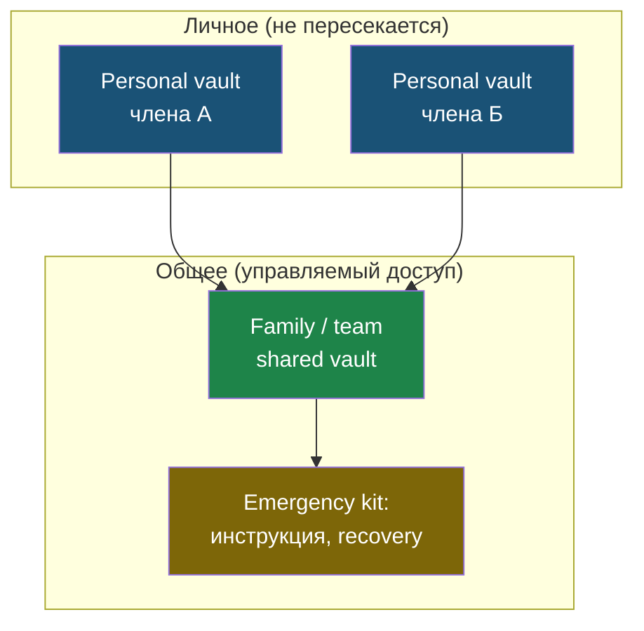

# Глава 13: Семья, команда и shared access

> **Запомни:** общий доступ должен быть управляемым. Пароль в чате — это не управление доступом.

---

## 13.1 Почему нельзя просто отправить пароль

Обычная ситуация:

```text
Нужен пароль от сервиса.
Один человек отправляет его в мессенджер.
Через год никто не помнит, кому он ушёл.
```

Проблемы:

- пароль остаётся в истории чата;
- его могут переслать;
- непонятно, кто имеет доступ;
- трудно отозвать доступ;
- при уходе человека пароль надо менять везде;
- MFA может быть привязан к одному телефону.

---

## 13.2 Shared vault

Shared vault — общее хранилище для выбранных записей.

Идея:

```text
Личные пароли остаются личными
Общие доступы лежат отдельно
Доступ можно выдать и отозвать
```

Примеры общих доступов:

- семейная подписка;
- домен;
- хостинг;
- Wi-Fi;
- общий магазин;
- рекламный кабинет;
- тестовый сервер;
- shared admin account, если без него нельзя.

---

## 13.3 Family plan

Для семьи важно:

- не видеть личные пароли друг друга;
- иметь общую папку;
- иметь emergency access;
- понимать, что делать при потере телефона;
- не держать критичный доступ только у одного человека.

Пример структуры:

```text
Personal vault: личные аккаунты
Family shared: подписки, Wi-Fi, общие сервисы
Emergency: инструкция и recovery
```

Схема показывает границу между личным и общим: личные vault остаются закрытыми, а общий доступ собран в одном управляемом месте, где его можно выдать и отозвать.



---

## 13.4 Маленькая команда

Команде нужны:

- роли;
- shared collections;
- владелец доступа;
- offboarding;
- список критичных сервисов;
- правило MFA;
- правило токенов;
- запрет секретов в чатах.

Если команда растёт, личный vault владельца перестаёт быть нормальной системой.

---

## 13.5 Offboarding

Offboarding — что происходит, когда человек уходит.

Нужно:

- отозвать доступ к shared vault;
- сменить общие пароли, если они были известны;
- отозвать tokens;
- удалить SSH keys;
- проверить GitHub/GitLab access;
- проверить cloud/hosting/domain access;
- передать ownership;
- записать, что сделано.

Если этого нет, бывший участник может сохранять доступ месяцами.

---

## 13.6 Общие аккаунты

Общий аккаунт — это когда все входят под одним логином.

Минусы:

- непонятно, кто сделал действие;
- трудно включить MFA;
- трудно отозвать одного человека;
- пароль часто утекает в чат;
- при увольнении надо менять пароль всем.

Лучше:

- индивидуальные аккаунты;
- роли;
- shared vault только для тех сервисов, где индивидуальные аккаунты невозможны.

---

## 13.7 Критичные общие сервисы

Особо внимательно:

- домены;
- хостинг;
- DNS;
- cloud;
- банк;
- рекламные кабинеты;
- GitHub organization;
- менеджер паролей команды;
- основной email бизнеса.

Для таких сервисов:

- минимум два ответственных;
- MFA;
- recovery;
- владелец записан;
- доступы не лежат только у одного человека.

---

## 13.8 Практика: тестовый shared access

Используй тестовые записи.

Шаги:

1. создай папку или collection `Shared Demo`;
2. добавь запись `Demo Shop`;
3. пригласи тестового участника или используй учебный сценарий без реального приглашения;
4. проверь, какие права выдаются;
5. отзови доступ;
6. запиши, что изменилось.

Если нет второго человека, опиши процесс на бумаге.

---

## 13.9 Практика: правила семьи

Напиши короткие правила:

```text
1. Личные пароли не смотрим.
2. Общие доступы храним в shared vault.
3. Пароли не отправляем в чат.
4. Recovery kit лежит ...
5. При смене телефона проверяем MFA.
```

Не делай документ на 20 страниц. Семейные правила должны быть понятны.

---

## 13.10 Практика: правила команды

Минимум:

```text
1. У каждого свой аккаунт.
2. Общие пароли только в shared vault.
3. MFA обязательно.
4. Tokens с минимальными правами.
5. При уходе человека выполняем offboarding checklist.
6. Критичные сервисы имеют минимум двух владельцев.
```

---

## 13.11 Чеклист offboarding

- [ ] Удалить из password manager organization
- [ ] Отозвать shared vault access
- [ ] Удалить SSH keys
- [ ] Отозвать tokens
- [ ] Проверить GitHub/GitLab
- [ ] Проверить hosting/cloud
- [ ] Передать ownership
- [ ] Сменить общие пароли, которые человек знал
- [ ] Проверить MFA/recovery
- [ ] Записать дату

---

## Чеклист главы 13

- [ ] Я понимаю, почему пароль в чате плох
- [ ] Я понимаю shared vault
- [ ] Я отличаю личные и общие доступы
- [ ] Я знаю, что такое offboarding
- [ ] Я составил правила семьи или команды
- [ ] Я нашёл критичные аккаунты, где не должен быть один владелец
