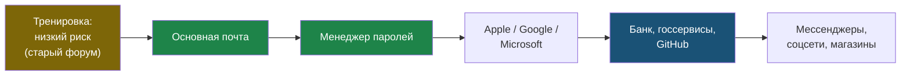

# Глава 14: Миграция старых паролей

> **Запомни:** миграция паролей — это проект на несколько недель, а не героическая попытка исправить всю цифровую жизнь за один вечер.

---

## 14.1 Почему нельзя менять всё сразу

Если у тебя 200 аккаунтов, попытка поменять всё за день приведёт к:

- усталости;
- ошибкам;
- потерянным recovery codes;
- одинаковым временным паролям;
- незавершённой MFA;
- хаосу в менеджере.

Лучше двигаться по приоритетам.

---

## 14.2 Правильный порядок

Сначала аккаунты, через которые можно восстановить другие аккаунты.

Приоритет:

1. основная почта;
2. менеджер паролей;
3. Apple ID / Google account / Microsoft account;
4. банк и государственные сервисы;
5. GitHub/GitLab и рабочие аккаунты;
6. домены и хостинг;
7. мессенджеры;
8. соцсети;
9. облачные диски;
10. магазины и подписки;
11. старые форумы.

---

## 14.3 Не трогай критичное первым

Сначала потренируйся на низком риске.

Пример:

```text
Старый магазин
  -> сменить пароль
  -> сохранить в менеджер
  -> выйти
  -> войти заново
```

После 2-3 успешных тренировок переходи к важным аккаунтам.

Схема показывает порядок миграции: сначала тренировка на низком риске, затем аккаунты, через которые восстанавливается всё остальное, и только потом остальная масса сервисов.



---

## 14.4 Импорт из браузера

Многие менеджеры умеют импортировать пароли из браузера.

Плюсы:

- быстро;
- не надо вручную переносить всё;
- видно повторы и слабые пароли.

Минусы:

- импорт может принести старый мусор;
- plain export из браузера опасен;
- после импорта надо чистить;
- в браузере могут остаться старые копии.

Правило:

> Импорт — это начало уборки, а не финал.

---

## 14.5 Удаление старых сохранённых паролей

После миграции можно удалить старые пароли из браузера, но осторожно.

Порядок:

1. убедись, что записи есть в менеджере;
2. проверь вход на нескольких сайтах;
3. сделай backup менеджера;
4. только потом удаляй старые записи из браузера;
5. не удаляй всё, если не уверен в восстановлении.

---

## 14.6 Повторяющиеся пароли

Менеджер может показать reused passwords.

План:

- сначала критичные повторы;
- потом важные;
- потом низкий риск.

Если один старый пароль повторялся в 20 местах, не надо менять все 20 за вечер. Начни с тех, где есть деньги, почта, работа, личные данные.

---

## 14.7 Закрытие ненужных аккаунтов

Иногда лучший пароль — отсутствие аккаунта.

Если сервис не нужен:

- удали аккаунт, если возможно;
- удали карту;
- удали адрес;
- удали лишние персональные данные;
- сохрани запись "аккаунт закрыт" при необходимости.

---

## 14.8 План на месяц

Пример:

### День 1

- выбрать менеджер;
- настроить MFA;
- создать backup;
- потренироваться на тестовых записях.

### Неделя 1

- почта;
- менеджер паролей;
- Apple/Google/Microsoft;
- GitHub;
- recovery codes.

### Неделя 2

- банк;
- государственные сервисы;
- домены;
- хостинг;
- cloud.

### Неделя 3

- мессенджеры;
- соцсети;
- магазины;
- подписки.

### Неделя 4

- удалить мусор;
- проверить повторяющиеся пароли;
- обновить backup;
- проверить recovery.

---

## 14.9 Практика: первые 10 аккаунтов

Создай таблицу:

```text
Аккаунт | Приоритет | Новый пароль | MFA | Recovery | Статус
```

В поле "Новый пароль" не записывай сам пароль.

Пиши:

```text
сгенерирован в менеджере
```

Пример:

| Аккаунт | Приоритет | Новый пароль | MFA | Recovery | Статус |
|---|---|---|---|---|---|
| Почта | 1 | сгенерирован | TOTP | сохранено | готово |
| GitHub | 2 | сгенерирован | TOTP | сохранено | готово |

---

## 14.10 Практика: 3 реальные замены

Выбери:

- один низкорисковый аккаунт;
- один важный аккаунт;
- один критичный аккаунт, если уже уверен.

Для каждого:

1. проверь recovery email;
2. сгенерируй новый пароль;
3. сохрани в менеджер;
4. включи MFA, если доступно;
5. сохрани recovery codes;
6. выйди;
7. войди заново;
8. отметь статус.

---

## 14.11 Что делать после миграции

Раз в 3 месяца:

- проверить critical accounts;
- проверить MFA;
- проверить recovery codes;
- обновить backup;
- закрыть старые аккаунты;
- посмотреть warnings менеджера паролей.

---

## Чеклист главы 14

- [ ] Я не пытаюсь менять все пароли за один вечер
- [ ] Я знаю правильный порядок миграции
- [ ] Я потренировался на низком риске
- [ ] Я выбрал первые 10 аккаунтов
- [ ] Я заменил первые 3 пароля
- [ ] Я сохранил recovery codes для важных аккаунтов
- [ ] Я запланировал проверку через 3 месяца
