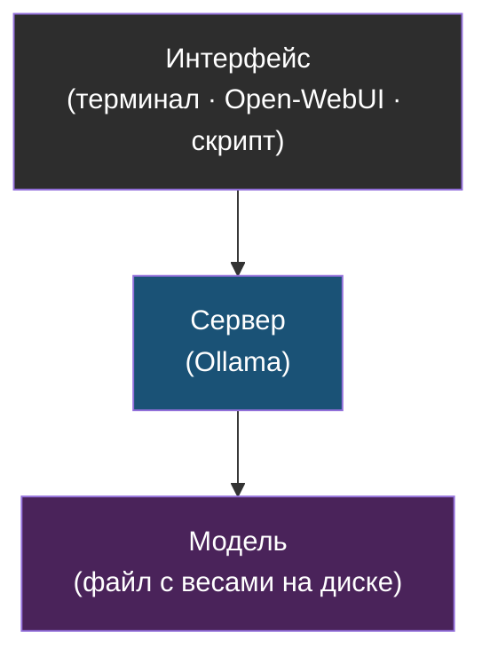

# Глава 0: LLM без мистики

> **Запомни:** локальная LLM — это не "домашний ChatGPT", а сервис со своими плюсами, минусами и требованиями к железу.

---

## 0.1 Что происходит, когда ты задаёшь вопрос модели

Очень упрощённо языковая модель получает текст и продолжает его наиболее вероятным образом. Она не "знает истину" как база данных. Она вычисляет продолжение текста по шаблонам, которые выучила во время обучения.

Практически это выглядит так:

```text
Твой вопрос
  -> разбивается на токены
  -> модель считает вероятное продолжение
  -> сервер собирает ответ
  -> ты видишь текст
```

Тот же путь как диаграмма-конвейер:


Токен — это кусочек текста. Иногда слово, иногда часть слова, иногда знак. Поэтому стоимость и скорость в LLM часто считают не в символах, а в токенах.

> **Аналогия:** модель — это очень начитанный автодополнитель в смартфоне, только вместо одного следующего слова он дописывает целый абзац. Он не "думает" — он предсказывает наиболее вероятное продолжение по огромному массиву текстов.

---

## 0.2 Модель, сервер и интерфейс

Важно разделить три вещи:

| Часть | Что это | Пример |
|---|---|---|
| Модель | Большой файл с весами | `llama`, `qwen`, `mistral` |
| Сервер | Программа, которая запускает модель | Ollama |
| Интерфейс | Где человек пишет запросы | терминал, Open-WebUI, скрипт |

Эти три слоя удобно держать в голове отдельно:



Если сайт Open-WebUI не открывается, это не значит, что модель сломалась. Может быть проблема в Nginx. Если API отвечает, но медленно, может не хватать RAM или GPU. Такое разделение помогает спокойно диагностировать.

---

## 0.3 Локальная модель против облачной

| Подход | Когда подходит | Плюсы | Минусы | Главный риск |
|---|---|---|---|---|
| Облачный AI | сложные задачи, лучшее качество | мощные модели, быстро | данные уходят наружу, цена за запрос | приватность и зависимость |
| Локальная CPU | учеба, приватные заметки, редкие скрипты | автономно, бесплатно за запрос | медленнее | ждать слишком высокого качества |
| Локальная GPU | частый чат, быстрые ответы | быстро, приватно | нужна видеокарта | сложнее железо |
| Гибрид | часть задач локально, часть в облаке | баланс | надо выбирать маршрут | путаница с данными |

Человеческий вывод: новичку стоит начать с маленькой локальной модели и простых задач. Техническому человеку полезно построить API и сравнить с облаком. Команде надо отдельно думать про доступы, логи и данные.

---

## 0.4 Практика: опиши свою задачу

Перед установкой ответь письменно:

- какие данные ты хочешь отправлять модели;
- можно ли эти данные отправлять во внешний сервис;
- нужен ли быстрый интерактивный ответ;
- сколько RAM и диска есть на машине;
- кто ещё будет иметь доступ к сервису.

Если в задаче есть приватные логи, документы, персональные данные или конфиги с секретами, начинай с локального варианта и не открывай API в интернет.

Проверка: у тебя должен получиться короткий текст из 5-7 строк: "я хочу использовать LLM для ...; данные ...; доступ нужен ...; риск ...".

---

> **Если что-то пошло не так:**
>
> - Если ты не знаешь с чего начать — ответь на вопросы из раздела 0.4 письменно. Это снимает 80% путаницы.
> - Если не понятно, нужна ли локальная модель — задай вопрос: "могу ли я отправить эти данные в ChatGPT без последствий?" Если нет — ставь локальную.
> - Если сомневаешься в требованиях к железу — начни с самой маленькой модели (1B-3B) и посмотри на реальное время ответа.
