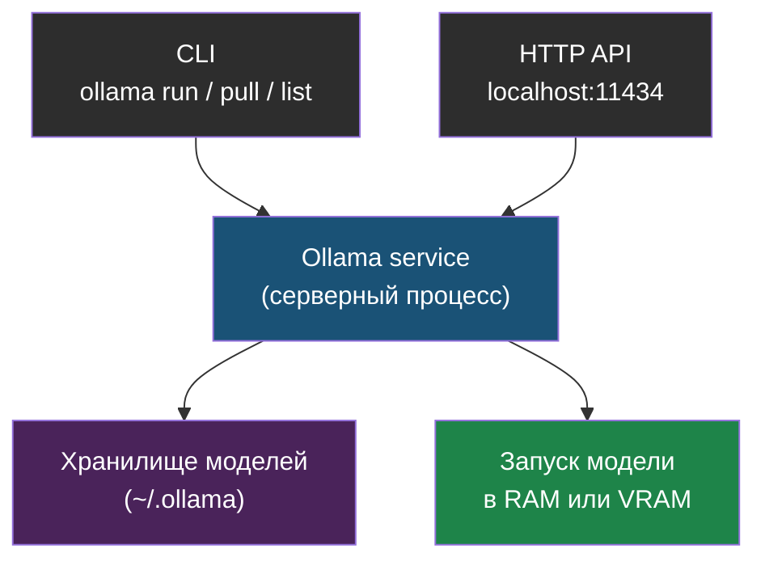

# Глава 1: Ollama и первая модель

> **Цель:** установить Ollama, скачать маленькую модель и получить первый ответ в терминале.

---

## 1.1 Что такое Ollama

Ollama — это удобный способ запускать локальные языковые модели. Он берёт на себя скачивание модели, запуск сервера, хранение файлов и простой CLI.

Ментальная модель:

```text
ollama pull model
  -> скачал модель
ollama run model
  -> запустил диалог
Ollama service
  -> HTTP API на localhost:11434
```

Как устроены роли Ollama:



> **Аналогия:** Ollama — это как Docker для моделей. Ты говоришь `ollama pull llama3.2:3b`, и он сам находит, скачивает и готовит модель к запуску — не нужно разбираться с форматами файлов и настройками вручную.

---

## 1.2 Установка

Перед установкой проверь ресурсы:

```bash
free -h
nproc
df -h
```

Для первой практики желательно иметь 8 GB RAM и 10 GB свободного диска. На 4 GB RAM можно пробовать маленькие модели, но ответы будут медленнее.

Нативная установка обычно выглядит так:

```bash
curl -fsSL https://ollama.com/install.sh | sh
systemctl status ollama
```

# Пример вывода:
```
● ollama.service - Ollama Service
     Loaded: loaded (/etc/systemd/system/ollama.service; enabled; preset: enabled)
     Active: active (running) since Mon 2025-05-05 12:34:01 UTC; 5s ago
   Main PID: 12345 (ollama)
      Tasks: 14 (limit: 9473)
     Memory: 38.2M
        CPU: 204ms
     CGroup: /system.slice/ollama.service
             └─12345 /usr/local/bin/ollama serve
```

Важно: `curl | sh` запускает скрипт из интернета. Так можно делать только с официального сайта проекта, а не из случайной статьи.

Docker-вариант:

```bash
docker run -d \
  --name ollama \
  -v ollama:/root/.ollama \
  -p 127.0.0.1:11434:11434 \
  --restart unless-stopped \
  ollama/ollama
```

Обрати внимание на `127.0.0.1:11434:11434`. Это значит: порт доступен только локально, а не всему интернету.

---

## 1.3 Первая модель

Список моделей быстро меняется. Перед реальной установкой проверь актуальные теги в библиотеке Ollama. Для учебного старта нужна маленькая instruct/chat-модель.

Пример:

```bash
ollama pull llama3.2:3b
```

# Пример вывода:
```
pulling manifest
pulling dde5aa3fc5ff... 100% ▕████████████████▏ 2.0 GB
pulling 966de95ca8a6...  100% ▕████████████████▏ 1.4 KB
pulling fcc5a6bec9da...  100% ▕████████████████▏  7.7 KB
pulling a70ff7e570d9...  100% ▕████████████████▏  6.0 KB
pulling 56bb8bd477a5...  100% ▕████████████████▏   96 B
pulling 34bb5ab01051...  100% ▕████████████████▏  561 B
verifying sha256 digest
writing manifest
success
```

```bash
ollama run llama3.2:3b
```

В диалоге задай простой вопрос:

```text
Объясни Docker в трех предложениях для школьника.
```

# Пример вывода (ответ модели):
```
>>> Объясни Docker в трех предложениях для школьника.

Docker — это программа, которая позволяет упаковать приложение вместе со всем,
что ему нужно для работы, в один «контейнер». Этот контейнер можно запустить
на любом компьютере, и программа будет работать одинаково, независимо от того,
что установлено на этом компьютере. Это как если бы ты упаковал игру со всеми
её файлами в коробку, и игра работала бы на любой приставке.

>>> /bye
```

Если модель отвечает медленно, это нормально. Первый запуск загружает модель в память.

---

## 1.4 Проверка

Проверь, что сервер отвечает:

```bash
curl http://localhost:11434/api/tags
```

# Пример вывода:
```json
{
  "models": [
    {
      "name": "llama3.2:3b",
      "model": "llama3.2:3b",
      "modified_at": "2025-05-05T12:40:00.000Z",
      "size": 2019393189,
      "digest": "a80c4f17acd55265feec403c7aef86be0c25983ab279d83f3bcd3abbcb5b8b72",
      "details": {
        "parent_model": "",
        "format": "gguf",
        "family": "llama",
        "families": ["llama"],
        "parameter_size": "3.2B",
        "quantization_level": "Q4_K_M"
      }
    }
  ]
}
```

Посмотри список моделей:

```bash
ollama list
```

# Пример вывода:
```
NAME              ID              SIZE      MODIFIED
llama3.2:3b       a80c4f17acd5    2.0 GB    2 minutes ago
```

Удаление модели:

```bash
ollama rm llama3.2:3b
```

---

## 1.5 Типовые ошибки

| Симптом | Причина | Что сделать |
|---|---|---|
| `connection refused` | сервис не запущен | `systemctl status ollama` или `docker logs ollama` |
| мало диска | модель не скачалась | `df -h`, удалить лишние модели |
| очень медленно | слабый CPU/RAM | взять модель меньше |
| порт виден снаружи | публикация на `0.0.0.0` | слушать только `127.0.0.1` |

---

> **Если что-то пошло не так:**
>
> **Симптом:** `systemctl status ollama` показывает `Active: failed` или `inactive (dead)`.
>
> Диагностика:
> ```bash
> journalctl -u ollama -n 20
> ```
> Типичные причины:
> - нет прав на запись в `/usr/share/ollama` — проверь владельца: `ls -la /usr/share/ollama`
> - бинарник не установился — попробуй переустановить: `curl -fsSL https://ollama.com/install.sh | sh`
> - занят порт 11434 — проверь: `ss -tlnp | grep 11434`
>
> Перезапуск после исправления:
> ```bash
> sudo systemctl restart ollama
> systemctl status ollama
> ```

Практика завершена, если `ollama list` показывает модель, а `curl /api/tags` возвращает JSON.
