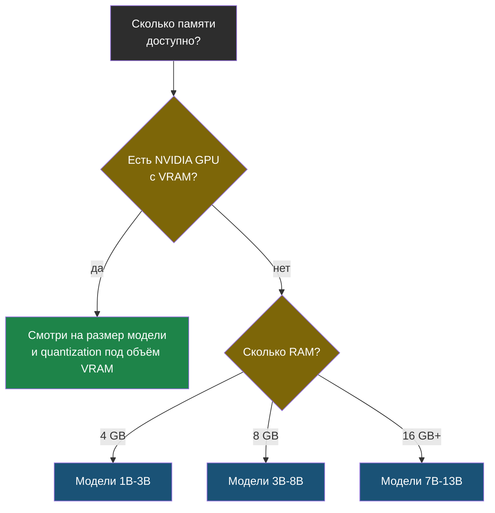

# Глава 2: Как выбрать модель

> **Цель:** не скачать всё подряд, а выбрать модель под задачу и железо.

---

## 2.1 Размер модели простыми словами

В названиях моделей часто встречаются числа: 3B, 7B, 8B, 13B, 70B. Это примерно количество параметров. Чем больше модель, тем больше ей нужно памяти и тем выше шанс на качественный ответ. Но больше не всегда лучше.

Для слабого сервера большая модель может быть бесполезной: она запустится очень медленно или не запустится вообще.

```text
маленькая модель
  -> быстрее
  -> меньше RAM
  -> хуже сложные рассуждения

большая модель
  -> лучше качество
  -> больше RAM/VRAM
  -> медленнее на CPU
```

> **Аналогия:** выбор модели — как выбор автомобиля для поездки. Не всегда нужен грузовик: если везёшь одну сумку, маленькая машина доедет быстрее и дешевле. Грузовик нужен только когда реально много груза.

---

## 2.2 Проверяем железо

```bash
free -h
nproc
df -h
cat /proc/cpuinfo | grep "model name" | head -1
```

# Пример вывода (сервер с 8 GB RAM):
```
              total        used        free      shared  buff/cache   available
Mem:           7.6Gi       2.1Gi       3.2Gi        45Mi       2.3Gi       5.2Gi
Swap:          2.0Gi          0B       2.0Gi
```

```
# Пример вывода df -h:
Filesystem      Size  Used Avail Use% Mounted on
/dev/sda1        40G   18G   20G  47% /
tmpfs           3.9G     0  3.9G   0% /dev/shm
```

```
# Пример вывода nproc:
4
```

```
# Пример вывода /proc/cpuinfo:
model name      : Intel(R) Core(TM) i5-8250U CPU @ 1.60GHz
```

Если есть NVIDIA GPU:

```bash
nvidia-smi
```

Простое правило для старта:

| RAM | Что пробовать |
|---|---|
| 4 GB | маленькие 1B-3B модели |
| 8 GB | 3B-8B модели |
| 16 GB | 7B-13B модели |
| GPU с VRAM | смотреть размер модели и quantization |

Это не закон, а ориентир. Разные модели и форматы занимают разное количество памяти.

Тот же выбор как дерево решений:



---

## 2.3 Выбор по задаче

| Задача | Что важнее | Какой тип модели искать |
|---|---|---|
| объяснить текст | понятность | general instruct |
| помочь с кодом | код и команды | coder model |
| кратко пересказать лог | контекст и скорость | small/medium instruct |
| сложное рассуждение | качество | более сильная модель или облако |
| приватная автоматизация | локальность | локальная модель, пусть медленнее |

Не называй одну модель "лучшей". Рынок меняется быстро. В книге важен принцип: задача, данные, железо, скорость, качество.

---

## 2.4 Практика: матрица выбора

Заполни таблицу для себя:

| Моя задача | Данные приватные? | RAM/VRAM | Нужна скорость? | Решение |
|---|---|---|---|---|
| анализ логов | да | 8 GB RAM | нет | маленькая локальная |
| сложный код-ревью | нет/частично | мало | да | облачный API или сильная GPU |

Проверка: ты должен выбрать одну модель для старта и написать, почему она подходит. Если причина звучит как "в интернете сказали лучшая", выбор не готов.

---

> **Если что-то пошло не так:**
>
> **Симптом:** модель скачалась, но при запуске `ollama run` — ошибка `out of memory` или процесс падает без сообщения.
>
> Диагностика:
> ```bash
> free -h
> ollama list
> ```
>
> Решения:
> - Выбери модель меньшего размера. Если стоит `7b`, попробуй `3b`.
> - Добавь swap-файл для временного запаса RAM:
>   ```bash
>   sudo fallocate -l 4G /swapfile
>   sudo chmod 600 /swapfile
>   sudo mkswap /swapfile
>   sudo swapon /swapfile
>   ```
> - После добавления swap перезапусти модель — она может медленнее, но запустится.
> - Если и это не помогает — удали модель и скачай вариант с квантизацией `Q4_K_M` или `Q4_0`, они легче.
