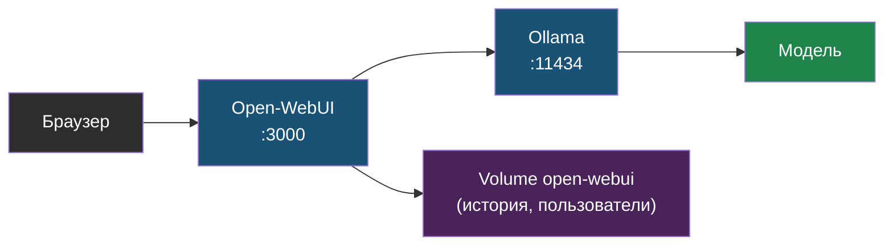

# Глава 4: Open-WebUI

> **Цель:** поднять браузерный интерфейс к локальной модели и понять, где он хранит данные.

---

## 4.1 Зачем нужен WebUI

Терминал удобен для проверки, но для ежедневного использования нужен интерфейс: история чатов, пользователи, настройки моделей, файлы, промпты. Open-WebUI — популярный web-интерфейс, который может подключаться к Ollama.

Архитектура:

```text
браузер
  -> Open-WebUI :3000
  -> Ollama :11434
  -> модель
```

Та же архитектура как диаграмма с хранением данных:



> **Аналогия:** Ollama — это движок автомобиля, а Open-WebUI — это панель управления и руль. Движок работает без панели, но управлять удобнее с ней.

---

## 4.2 Docker Compose

```yaml
services:
  ollama:
    image: ollama/ollama
    container_name: ollama
    volumes:
      - ollama:/root/.ollama
    ports:
      - "127.0.0.1:11434:11434"
    restart: unless-stopped

  open-webui:
    image: ghcr.io/open-webui/open-webui:main
    container_name: open-webui
    volumes:
      - open-webui:/app/backend/data
    ports:
      - "127.0.0.1:3000:8080"
    environment:
      - OLLAMA_BASE_URL=http://ollama:11434
    depends_on:
      - ollama
    restart: unless-stopped

volumes:
  ollama:
  open-webui:
```

Запуск:

```bash
docker compose up -d
```

# Пример вывода:
```
[+] Running 4/4
 ✔ Network ai_default         Created   0.1s
 ✔ Volume "ai_ollama"         Created   0.0s
 ✔ Volume "ai_open-webui"     Created   0.0s
 ✔ Container ollama           Started   1.3s
 ✔ Container open-webui       Started   2.1s
```

```bash
docker compose ps
```

# Пример вывода:
```
NAME            IMAGE                                    COMMAND               SERVICE       CREATED         STATUS         PORTS
ollama          ollama/ollama                            "/bin/ollama serve"   ollama        2 minutes ago   Up 2 minutes   127.0.0.1:11434->11434/tcp
open-webui      ghcr.io/open-webui/open-webui:main      "bash start.sh"       open-webui    2 minutes ago   Up 2 minutes   127.0.0.1:3000->8080/tcp
```

```bash
curl -f http://localhost:3000
```

---

## 4.3 Первый вход

Первый зарегистрированный пользователь обычно становится администратором. Поэтому после запуска сразу зайди в интерфейс и создай своего admin-пользователя.

После этого проверь настройки регистрации. Если сервис только для тебя или маленькой команды, публичную регистрацию лучше отключить.

---

## 4.4 Где хранятся данные

Open-WebUI хранит настройки и историю в volume `open-webui`. Это значит:

- история чатов не исчезает после перезапуска контейнера;
- администратор сервера потенциально может получить доступ к данным;
- backup volume важен, если история нужна;
- приватные данные в чате всё равно остаются данными на сервере.

---

## 4.5 Практика

1. Подними compose-стек.
2. Создай первого пользователя.
3. Проверь, что модель видна в интерфейсе.
4. Задай тестовый вопрос.
5. Посмотри логи:

```bash
docker logs open-webui --tail=50
docker logs ollama --tail=50
```

Проверка: Open-WebUI доступен только с localhost, требует логин и успешно отправляет запрос в Ollama.

---

> **Если что-то пошло не так:**
>
> **Симптом:** Open-WebUI открывается, но при попытке отправить сообщение — ошибка "Unable to connect to Ollama" или пустой список моделей.
>
> Диагностика:
> ```bash
> # Проверить, видят ли контейнеры друг друга
> docker compose ps
> docker logs open-webui --tail=30
>
> # Проверить сетевую связность между контейнерами
> docker exec open-webui curl -s http://ollama:11434/api/tags
> ```
>
> Типичные причины:
> - В `OLLAMA_BASE_URL` указан неправильный адрес. В Docker Compose контейнеры обращаются друг к другу по имени сервиса (`ollama`), а не по `localhost`.
> - Сервис `ollama` ещё не успел запуститься — подожди 10-15 секунд и обнови страницу.
> - Контейнеры в разных сетях — убедись, что оба определены в одном `docker-compose.yml` файле.
>
> Исправление адреса в переменной окружения:
> ```yaml
> environment:
>   - OLLAMA_BASE_URL=http://ollama:11434  # правильно
>   # - OLLAMA_BASE_URL=http://localhost:11434  # неправильно для Docker
> ```
>
> После изменения пересоздай контейнер:
> ```bash
> docker compose up -d --force-recreate open-webui
> ```
