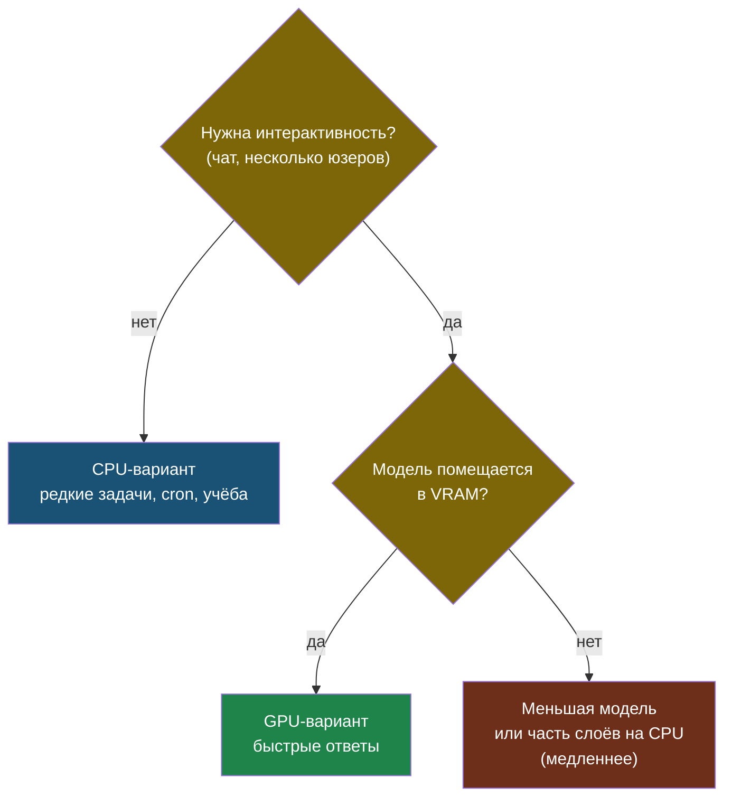

# Глава 7: CPU, GPU и реальные ресурсы

> **Цель:** понимать, почему модель медленная и когда GPU действительно нужен.

---

## 7.1 CPU-вариант

CPU есть почти везде. Поэтому он хорош для старта, обучения и редких задач автоматизации.

Минусы:

- первый ответ может идти 30-60 секунд;
- большая модель может не поместиться в RAM;
- параллельные запросы быстро перегружают сервер.

Плюсы:

- не нужна видеокарта;
- проще установка;
- подходит для cron-скриптов, где скорость не критична.

> **Аналогия:** CPU-запуск модели — как готовить на одной конфорке вместо большой плиты. Можно всё то же самое, просто дольше. Для одного блюда раз в день — нормально. Для ресторана с очередью — нет.

---

Дерево выбора CPU или GPU:



---

## 7.2 GPU-вариант

GPU нужен, если важна интерактивность: чат, несколько пользователей, длинные ответы, модели крупнее.

Проверка NVIDIA GPU:

```bash
nvidia-smi
```

# Пример вывода:
```
Mon May  5 12:50:00 2025
+-----------------------------------------------------------------------------------------+
| NVIDIA-SMI 550.54.15              Driver Version: 550.54.15      CUDA Version: 12.4     |
|-----------------------------------------+------------------------+----------------------+
| GPU  Name                 Persistence-M | Bus-Id          Disp.A | Volatile Uncorr. ECC |
| Fan  Temp   Perf          Pwr:Usage/Cap |           Memory-Usage | GPU-Util  Compute M. |
|                                         |                        |               MIG M. |
|=========================================+========================+======================|
|   0  NVIDIA GeForce RTX 3060       Off  | 00000000:01:00.0  Off |                  N/A |
| 35%   48C    P8              12W / 170W |   2314MiB / 12288MiB  |      0%      Default |
|                                         |                        |                  N/A |
+-----------------------------------------+------------------------+----------------------+

+-----------------------------------------------------------------------------------------+
| Processes:                                                                              |
|  GPU   GI   CI        PID   Type   Process name                            GPU Memory  |
|        ID   ID                                                             Usage      |
|=========================================================================================|
|    0   N/A  N/A     23456      C   /usr/local/bin/ollama                    2312MiB   |
+-----------------------------------------------------------------------------------------+
```

Здесь видно: GPU — RTX 3060 с 12 GB VRAM, из которых 2.3 GB занимает процесс `ollama`. Это значит, что модель загружена в GPU-память и будет работать быстро.

Docker-запуск обычно требует NVIDIA Container Toolkit и параметра `--gpus all`:

```bash
docker run --gpus all -d \
  --name ollama \
  -v ollama:/root/.ollama \
  -p 127.0.0.1:11434:11434 \
  ollama/ollama
```

---

## 7.3 Как понять, что Ollama использует GPU

Два способа:

**1. Посмотреть в nvidia-smi:**
```bash
nvidia-smi | grep ollama
```
Если строка с `ollama` есть и `GPU Memory Usage` > 0 — GPU работает.

**2. Посмотреть логи Ollama:**
```bash
journalctl -u ollama -n 30
# Или для Docker:
docker logs ollama --tail=30
```

# Пример вывода логов с GPU:
```
time=2025-05-05T12:50:01Z level=INFO msg="llm server loaded in 1.23s"
time=2025-05-05T12:50:01Z level=INFO msg="CUDA initialized" device=0 name="NVIDIA GeForce RTX 3060" total_vram=12288MiB available_vram=9974MiB
time=2025-05-05T12:50:01Z level=INFO msg="model loaded on GPU" layers=32 offload=32
```

Строка `model loaded on GPU` и `offload=32` подтверждают: все слои модели загружены на GPU.

Если вместо этого видно `offload=0` или `model loaded on CPU` — GPU не используется. Проверь что CUDA установлена и NVIDIA Container Toolkit настроен.

---

## 7.4 Что мониторить

```bash
free -h
df -h
docker stats --no-stream
docker logs ollama --tail=50
```

Если есть GPU:

```bash
watch -n 1 nvidia-smi
```

---

## 7.5 Практика: измерение скорости

Задай один и тот же prompt двум моделям или двум вариантам запуска и запиши:

| Модель | Железо | Время ответа | Субъективное качество |
|---|---|---|---|
| small | CPU | 20 сек | нормально для простого |
| bigger | CPU/GPU | ... | ... |

Вывод должен быть честным: если маленькая модель решает твою задачу, большая не нужна.

---

> **Если что-то пошло не так:**
>
> **Симптом:** nvidia-smi показывает GPU, но Ollama всё равно медленный и в логах нет строки про CUDA.
>
> Диагностика:
> ```bash
> # Проверить что CUDA видна системе
> nvidia-smi
> nvcc --version
>
> # Для Docker — проверить наличие NVIDIA Container Toolkit
> docker run --rm --gpus all nvidia/cuda:12.0-base nvidia-smi
> ```
>
> Типичные причины:
> - Забыли флаг `--gpus all` при запуске Docker-контейнера.
> - NVIDIA Container Toolkit не установлен: `sudo apt install nvidia-container-toolkit`.
> - Нативный Ollama установлен без поддержки CUDA — переустановить с нужными зависимостями.
>
> **Симптом:** `nvidia-smi` не находится / команда не найдена.
>
> GPU-драйвер не установлен или не та карта. Проверь:
> ```bash
> lspci | grep -i nvidia
> # Если карта есть — установить драйвер по инструкции NVIDIA для своего дистрибутива
> ```
