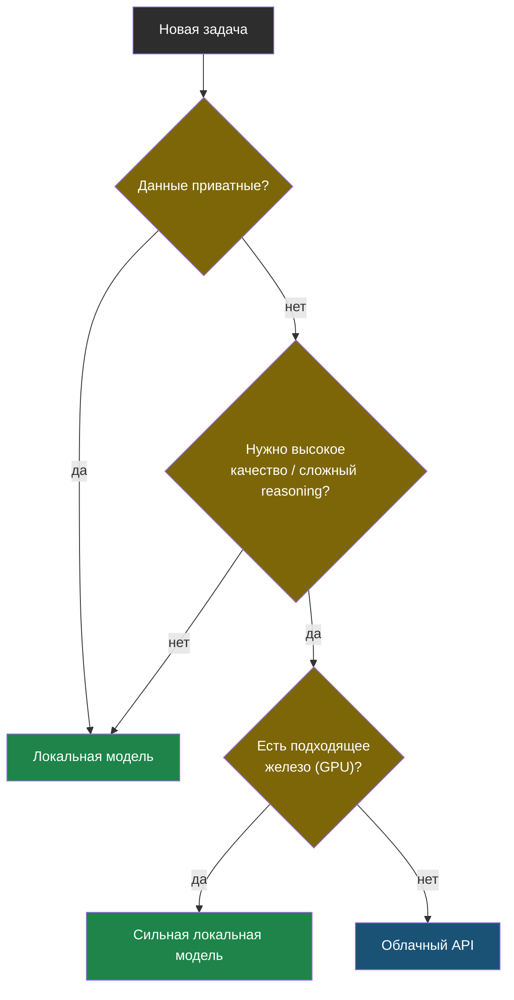

# Глава 9: Локальная модель или облачный API

> **Цель:** выбирать инструмент под задачу, а не спорить "локальное против облачного".

---

## 9.1 Когда локальная модель лучше

Локальная модель подходит, если:

- данные приватные;
- интернет может быть недоступен;
- запросов много и они простые;
- скорость не критична;
- нужно понять, как устроена интеграция.

Примеры: объяснение локальных логов, черновики инструкций, классификация заметок, простые подсказки в скриптах.

**Практический пример:** ты анализируешь логи nginx-сервера, в которых есть внутренние IP-адреса и пути к файлам. Эти данные нельзя отправлять в облако — используй локальную модель. Она ответит медленнее, но данные не покинут сервер.

---

## 9.2 Когда облачный API лучше

Облачная модель подходит, если:

- нужно высокое качество;
- задача сложная;
- нет подходящего железа;
- нужен быстрый ответ;
- можно отправлять данные наружу.

Примеры: сложный анализ архитектуры, глубокий code review, генерация большого текста, задачи где ошибка дорого стоит и нужен сильный reasoning.

**Практический пример:** ты пишешь технический документ об архитектуре публичного open-source проекта. Данные публичны, задача сложная. Облачная модель напишет значительно лучше и быстрее.

---

## 9.3 Таблица: когда какой вариант

| Критерий | Локальная | Облачная |
|---|---|---|
| Приватность данных | да — данные остаются у тебя | нет — данные уходят провайдеру |
| Качество ответа | среднее (зависит от модели) | высокое |
| Скорость без GPU | медленная | быстрая |
| Стоимость | бесплатно за запрос | платно за токен |
| Офлайн-работа | да | нет |
| Простота настройки | сложнее | проще (только API-ключ) |
| Работа с чужими данными | нельзя без согласия | нельзя без согласия |

---

## 9.4 Гибридный подход

```text
приватные логи -> локальная модель
публичная документация -> облачная модель
черновик -> локально
финальная проверка сложной задачи -> облако
```

Главное правило: сначала классифицируй данные, потом выбирай модель.



---

## 9.5 Практика

Возьми пять своих возможных задач и разложи:

| Задача | Данные | Риск | Локально/облако | Почему |
|---|---|---|---|---|
| анализ nginx log | IP и URL | средний | локально | приватность |
| объяснить Dockerfile open-source | публично | низкий | облако | качество |

Проверка: для каждой задачи есть причина выбора, а не просто привычка.

---

> **Если что-то пошло не так:**
>
> **Ситуация:** выбрал локальную модель, но качество ответов неприемлемо для задачи.
>
> Диагностика — проверь по порядку:
> 1. Попробуй более крупную модель — качество часто пропорционально размеру.
> 2. Улучши промпт — дай больше контекста и конкретики в вопросе.
> 3. Если даже большая локальная модель не справляется — это честный повод переключиться на облако для этой конкретной задачи.
>
> **Ситуация:** хочешь использовать облачный API, но не знаешь, можно ли отправлять туда конкретные данные.
>
> Правило проверки: прочитай Terms of Service и Privacy Policy провайдера для твоего тарифного плана. Корпоративные тарифы обычно дают гарантии что данные не используются для обучения. Бесплатные тарифы — часто нет.
