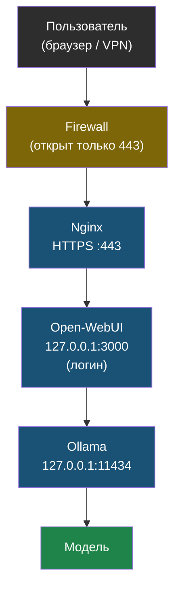

# Глава 10: Итоговый проект

> **Цель:** собрать рабочий AI-сервис и доказать, что он безопасно настроен.

---

## 10.1 Вариант A: личный AI-сервис

Состав:

```text
Ollama
Open-WebUI
Nginx HTTPS
firewall
```

Как этот стек выглядит целиком:



Критерии готовности с командами проверки:

- **WebUI открывается через домен или VPN:**
  ```bash
  curl -I https://ai.example.com
  # Ожидание: HTTP/2 200
  ```

- **Первый пользователь создан и имеет admin-доступ:**
  Войти в Open-WebUI → Settings → Admin Panel — должна быть вкладка администратора.

- **Регистрация закрыта, если она не нужна:**
  ```bash
  # Проверить через браузер: открыть страницу регистрации без авторизации
  curl -s http://localhost:3000/auth/signup | grep -i "disabled\|sign up"
  ```

- **Ollama слушает только localhost:**
  ```bash
  ss -tlnp | grep 11434
  # Ожидание: 127.0.0.1:11434 (не 0.0.0.0:11434)
  ```

- **Порты 11434 и 3000 не доступны снаружи:**
  ```bash
  sudo ufw status | grep -E '11434|3000'
  # Ожидание: DENY для обоих портов
  ```

- **Сервис работает и отвечает:**
  ```bash
  ollama list
  curl http://localhost:11434/api/tags
  curl -I http://localhost:3000
  ```

- **Есть инструкция обновления и просмотра логов:**
  ```bash
  # Обновление контейнеров:
  docker compose pull && docker compose up -d

  # Просмотр логов:
  docker logs ollama --tail=50
  docker logs open-webui --tail=50
  ```

---

## 10.2 Вариант B: AI в скриптах

Состав:

```text
Ollama localhost
bash script
Python script
тестовый log file
```

Критерии готовности с командами проверки:

- **Скрипт вызывает `/api/generate` или `/api/chat`:**
  ```bash
  ./ask-ollama.sh llama3.2:3b "Привет"
  # Ожидание: ответ модели в stdout
  ```

- **Ошибки HTTP обрабатываются:**
  ```bash
  # Проверить что скрипт не падает молча при недоступном API
  # Остановить ollama и запустить скрипт — должно быть понятное сообщение об ошибке
  systemctl stop ollama
  ./ask-ollama.sh llama3.2:3b "test" && echo "OK" || echo "Ошибка обработана"
  systemctl start ollama
  ```

- **Timeout задан:**
  ```bash
  # Убедиться что в Python-скрипте есть параметр timeout=
  grep -n "timeout" script.py
  ```

- **Реальные секреты не отправляются:**
  ```bash
  # Проверить что в тестовом файле нет паролей или токенов
  grep -i "password\|token\|secret\|key" sample.log || echo "Секретов не найдено"
  ```

- **Результат сохраняется или выводится:**
  ```bash
  python3 script.py | head -5
  # Ожидание: читаемый ответ модели
  ```

---

## 10.3 Документация проекта

Создай `AI-SERVICE.md`:

```markdown
# Мой локальный AI-сервис

## Где работает
- Хост:
- Домен/VPN:
- Порты:

## Модели
| Модель | Размер | Для чего | Когда удалять |

## Команды
- Статус:
- Логи:
- Обновление:
- Удаление модели:

## Безопасность
- Ollama снаружи закрыт: да/нет
- WebUI требует логин: да/нет
- HTTPS/VPN: да/нет
```

---

## 10.4 Финальный self-audit

Ответь:

- чем модель отличается от сервера;
- какой порт использует Ollama;
- почему нельзя открывать `11434` в интернет;
- где Open-WebUI хранит данные;
- когда локальная модель хуже облачной;
- как удалить лишнюю модель;
- как проверить, что сервис работает.

Если ты можешь объяснить это другому человеку без терминов "магия" и "нейронка сама понимает", книга достигла цели.

---

> **Если что-то пошло не так:**
>
> **Перед финальной проверкой — беглая диагностика всего стека:**
>
> ```bash
> # 1. Ollama запущен?
> systemctl status ollama
> # или: docker compose ps | grep ollama
>
> # 2. API отвечает?
> curl http://localhost:11434/api/tags
>
> # 3. Модель загружена?
> ollama list
>
> # 4. Open-WebUI запущен?
> docker compose ps | grep open-webui
> curl -I http://localhost:3000
>
> # 5. Nginx передаёт трафик?
> sudo nginx -t
> curl -I https://ai.example.com
>
> # 6. Порты закрыты снаружи?
> sudo ufw status | grep -E '11434|3000'
> ss -tlnp | grep 11434
> ```
>
> Если что-то не работает — смотри в соответствующую главу по номеру шага, который упал.
