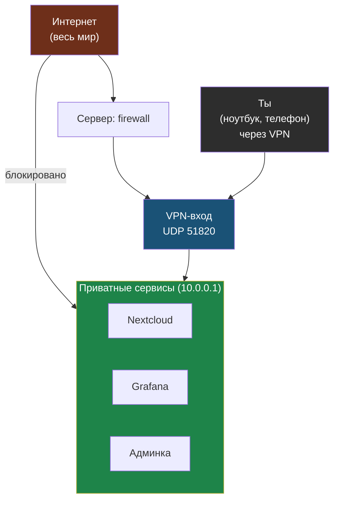

# Глава 0: Зачем нужен VPN

> **Запомни:** VPN нужен не для красоты, а чтобы не выставлять внутренние сервисы всему интернету.

---

## 0.1 Бытовая проблема

У тебя есть сервер. На нём могут быть Nextcloud, Grafana, панель администрирования, тестовые сайты, базы, внутренние инструменты.

Плохой выбор выглядит так:

```text
вариант 1: открыть всё наружу -> удобно, но рискованно
вариант 2: закрыть всё -> безопаснее, но сам не можешь пользоваться
```

WireGuard даёт третий вариант: сервисы слушают приватный VPN-адрес, а ты подключаешься к ним с ноутбука и телефона.



Внутренние сервисы не видны из интернета напрямую — войти к ним можно только через зашифрованный VPN-вход.

---

## 0.2 WireGuard против OpenVPN и IPsec

| Критерий | WireGuard | OpenVPN | IPsec |
|---|---|---|---|
| Сложность | низкая | средняя | высокая |
| Конфиг | короткий | длиннее | сложный |
| Скорость | высокая | нормальная | нормальная |
| Клиенты | есть везде | есть везде | зависит от ОС |
| Учебный старт | лучший | можно, но дольше | не для старта |

Человеческий вывод: для личного сервера и маленькой команды WireGuard обычно проще всего.

---

## 0.3 Что мы не делаем

В этой книге нет корпоративного site-to-site, сложной маршрутизации офисов и глубокого разбора криптографии. Мы строим понятный личный VPN.

---

## 0.4 Практика

Запиши, какие сервисы ты хочешь спрятать за VPN:

| Сервис | Сейчас открыт? | Должен быть через VPN? |
|---|---|---|
| SSH | да | возможно |
| Nextcloud | да | по ситуации |
| Grafana | да/нет | да |
| админка | да/нет | да |

Проверка: у тебя есть список сервисов, которые после проекта не должны быть видны всему интернету.