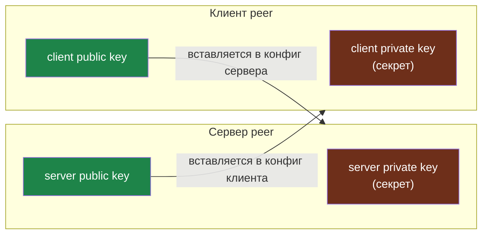
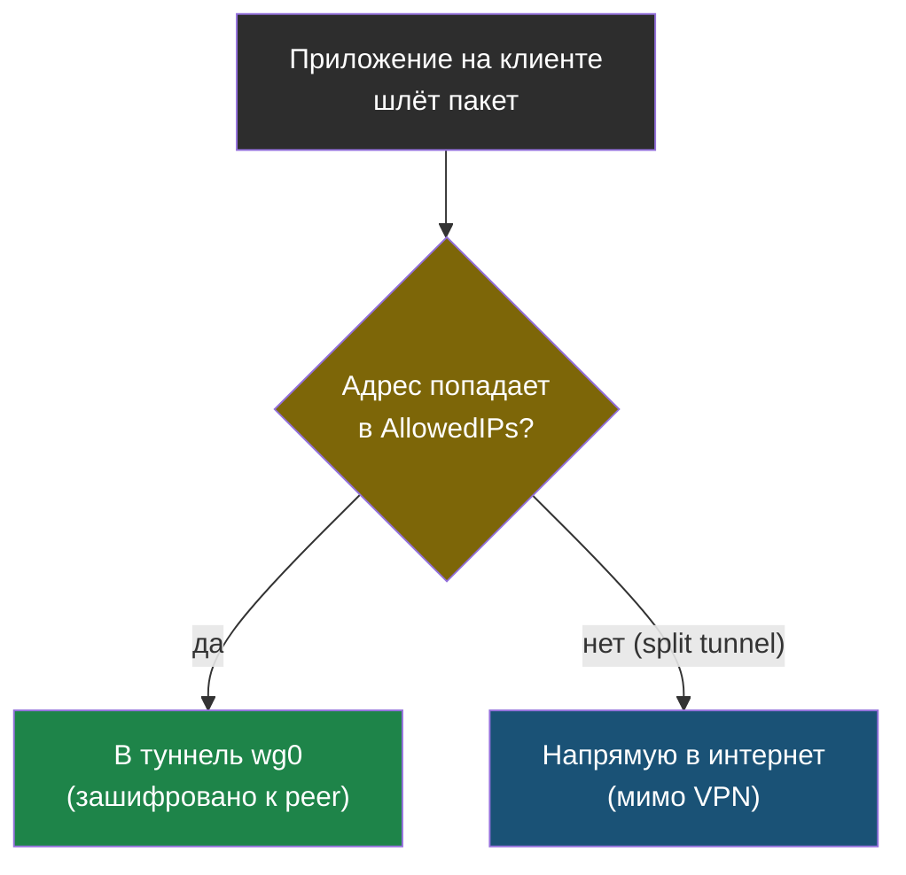

# Глава 1: Как WireGuard думает о ключах и peers

> **Цель:** понять модель WireGuard без сложной криптографии.

---

## 1.1 Peer вместо клиента и сервера

В WireGuard каждый участник называется peer. Один peer обычно слушает публичный UDP-порт на сервере, остальные подключаются к нему. Но технически все они peers.

```text
server peer
  private key
  public key
  VPN IP 10.0.0.1

phone peer
  private key
  public key
  VPN IP 10.0.0.2
```

---

## 1.2 Приватный и публичный ключ

Приватный ключ остаётся только на устройстве. Публичный ключ можно передать другому peer.

Правило простое:

```text
private key -> никому
public key -> можно вставлять в конфиг другого peer
```

> *Публичный ключ — как номер телефона: его можно давать всем. Приватный ключ — как PIN-код от SIM-карты: знаешь только ты. Даже если кто-то знает твой номер телефона, без PIN он ничего не сделает.*



Каждый peer хранит свой приватный ключ у себя и знает только публичный ключ собеседника. Приватные ключи (красные) никогда не покидают устройство.

QR-код клиента содержит приватный ключ. Поэтому QR нельзя отправлять в общий чат или хранить где попало.

---

## 1.3 AllowedIPs

`AllowedIPs` отвечает за маршруты и разрешённые адреса.

На сервере для клиента:

```ini
AllowedIPs = 10.0.0.2/32
```

Это значит: этот peer имеет только адрес `10.0.0.2`.

На клиенте:

```ini
AllowedIPs = 10.0.0.0/24
```

Это split tunnel: через VPN идёт только VPN-сеть.

```ini
AllowedIPs = 0.0.0.0/0
```

Это full tunnel: через VPN идёт почти весь IPv4-трафик.



`AllowedIPs` на стороне клиента — это и список маршрутов в туннель. При `10.0.0.0/24` (split tunnel) в VPN идёт только VPN-сеть, остальное — напрямую. При `0.0.0.0/0` (full tunnel) под условие попадает весь трафик.

---

## 1.4 Практика

Сгенерируй тестовую пару ключей:

```bash
wg genkey | tee privatekey | wg pubkey > publickey
cat publickey
```

```bash
# Пример вывода:
8J3vQkLmN2+XpR7tYwZ5aB1cDfGhIjKoMnOpQrSt4U=
```

```bash
cat privatekey
```

```bash
# Пример вывода:
kNq1WsE2rTy3uIoP4aS5dFgH6jKlZ7xC8vBnMqR0wA=
```

Ключи — длинные строки base64 из 44 символов. Публичный ключ математически вычислен из приватного, но обратный путь невозможен.

> **Если что-то пошло не так:**
>
> Команда `wg genkey` не нашлась → WireGuard ещё не установлен. Перейди к главе 2.
>
> Файл `privatekey` пустой → проблема с правами на директорию. Попробуй `mkdir -p ~/wg-test && cd ~/wg-test` и выполни команду там.

Проверка: ты можешь объяснить, какой файл нельзя показывать никому.