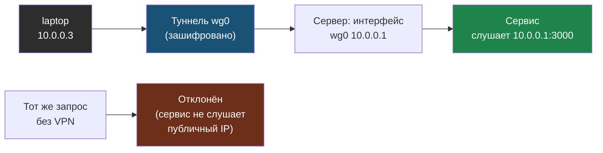

# Глава 8: Итоговый проект

> **Цель:** собрать личную VPN-сеть и спрятать один сервис за WireGuard.

---

## 8.1 Требуемый результат

```text
10.0.0.1 server
10.0.0.2 phone
10.0.0.3 laptop
```

Один сервис должен быть доступен через VPN и недоступен без VPN.



Запрос через VPN доходит до сервиса по адресу `10.0.0.1`; тот же запрос из обычного интернета не проходит, потому что сервис не слушает публичный адрес.

---

## 8.2 Шаги

1. Установить WireGuard.
2. Создать ключи сервера.
3. Создать конфиг первого клиента.
4. Разрешить `51820/udp`.
5. Проверить handshake.
6. Добавить второй клиент.
7. Ограничить доступ к одному сервису через `wg0`.
8. Записать таблицу peers.
9. Описать процедуру отзыва ключа.

---

## 8.3 Документация

Создай `WIREGUARD-RUNBOOK.md`:

```markdown
# WireGuard

## Сеть
- VPN subnet: 10.0.0.0/24
- Server VPN IP: 10.0.0.1
- UDP port: 51820

## Peers
| Device | VPN IP | Public key | Owner | Revoke date |

## Проверка
- status: sudo wg show
- service: systemctl status wg-quick@wg0
- firewall: sudo ufw status verbose

## Отзыв доступа
1. ...
```

---

## 8.4 Финальный чеклист с командами проверки

| Пункт | Команда проверки | Ожидаемый результат |
|---|---|---|
| WireGuard установлен | `wg --version` | строка с версией, например `wireguard-tools v1.0.20210914` |
| Интерфейс поднят | `ip link show wg0` | строка с `wg0` и `state UNKNOWN` (нормально) |
| Сервис включён | `systemctl is-enabled wg-quick@wg0` | `enabled` |
| Порт слушается | `sudo ss -ulnp \| grep 51820` | строка с `UNCONN` и `51820` |
| Firewall разрешает VPN | `sudo ufw status verbose \| grep 51820` | `51820/udp ALLOW IN Anywhere` |
| Handshake свежий | `sudo wg show` | `latest handshake: X seconds ago` (менее 3 минут при активном клиенте) |
| Клиент достижим | `ping -c 3 10.0.0.2` | 3 пакета без потерь |
| IP forwarding включён | `sysctl net.ipv4.ip_forward` | `net.ipv4.ip_forward = 1` |
| Сервис автостартует | `systemctl is-active wg-quick@wg0` | `active` |
| Логи без ошибок | `journalctl -u wg-quick@wg0 --since "1 hour ago" \| grep -i error` | пустой вывод |

**Команды для быстрого полного аудита:**

```bash
echo "=== WireGuard version ===" && wg --version
echo "=== Interface ===" && ip link show wg0
echo "=== WG status ===" && sudo wg show
echo "=== Service ===" && systemctl is-enabled wg-quick@wg0 && systemctl is-active wg-quick@wg0
echo "=== Port ===" && sudo ss -ulnp | grep 51820
echo "=== Firewall ===" && sudo ufw status verbose | grep 51820
echo "=== IP forwarding ===" && sysctl net.ipv4.ip_forward
```

---

## 8.5 Self-audit

Ты должен уметь объяснить:

- что такое private/public key;
- почему один конфиг нельзя ставить на все устройства;
- зачем нужен `AllowedIPs`;
- чем split tunnel отличается от full tunnel;
- как проверить handshake;
- как отозвать доступ потерянного телефона.

Если ответы есть, VPN уже не "магия", а управляемая часть инфраструктуры.