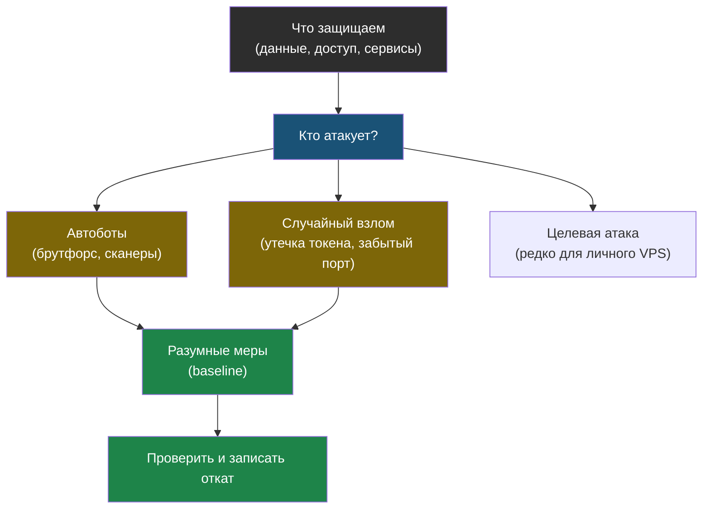

# Глава 0: Threat model

> **Цель:** понять, от кого и что мы защищаем, прежде чем менять настройки.

---

## 0.1 Что такое threat model

Threat model — это простая карта угроз:

- что у нас есть ценного;
- кто может атаковать;
- каким способом;
- что будет, если получится;
- какие меры разумны.

Для личного VPS чаще всего опасны не спецслужбы и не киношные хакеры, а автоматические боты, старые уязвимости, слабые пароли и случайно открытые панели.

> **Аналогия:** Защищать сервер — как защищать квартиру. Тебе не нужна охрана как у президента. Достаточно нормального замка, решёток на окнах и не оставлять ключ под ковриком. Большинство злоумышленников идут туда, где легче.

---

## 0.2 Типовые угрозы

| Угроза | Что делает | Защита |
|---|---|---|
| боты SSH | перебирают пароли | ключи, no password login, fail2ban |
| сканеры интернета | ищут открытые порты | firewall, закрыть лишнее |
| уязвимый сервис | атакуют старую версию | обновления, минимальная публикация |
| утечка токена | используют найденный секрет | ротация, хранение секретов |
| ошибка администратора | сам закрыл доступ | второй SSH-сеанс, rollback |

---

## 0.3 Три сценария атаки: что видно в логах

| Сценарий | Тип атаки | Признаки в логах |
|---|---|---|
| **Брутфорс SSH** | Бот перебирает пароли или логины | `auth.log`: сотни строк `Failed password for invalid user admin from 45.33.32.156` за минуты; одинаковый IP; попытки с root, admin, ubuntu |
| **Эксплуатация сервиса** | Атака на веб-приложение или API | `nginx/access.log`: запросы к `/.env`, `/wp-admin`, `/phpmyadmin`, `/../../../etc/passwd`; код ответа 200 или 404 на нетипичные пути; необычный User-Agent |
| **Взлом через утечку токена** | Кто-то нашёл API-ключ или SSH-ключ | `auth.log`: вход с нового IP в нерабочее время (`Accepted publickey for deploy from 185.220.101.x`); неожиданный cron, новые пользователи, трафик наружу ночью |

---

## 0.4 Что не входит в цель

Мы не строим банковский контур и не пытаемся получить идеальную оценку. Цель: разумный baseline для личного сервера, маленькой команды или учебного проекта.

---

## 0.5 Практика

Заполни таблицу:

| Актив | Что будет при взломе | Открыт наружу? | Защита сейчас |
|---|---|---|---|
| SSH | полный контроль | да | ключ/пароль |
| Nextcloud | файлы | да | HTTPS |
| Grafana | метрики | да/нет | пароль |

Проверка: ты можешь назвать три главных риска своего сервера.
