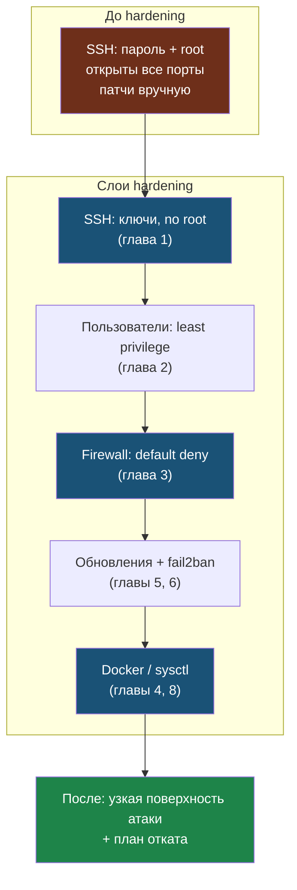

# Глава 9: Итоговый проект

> **Цель:** применить минимальный hardening baseline и оставить план отката.

---

## 9.1 Минимальный baseline

Весь baseline — это слои, которые вместе сужают поверхность атаки:



Для каждого пункта — команда проверки и ожидаемый результат.

**SSH по ключам:**
```bash
ssh -o PreferredAuthentications=publickey user@server echo "ok"
```
Ожидаемый вывод: `ok` (вошёл без запроса пароля)

**`PasswordAuthentication no`:**
```bash
ssh -o PreferredAuthentications=password user@server
```
Ожидаемый вывод: `Permission denied (publickey).`

**`PermitRootLogin no`:**
```bash
ssh root@server
```
Ожидаемый вывод: `Permission denied (publickey).` или `root@server: Permission denied`

**Firewall default deny incoming:**
```bash
sudo ufw status verbose | grep "Default:"
```
Ожидаемый вывод: `Default: deny (incoming), allow (outgoing)`

**Открыты только нужные порты:**
```bash
sudo ufw status numbered
sudo ss -tlnp
```
Ожидаемый вывод: только порты 22, 80, 443 (и другие, которые ты намеренно открыл)

**fail2ban активен:**
```bash
sudo systemctl is-active fail2ban
sudo fail2ban-client status sshd
```
Ожидаемый вывод:
```
active
Status for the jail: sshd
|- Filter
|  |- Currently failed: ...
`- Actions
   |- Currently banned: ...
```

**security updates включены:**
```bash
sudo unattended-upgrade --dry-run -v 2>&1 | tail -5
```
Ожидаемый вывод: список пакетов или `No packages found that can be upgraded unattended`

**lynis запущен до и после:**
```bash
ls -lh /tmp/lynis-before.dat /tmp/lynis-after.dat 2>/dev/null || echo "Файлы отчётов не найдены"
```
Ожидаемый вывод: оба файла существуют и не нулевого размера

---

## 9.2 Расширенный baseline

**sysctl минимум применён и проверен:**
```bash
sysctl net.ipv4.tcp_syncookies net.ipv4.conf.all.accept_redirects
```
Ожидаемый вывод:
```
net.ipv4.tcp_syncookies = 1
net.ipv4.conf.all.accept_redirects = 0
```

**Docker-порты привязаны к localhost где возможно:**
```bash
sudo ss -tlnp | grep docker
```
Ожидаемый вывод: строки с `127.0.0.1:порт` вместо `0.0.0.0:порт`

**Внутренние сервисы доступны через WireGuard:**
```bash
sudo wg show
```
Ожидаемый вывод: список пиров с `latest handshake` не старше нескольких минут (если пир активен)

**Есть список пользователей и sudo-доступов:**
```bash
getent group sudo
awk -F: '$3 >= 1000 && $1 != "nobody" {print $1}' /etc/passwd
```
Ожидаемый вывод: только нужные пользователи в обоих списках

**Есть документ изменений:**
```bash
ls -lh HARDENING-LOG.md 2>/dev/null || echo "Лог не создан"
```

---

## 9.3 Документ изменений

Создай `HARDENING-LOG.md`:

```markdown
# Hardening log

## Дата

## Что изменено
| Изменение | Команда/файл | Проверка | Откат |

## Проверки
- SSH:
- Firewall:
- Docker:
- WireGuard:
- Web:

## Осталось сделать
```

---

## 9.4 Self-audit

Ты должен уметь объяснить:

- что такое поверхность атаки;
- почему SSH-ключи лучше пароля;
- почему второй SSH-сеанс обязателен;
- какие порты открыты и зачем;
- какие изменения могут сломать Docker/WireGuard;
- как откатить каждое важное изменение.
