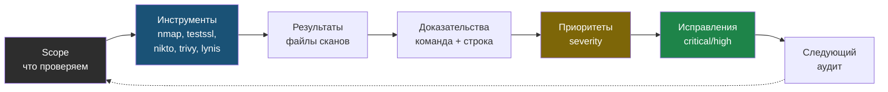

# Базовый ИБ-аудит: проверь свой сервер своими руками

> Книга 26: defensive-аудит своего сервера. Не атака, не пентест чужих систем, а регулярная проверка периметра, TLS, web-заголовков, контейнеров, логов и отчёта.

---

## Оглавление

- [Глава 0: Что такое аудит](chapter-00.md)
- [Глава 1: nmap и периметр](chapter-01.md)
- [Глава 2: SSL/TLS](chapter-02.md)
- [Глава 3: HTTP security headers](chapter-03.md)
- [Глава 4: Nikto без паники](chapter-04.md)
- [Глава 5: Trivy и Docker-образы](chapter-05.md)
- [Глава 6: Lynis в аудите](chapter-06.md)
- [Глава 7: Логи как источник фактов](chapter-07.md)
- [Глава 8: Отчёт](chapter-08.md)
- [Глава 9: Итоговый проект](chapter-09.md)
- [Приложение A: Шаблон отчёта](appendix-a.md)
- [Приложение B: Severity и false positives](appendix-b.md)
- [**Глоссарий**](glossary.md)

---

## Главная идея

Аудит — это не "взломать себя". Это проверить, что реально открыто, какие версии видны, какие предупреждения есть, что из этого важно и что исправлять первым.

```text
scope
  -> инструменты
  -> результаты
  -> доказательства
  -> приоритеты
  -> исправления
  -> следующий аудит
```

Тот же цикл как замкнутый процесс: каждый аудит готовит почву для следующего.

