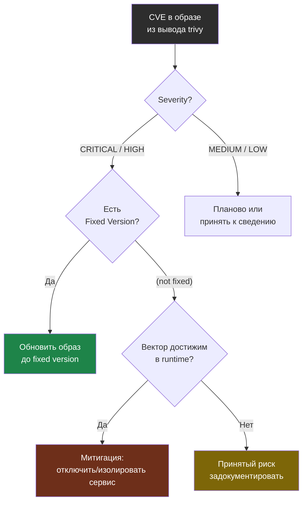

# Глава 5: Trivy и Docker-образы

> **Цель:** увидеть известные CVE в образах и правильно приоритизировать.

---

## 5.1 Установка

Способ установки меняется. Перед реальным использованием проверь актуальную документацию Trivy. Для учебного запуска можно использовать Docker-образ или пакет из репозитория.

---

## 5.2 Сканирование образа

```bash
trivy image nginx:latest | tee audits/2026-05-06/trivy-nginx.txt
```

**Пример полного вывода:**

```
# Пример вывода:
2026-05-06T14:55:01.234Z INFO  Vulnerability scanning is enabled
2026-05-06T14:55:01.235Z INFO  [vuln] Detecting OS packages and language-specific packages...

nginx:latest (debian 12.5)
===========================
Total: 87 (UNKNOWN: 0, LOW: 71, MEDIUM: 12, HIGH: 3, CRITICAL: 1)

┌──────────────────────┬────────────────┬──────────┬──────────────────────┬───────────────────┬───────────────────────────────────────────────────────┐
│       Library        │  Vulnerability │ Severity │  Installed Version   │   Fixed Version   │                         Title                         │
├──────────────────────┼────────────────┼──────────┼──────────────────────┼───────────────────┼───────────────────────────────────────────────────────┤
│ openssl              │ CVE-2024-0727  │ CRITICAL │ 3.0.11-1~deb12u2     │ 3.0.13-1~deb12u1  │ openssl: denial of service via null dereference         │
├──────────────────────┼────────────────┼──────────┼──────────────────────┼───────────────────┼───────────────────────────────────────────────────────┤
│ libexpat1            │ CVE-2023-52425 │ HIGH     │ 2.5.0-1              │ 2.5.0-1+deb12u1   │ expat: parsing huge tokens causes OOM                  │
├──────────────────────┼────────────────┼──────────┼──────────────────────┼───────────────────┼───────────────────────────────────────────────────────┤
│ perl-base            │ CVE-2023-47100 │ HIGH     │ 5.36.0-7             │ 5.36.0-7+deb12u1  │ perl: buffer overflow via crafted regular expression    │
├──────────────────────┼────────────────┼──────────┼──────────────────────┼───────────────────┼───────────────────────────────────────────────────────┤
│ libgnutls30          │ CVE-2024-0553  │ HIGH     │ 3.7.9-2+deb12u2      │ 3.7.9-2+deb12u3   │ gnutls: timing side-channel in RSA key exchange        │
├──────────────────────┼────────────────┼──────────┼──────────────────────┼───────────────────┼───────────────────────────────────────────────────────┤
│ libc-bin             │ CVE-2023-4806  │ MEDIUM   │ 2.36-9+deb12u4       │ (not fixed)       │ glibc: potential use-after-free in getaddrinfo()        │
├──────────────────────┼────────────────┼──────────┼──────────────────────┼───────────────────┼───────────────────────────────────────────────────────┤
│ tar                  │ CVE-2005-2541  │ LOW      │ 1.34+dfsg-1.2        │ (not fixed)       │ tar: does not check for symlinks in world-writable dirs │
└──────────────────────┴────────────────┴──────────┴──────────────────────┴───────────────────┴───────────────────────────────────────────────────────┘
```

---

## 5.3 Как читать таблицу

**Разбор одной строки:**

```
│ openssl │ CVE-2024-0727 │ CRITICAL │ 3.0.11-1~deb12u2 │ 3.0.13-1~deb12u1 │ openssl: denial of service via null dereference │
```

- **Library** (`openssl`) — пакет внутри образа, в котором обнаружена уязвимость.
- **Vulnerability** (`CVE-2024-0727`) — идентификатор уязвимости в базе CVE (Common Vulnerabilities and Exposures). По нему можно найти детали на nvd.nist.gov.
- **Severity** (`CRITICAL`) — уровень опасности: CRITICAL, HIGH, MEDIUM, LOW.
- **Installed Version** (`3.0.11-1~deb12u2`) — версия пакета в образе прямо сейчас.
- **Fixed Version** (`3.0.13-1~deb12u1`) — версия, в которой уязвимость исправлена. Нужно обновиться до неё или выше.
- **Title** — краткое описание уязвимости: здесь OpenSSL может быть обвален через специально созданный запрос (denial of service).

**Что значит `(not fixed)` в колонке Fixed Version:**

```
│ libc-bin │ CVE-2023-4806 │ MEDIUM │ 2.36-9+deb12u4 │ (not fixed) │ ...
```

Исправленной версии ещё нет в репозитории дистрибутива. Это частая ситуация для MEDIUM/LOW. Обновить образ не поможет — нет новой версии. Действие: принять риск или проверить, применима ли уязвимость к твоему сценарию.

---

## 5.4 CRITICAL находка — что делать

```
openssl CVE-2024-0727 CRITICAL — denial of service via null dereference
Fixed Version: 3.0.13-1~deb12u1
```

Шаги:

1. Обнови образ: `docker pull nginx:latest` (если вышел новый образ с патчем).
2. Если `latest` не обновлён — укажи конкретный тег с патчем: `nginx:1.27-alpine`.
3. Если нет обновлённого образа — оцени применимость: сервис nginx не использует openssl напрямую для парсинга пользовательских данных? Тогда риск может быть ниже CRITICAL на практике.
4. Запиши в отчёт: CVE, severity, fixed version, планируемое действие, дата.

---

## 5.5 LOW находки — когда можно игнорировать

```
tar CVE-2005-2541 LOW — (not fixed) — does not check for symlinks in world-writable dirs
```

```
# False positive / принятый риск — объяснение:
# CVE-2005-2541 — уязвимость в tar при работе с symlinks в world-writable директориях.
# В контексте nginx-контейнера tar не используется во время работы сервиса.
# Вектор атаки недостижим: контейнер не обрабатывает tar-архивы от пользователей.
# Fix не выпущен за 20 лет — считается особенностью поведения, а не уязвимостью.
# Принятый риск. Пересмотреть если поменяется use case контейнера.
```

LOW находку можно документировать как принятый риск если:
- нет исправленной версии (`not fixed`);
- уязвимый компонент не используется в runtime-сценарии контейнера;
- CVE имеет старый возраст без активной эксплуатации.

---

## 5.6 Сканирование только HIGH/CRITICAL

```bash
trivy image --severity HIGH,CRITICAL nginx:latest
```

```
# Пример вывода (только серьёзные):
nginx:latest (debian 12.5)
===========================
Total: 4 (HIGH: 3, CRITICAL: 1)
```

---

## 5.7 Все локальные образы

```bash
docker images --format "{{.Repository}}:{{.Tag}}" > audits/2026-05-06/images.txt
```

Дальше сканируй важные образы по одному. Не надо автоматически паниковать от каждой LOW/MEDIUM.

---

## 5.8 Если trivy говорит «No vulnerabilities found»

```
# Пример вывода:
nginx:1.27-alpine (alpine 3.19.1)
==================================
Total: 0 (UNKNOWN: 0, LOW: 0, MEDIUM: 0, HIGH: 0, CRITICAL: 0)
```

Это хорошо — известных CVE нет. Но не значит «безопасно абсолютно»: trivy проверяет только известные уязвимости из баз данных. Zero-day, неправильная конфигурация сервиса и другие риски он не покрывает.

---

## 5.9 Что делать с CVE

| Severity | Действие |
|---|---|
| Critical | обновить срочно или временно отключить сервис |
| High | запланировать быстрое обновление |
| Medium | планово |
| Low | принять к сведению |

Но контекст важен: уязвимый пакет внутри образа может быть недостижим из твоего приложения.

Дерево приоритизации CVE: severity задаёт срочность, но контекст может понизить риск.



---

## 5.10 Практика

Просканируй один важный образ. Запиши top-5 находок HIGH/CRITICAL и действие: обновить образ, заменить образ, принять риск или проверить применимость.
