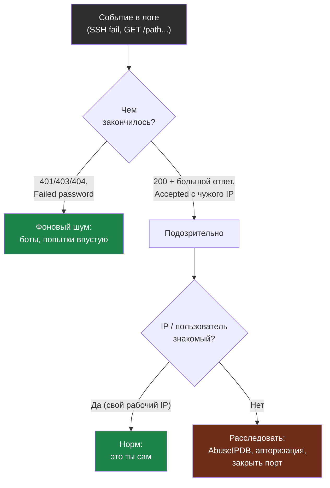

# Глава 7: Логи как источник фактов

> **Цель:** искать не только настройки, но и реальные события.

---

## 7.1 SSH

```bash
grep "Failed password" /var/log/auth.log | tail -20
grep "Accepted" /var/log/auth.log | tail -20
journalctl -u ssh --since "7 days ago"
```

**Пример вывода — нормальный фон (боты bruteforce):**

```
# Пример вывода — grep "Failed password" /var/log/auth.log | tail -20:
May  6 03:12:44 myserver sshd[12301]: Failed password for root from 185.220.101.47 port 44312 ssh2
May  6 03:12:46 myserver sshd[12302]: Failed password for root from 185.220.101.47 port 44314 ssh2
May  6 03:12:48 myserver sshd[12303]: Failed password for admin from 185.220.101.47 port 44316 ssh2
May  6 04:45:12 myserver sshd[13401]: Failed password for root from 91.241.19.88 port 51234 ssh2
May  6 09:33:01 myserver sshd[15200]: Failed password for root from 45.155.205.233 port 39812 ssh2
```

Это **нормальный фон интернета** — автоматизированные боты постоянно пытаются войти как root по SSH. Опасно только если они успешно входят.

**Пример вывода — успешные входы:**

```
# Пример вывода — grep "Accepted" /var/log/auth.log | tail -20:
May  6 10:15:33 myserver sshd[16042]: Accepted publickey for deploy from 203.0.113.100 port 52341 ssh2
May  6 14:22:17 myserver sshd[18901]: Accepted publickey for deploy from 203.0.113.100 port 53102 ssh2
```

Это норм: пользователь `deploy` с вашего рабочего IP заходит по ключу. Если увидишь незнакомый IP или пользователь `root` — расследуй.

Ищи успешные входы в неожиданное время, root login, много ошибок с одного IP.

---

## 7.2 Nginx

```bash
awk '$9 >= 400' /var/log/nginx/access.log | tail -50
grep -E "\.env|wp-login|phpmyadmin|admin" /var/log/nginx/access.log | tail -50
awk '{print $1}' /var/log/nginx/access.log | sort | uniq -c | sort -rn | head -10
```

**Пример вывода — grep на подозрительные пути:**

```
# Пример вывода — нормальный сканирующий бот:
185.220.101.47 - - [06/May/2026:03:14:22 +0000] "GET /.env HTTP/1.1" 404 153 "-" "python-requests/2.28.0"
185.220.101.47 - - [06/May/2026:03:14:23 +0000] "GET /wp-login.php HTTP/1.1" 404 153 "-" "python-requests/2.28.0"
185.220.101.47 - - [06/May/2026:03:14:24 +0000] "GET /phpmyadmin/ HTTP/1.1" 404 153 "-" "python-requests/2.28.0"
91.241.19.88  - - [06/May/2026:04:47:01 +0000] "GET /.git/config HTTP/1.1" 404 153 "-" "Golang net/http"
```

Все запросы вернули `404` — сервер правильно ответил «не существует». Это **нормальный фон**, а не атака. WordPress и phpMyAdmin на этом сервере нет.

**Пример подозрительного вывода (возможный инцидент):**

```
# Пример вывода — подозрительно, требует расследования:
203.0.113.200 - - [06/May/2026:02:33:15 +0000] "GET /admin/export.php?table=users HTTP/1.1" 200 48293 "-" "curl/7.88.0"
203.0.113.200 - - [06/May/2026:02:33:16 +0000] "GET /admin/export.php?table=orders HTTP/1.1" 200 102847 "-" "curl/7.88.0"
```

Запрос к `/admin/export.php` вернул `200` с большим телом ответа (48293 байт — похоже на дамп данных). IP незнакомый. Это не false positive — нужно разобраться: кто этот IP, есть ли авторизация в `/admin/`.

**Топ IP по количеству запросов:**

```bash
awk '{print $1}' /var/log/nginx/access.log | sort | uniq -c | sort -rn | head -10
```

```
# Пример вывода:
   4821 185.220.101.47
   1203 91.241.19.88
    847 45.155.205.233
    312 203.0.113.100
     28 203.0.113.1
```

Первые три IP с тысячами запросов — боты. Проверь их в AbuseIPDB. `203.0.113.100` с 312 запросами — скорее всего ты сам (рабочий IP).

---

## 7.3 Скрипт check-logs.sh: топ-10 атакующих IP за 24 часа

```bash
#!/bin/bash
# check-logs.sh — анализ SSH brute-force за последние 24 часа

LOG="/var/log/auth.log"
SINCE=$(date -d "24 hours ago" "+%b %e")

echo "=== Топ-10 IP по Failed password SSH за последние 24 часа ==="
grep "Failed password" "$LOG" | grep "$SINCE" \
  | awk '{print $(NF-3)}' \
  | sort | uniq -c | sort -rn | head -10

echo ""
echo "=== Успешные входы за последние 24 часа ==="
grep "Accepted" "$LOG" | grep "$SINCE" \
  | awk '{print $1, $2, $3, "user:", $9, "from:", $11}'
```

Использование:

```bash
chmod +x check-logs.sh
sudo ./check-logs.sh
```

```
# Пример вывода:
=== Топ-10 IP по Failed password SSH за последние 24 часа ===
    847 185.220.101.47
    312 91.241.19.88
    203 45.155.205.233
     87 193.142.146.35
     42 194.165.16.11

=== Успешные входы за последние 24 часа ===
May 6 10:15:33 user: deploy from: 203.0.113.100
May 6 14:22:17 user: deploy from: 203.0.113.100
```

Сохрани вывод в папку аудита:

```bash
sudo ./check-logs.sh | tee audits/2026-05-06/ssh-analysis.txt
```

---

## 7.4 Docker logs

```bash
docker ps
docker logs <container> --tail=100
```

Ищи постоянные ошибки авторизации, stack trace, проблемы подключения к БД.

**Пример нормального лога:**

```
# Пример вывода — нормально:
2026-05-06T10:15:33Z INFO  Server started on :3000
2026-05-06T10:15:34Z INFO  Connected to PostgreSQL
2026-05-06T10:16:01Z INFO  GET /api/health 200 2ms
```

**Пример подозрительного лога:**

```
# Пример вывода — требует внимания:
2026-05-06T03:14:22Z WARN  Failed login attempt for user "admin" from 185.220.101.47
2026-05-06T03:14:23Z WARN  Failed login attempt for user "admin" from 185.220.101.47
2026-05-06T03:14:24Z WARN  Failed login attempt for user "root" from 185.220.101.47
2026-05-06T03:14:25Z ERROR Account "admin" locked after 5 failed attempts
```

Множественные неудачные попытки + блокировка аккаунта — брутфорс внутри приложения. Проверь, закрыт ли порт 3000 снаружи через ufw.

---

## 7.5 Практика

Собери 5 фактов из логов:

| Факт | Источник | Это нормально? | Действие |
|---|---|---|---|

Проверка: выводы основаны на строках логов, а не ощущениях.

Как отличить фоновый шум интернета от реального инцидента в логах:


