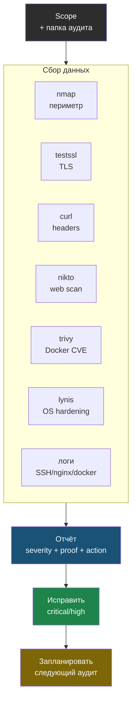

# Глава 9: Итоговый проект

> **Цель:** провести квартальный аудит своего сервера.

---

## 9.1 Шаги

1. Зафиксировать scope.
2. Создать папку аудита.
3. Запустить nmap.
4. Проверить TLS.
5. Проверить headers.
6. Запустить nikto.
7. Просканировать важные Docker-образы.
8. Запустить lynis.
9. Посмотреть SSH/Nginx/Docker logs.
10. Написать отчёт.
11. Исправить critical/high.
12. Запланировать следующий аудит.

Те же шаги как сквозной конвейер: сбор данных каждым инструментом сходится в один отчёт.



---

## 9.2 Сохранение результатов каждого инструмента

Каждый запуск сохраняй в папку с датой:

```bash
# Создать папку аудита
AUDIT_DIR="audits/$(date +%Y-%m-%d)"
mkdir -p "$AUDIT_DIR"

# Scope — заполни вручную
cat > "$AUDIT_DIR/scope.md" << 'EOF'
# Scope аудита

- Домен:
- IP:
- Владелец:
- Дата:
- Что проверяем:
- Что не проверяем:
EOF

# nmap — базовое сканирование
nmap <YOUR_SERVER_IP> -oN "$AUDIT_DIR/nmap-basic.txt"

# nmap — с версиями сервисов
nmap -sV <YOUR_SERVER_IP> -oN "$AUDIT_DIR/nmap-versions.txt"

# TLS
docker run --rm drwetter/testssl.sh https://yourdomain.com \
  | tee "$AUDIT_DIR/testssl.txt"

# HTTP headers
curl -s -D - https://yourdomain.com -o /dev/null \
  | tee "$AUDIT_DIR/headers.txt"

# Nikto
nikto -h https://yourdomain.com -o "$AUDIT_DIR/nikto.txt" -Format txt

# Trivy — все важные образы
docker images --format "{{.Repository}}:{{.Tag}}" > "$AUDIT_DIR/images.txt"
trivy image nginx:latest    | tee "$AUDIT_DIR/trivy-nginx.txt"
trivy image myapp:latest    | tee "$AUDIT_DIR/trivy-myapp.txt"

# Lynis
sudo lynis audit system --quiet 2>&1 | tee "$AUDIT_DIR/lynis.txt"

# SSH логи
grep "Failed password" /var/log/auth.log | grep "$(date '+%b %e')" \
  | awk '{print $(NF-3)}' | sort | uniq -c | sort -rn | head -20 \
  > "$AUDIT_DIR/ssh-failed.txt"

grep "Accepted" /var/log/auth.log | tail -50 \
  > "$AUDIT_DIR/ssh-accepted.txt"

# Nginx — подозрительные запросы
grep -E "\.env|wp-login|phpmyadmin|\.git" /var/log/nginx/access.log \
  | tail -100 > "$AUDIT_DIR/nginx-suspicious.txt"

echo "Все файлы сохранены в $AUDIT_DIR"
ls -la "$AUDIT_DIR"
```

**Пример вывода в конце:**

```
# Пример вывода:
Все файлы сохранены в audits/2026-05-06
total 248
drwxr-xr-x 2 user user  4096 May  6 15:30 .
drwxr-xr-x 8 user user  4096 May  6 15:25 ..
-rw-r--r-- 1 user user  2341 May  6 15:28 headers.txt
-rw-r--r-- 1 user user  4821 May  6 15:29 lynis.txt
-rw-r--r-- 1 user user   512 May  6 15:25 nmap-basic.txt
-rw-r--r-- 1 user user   748 May  6 15:26 nmap-versions.txt
-rw-r--r-- 1 user user  8934 May  6 15:30 nikto.txt
-rw-r--r-- 1 user user   234 May  6 15:25 scope.md
-rw-r--r-- 1 user user   189 May  6 15:31 ssh-accepted.txt
-rw-r--r-- 1 user user   423 May  6 15:31 ssh-failed.txt
-rw-r--r-- 1 user user 24831 May  6 15:27 testssl.txt
-rw-r--r-- 1 user user 12048 May  6 15:30 trivy-nginx.txt
```

---

## 9.3 Критерии готовности

- Есть `scope.md`.
- Есть файлы результатов.
- Есть `report.md`.
- У каждой важной находки есть доказательство.
- False positives отмечены.
- Critical/high имеют действие.
- Дата следующего аудита записана.

---

## 9.4 Self-audit

Ты должен уметь объяснить:

- почему нельзя сканировать чужие IP;
- что такое scope;
- чем open отличается от filtered;
- почему CVE не всегда равно реальная уязвимость;
- зачем отчёт, если сервер твой;
- как определить приоритет исправления.
