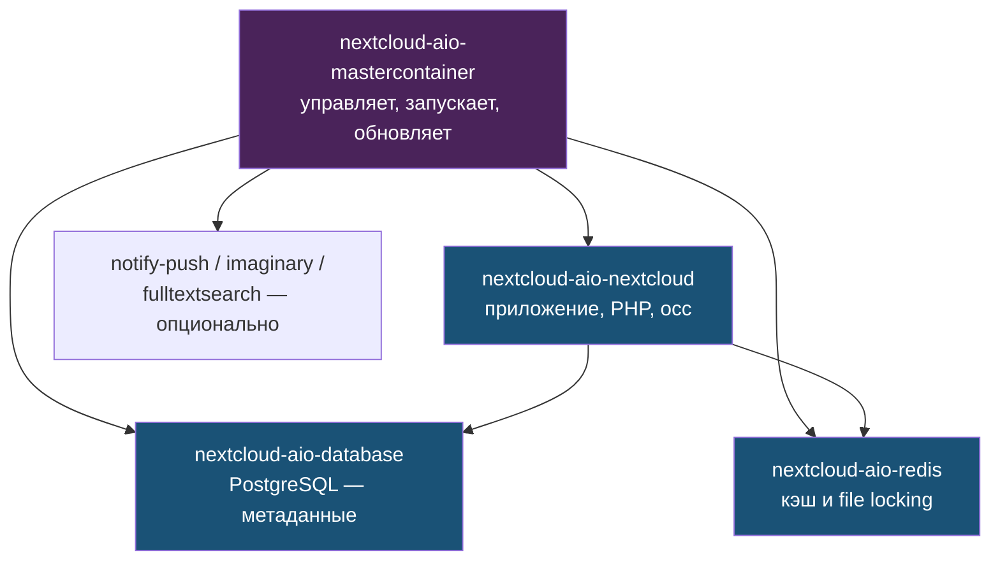
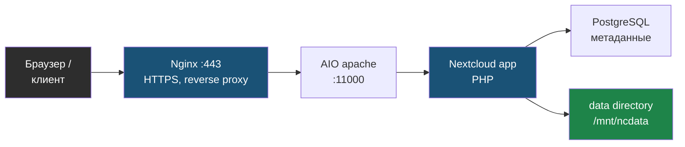

# Глава 0: Что у тебя стоит

> **Цель:** сначала разобраться в существующей установке, а не сразу что-то менять.

---

**Аналогия:** Nextcloud AIO — как кухня ресторана. `nextcloud-aio-mastercontainer` — шеф-повар, который командует остальными: он запускает и останавливает всех. `nextcloud-aio-nextcloud` — основная плита, где готовится еда. `nextcloud-aio-database` — холодильник, где хранятся все продукты (метаданные). `nextcloud-aio-redis` — специи под рукой: быстро, всегда рядом, без них медленнее. Если шеф не работает — кухня стоит.

---

## 0.1 Не начинай с правок

Nextcloud уже работает. Значит первая задача — инвентаризация:

- какие контейнеры запущены;
- какие порты слушают;
- где данные;
- где config;
- где reverse proxy;
- где backup.

---

## 0.2 Контейнеры

```bash
docker ps --format "table {{.Names}}\t{{.Status}}\t{{.Image}}\t{{.Ports}}"
```

# Пример вывода:
```
NAMES                              STATUS          IMAGE                                    PORTS
nextcloud-aio-mastercontainer      Up 12 days      nextcloud/all-in-one:latest              0.0.0.0:8080->8080/tcp
nextcloud-aio-nextcloud            Up 12 days      nextcloud/aio-nextcloud:latest           0.0.0.0:11000->80/tcp
nextcloud-aio-database             Up 12 days      nextcloud/aio-postgresql:latest
nextcloud-aio-redis                Up 12 days      nextcloud/aio-redis:latest
nextcloud-aio-notify-push          Up 12 days      nextcloud/aio-notify-push:latest
nextcloud-aio-imaginary            Up 12 days      nextcloud/aio-imaginary:latest
nextcloud-aio-fulltextsearch       Up 12 days      nextcloud/aio-fulltextsearch:latest
```

```bash
docker volume ls | grep nextcloud
```

# Пример вывода:
```
local     nextcloud_aio_backupdir
local     nextcloud_aio_database
local     nextcloud_aio_database_dump
local     nextcloud_aio_mastercontainer
local     nextcloud_aio_nextcloud
local     nextcloud_aio_nextcloud_data
local     nextcloud_aio_redis
```

Имена контейнеров в AIO обычно похожи на `nextcloud-aio-nextcloud`, но сначала всегда проверяй реальные имена через `docker ps`.

Как устроена связка контейнеров AIO (mastercontainer управляет остальными):



---

## 0.3 Config без утечки секретов

Не публикуй полный `config.php`. Там могут быть пароли, salts, secret и домены.

Лучше смотреть отдельные значения через `occ config:system:get`, когда `occ` уже настроен.

Если всё же смотришь файл локально:

```bash
docker exec nextcloud-aio-nextcloud ls -l /var/www/html/config
```

# Пример вывода:
```
total 28
-rw-r----- 1 www-data www-data  329 Jan 14 10:22 CAN_INSTALL
-rw-r----- 1 www-data www-data 3187 Apr 28 09:11 config.php
-rw-r----- 1 www-data www-data  763 Jan 14 10:22 config.sample.php
drwxr-x--- 2 www-data www-data 4096 Jan 14 10:22 lost+found
```

```bash
docker inspect nextcloud-aio-nextcloud --format '{{json .Mounts}}' | python3 -m json.tool | grep -A5 '"Destination": "/var/www/html"'
```

# Пример вывода (сокращённый):
```json
{
    "Type": "volume",
    "Name": "nextcloud_aio_nextcloud",
    "Source": "/var/lib/docker/volumes/nextcloud_aio_nextcloud/_data",
    "Destination": "/var/www/html",
    "Mode": "",
    "RW": true,
    "Propagation": ""
},
{
    "Type": "volume",
    "Name": "nextcloud_aio_nextcloud_data",
    "Source": "/var/lib/docker/volumes/nextcloud_aio_nextcloud_data/_data",
    "Destination": "/mnt/ncdata",
    "Mode": "",
    "RW": true,
    "Propagation": ""
}
```

Не вставляй полный вывод в чат или документацию.

---

## 0.4 Схема установки

Нарисуй свою схему:

```text
internet
  -> Nginx host :443
  -> AIO/Nextcloud internal port
  -> nextcloud app
  -> PostgreSQL
  -> Redis
  -> data directory
```

Тот же путь запроса в виде потока — от браузера до данных:



---

## 0.5 Практика

Создай таблицу:

| Компонент | Имя/путь | Как проверить |
|---|---|---|
| Nextcloud container | | `docker ps` |
| Database | | `docker ps` |
| Redis | | `docker ps` |
| Data directory | | `docker inspect` |
| Nginx config | | `nginx -T` |

Проверка: ты можешь показать схему своей установки без раскрытия секретов.

---

> **Если что-то пошло не так:**
>
> **Симптом:** `docker ps` показывает не все контейнеры AIO, некоторые в статусе `Exited`.
>
> ```bash
> # Посмотреть все контейнеры, включая остановленные
> docker ps -a | grep nextcloud
>
> # Посмотреть, почему контейнер упал
> docker logs nextcloud-aio-database --tail=50
>
> # Запустить через mastercontainer (правильный способ для AIO)
> # Открыть AIO interface: http://localhost:8080 или https://localhost:8443
> ```
>
> **Симптом:** `docker volume ls | grep nextcloud` не показывает ничего — возможно, другое имя docker-сети или проект. Проверь:
> ```bash
> docker volume ls
> docker info | grep -i "storage"
> ```
