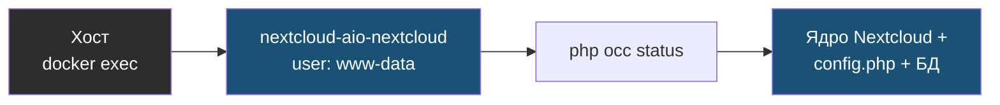

# Глава 1: occ — командная строка Nextcloud

> **Цель:** управлять Nextcloud через официальный CLI-инструмент.

---

## 1.1 Что такое occ

`occ` — командная строка Nextcloud. Через неё проверяют статус, приложения, пользователей, индексы, maintenance mode и многое другое.

В AIO команда обычно выглядит так:

```bash
docker exec --user www-data nextcloud-aio-nextcloud php occ status
```

Если имя контейнера другое, замени его на своё из `docker ps`.

Что происходит, когда ты запускаешь `occ` снаружи контейнера:



Важно: `occ` запускается под пользователем `www-data` (отсюда `--user www-data`). Под `root` команда либо откажется работать, либо испортит права на файлы.

---

## 1.2 Удобная функция

```bash
occ() {
  docker exec --user www-data nextcloud-aio-nextcloud php occ "$@"
}
```

Добавлять в `~/.bashrc` стоит только после проверки вручную.

---

## 1.3 Базовые команды

```bash
occ status
```

# Пример вывода:
```
  - installed: true
  - version: 28.0.4.1
  - versionstring: 28.0.4
  - edition: Community
  - maintenance: false
  - needsDbUpgrade: false
  - productname: Nextcloud
  - extendedSupport: false
```

```bash
occ app:list
```

# Пример вывода:
```
Enabled:
  - accessibility: 1.17.0
  - activity: 2.20.0
  - admin_audit: 1.17.0
  - calendar: 4.6.4
  - contacts: 5.5.2
  - deck: 1.12.4
  - files: 1.24.0
  - files_pdfviewer: 2.9.0
  - files_sharing: 1.20.0
  - files_trashbin: 1.17.0
  - notes: 4.9.3
  - photos: 2.3.2
  - tasks: 0.15.0
  - viewer: 2.2.0
Disabled:
  - admin_audit_log_purger
  - bruteforcesettings
  - cadviewer
  - oauth2
```

```bash
occ db:add-missing-indices
```

# Пример вывода:
```
Check indices of the share table.
Check indices of the filecache table.
Check indices of the twofactor_providers table.
Check indices of the login_flow_v2 table.
Check indices of the whats_new table.
Check indices of the cards table.
Check indices of the cards_properties table.
Adding additional systemtag_object_mapping index to the oc_systemtag_object_mapping table, this can take some time...
systemtag_object_mapping table updated successfully.
Done.
```

Если индексов не хватало — ты увидишь строки `Adding ... index`. Если всё актуально:

```
No missing indexes have been found.
```

```bash
occ maintenance:mode --on
```

# Пример вывода:
```
Maintenance mode enabled
```

```bash
occ maintenance:mode --off
```

# Пример вывода:
```
Maintenance mode disabled
```

---

```bash
occ system:check
occ maintenance:repair
```

---

## 1.4 Безопасность

Некоторые команды выводят настройки. Не публикуй вывод `occ config:list system` целиком: там могут быть чувствительные значения.

---

## 1.5 Практика

Выполни:

```bash
occ status
occ app:list
occ system:check
```

Запиши версию Nextcloud и список включённых приложений. Практика завершена, если ты можешь запускать `occ` без копирования длинной команды каждый раз.

---

> **Если что-то пошло не так:**
>
> **Симптом:** `occ status` выдаёт `Nextcloud is in maintenance mode - no commands allowed`.
>
> Это значит, что maintenance mode уже включён и команды заблокированы. Выходи через:
> ```bash
> docker exec --user www-data nextcloud-aio-nextcloud php occ maintenance:mode --off
> ```
>
> Если и это не помогает, maintenance mode прописан прямо в config.php. Проверь:
> ```bash
> docker exec nextcloud-aio-nextcloud grep -n "maintenance" /var/www/html/config/config.php
> ```
> Ищи строку `'maintenance' => true`. Если нашёл, отключи через occ ещё раз — или вручную (крайний случай): замени `true` на `false`.
>
> **Симптом:** `occ: command not found` — функция не добавлена в текущую сессию. Добавь в терминал:
> ```bash
> occ() { docker exec --user www-data nextcloud-aio-nextcloud php occ "$@"; }
> ```
>
> **Симптом:** `Error while trying to create admin user: An account with this username already exists` при `occ user:add` — пользователь уже есть, используй `occ user:info`.
