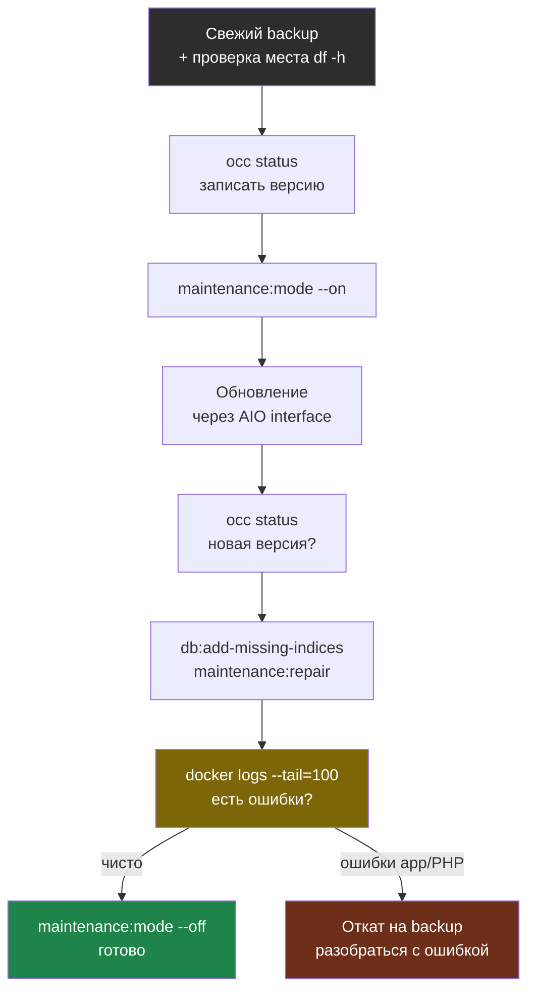

# Глава 2: Обновления

> **Цель:** обновлять Nextcloud не на удачу, а по чеклисту.

---

## 2.1 Виды обновлений

| Что обновляется | Риск | Как проверять |
|---|---|---|
| приложения | средний | `occ app:list`, UI |
| Nextcloud core | выше | release notes, backup |
| AIO containers | выше | AIO interface, logs |
| host packages | зависит | apt logs, reboot |

---

## 2.2 Чеклист перед обновлением

- есть свежий backup;
- backup проверен хотя бы иногда restore drill;
- есть свободное место;
- известны текущие версии;
- есть окно обслуживания;
- понятно, как выключить maintenance mode.

Команды:

```bash
occ status
```

# Пример вывода (до обновления):
```
  - installed: true
  - version: 27.1.7.1
  - versionstring: 27.1.7
  - edition: Community
  - maintenance: false
  - needsDbUpgrade: false
```

```bash
df -h
```

# Пример вывода:
```
Filesystem      Size  Used Avail Use% Mounted on
/dev/sda1        50G   31G   17G  65% /
/dev/sdb1       200G  142G   48G  75% /data
```

```bash
docker ps
```

---

## 2.3 После обновления

```bash
occ status
```

# Пример вывода (после обновления):
```
  - installed: true
  - version: 28.0.4.1
  - versionstring: 28.0.4
  - edition: Community
  - maintenance: false
  - needsDbUpgrade: false
```

```bash
occ system:check
occ db:add-missing-indices
```

# Пример вывода:
```
Adding primary key to the oc_authtoken table, this can take some time...
oc_authtoken table updated successfully.
Adding index to oc_calendarobjects_props table, this can take some time...
oc_calendarobjects_props table updated successfully.
Done.
```

```bash
occ maintenance:repair
docker logs nextcloud-aio-nextcloud --tail=100
```

Если приложение несовместимо, не включай его обратно вслепую. Сначала проверь логи и совместимость.

Весь цикл обновления как workflow — от бэкапа до проверки:



---

## 2.4 Практика

Составь свой `UPDATE-CHECKLIST.md`. Не обязательно обновляться прямо сейчас. Главное — чтобы перед следующим обновлением у тебя был порядок действий.

---

> **Если что-то пошло не так:**
>
> **Симптом:** обновление зависло, Nextcloud остался в `maintenance: true` и не выходит.
>
> Подождите 5–10 минут — иногда обновление просто долго идёт. Затем:
> ```bash
> # Смотреть что происходит в реальном времени
> docker logs nextcloud-aio-nextcloud --follow --tail=50
>
> # Если процесс явно завис — выйти из maintenance mode
> occ maintenance:mode --off
>
> # Затем запустить ремонт
> occ maintenance:repair
> ```
>
> **Симптом:** после обновления Nextcloud выдаёт ошибку 500 (Internal Server Error).
>
> ```bash
> # Смотреть свежие логи — там будет стек ошибки
> docker logs nextcloud-aio-nextcloud --tail=200 2>&1 | grep -i "error\|exception\|fatal"
>
> # Пример ошибки в логах:
> # [error] [no app in context] Error PHP Call to undefined function OCA\Photos\Sabre\...
>
> # Отключить проблемное приложение
> occ app:disable photos
>
> # Запустить полный ремонт
> occ maintenance:repair
>
> # Проверить снова
> occ status
> ```
>
> **Симптом:** `needsDbUpgrade: true` в выводе `occ status`.
>
> ```bash
> occ upgrade
> occ db:add-missing-indices
> occ db:add-missing-columns
> ```
