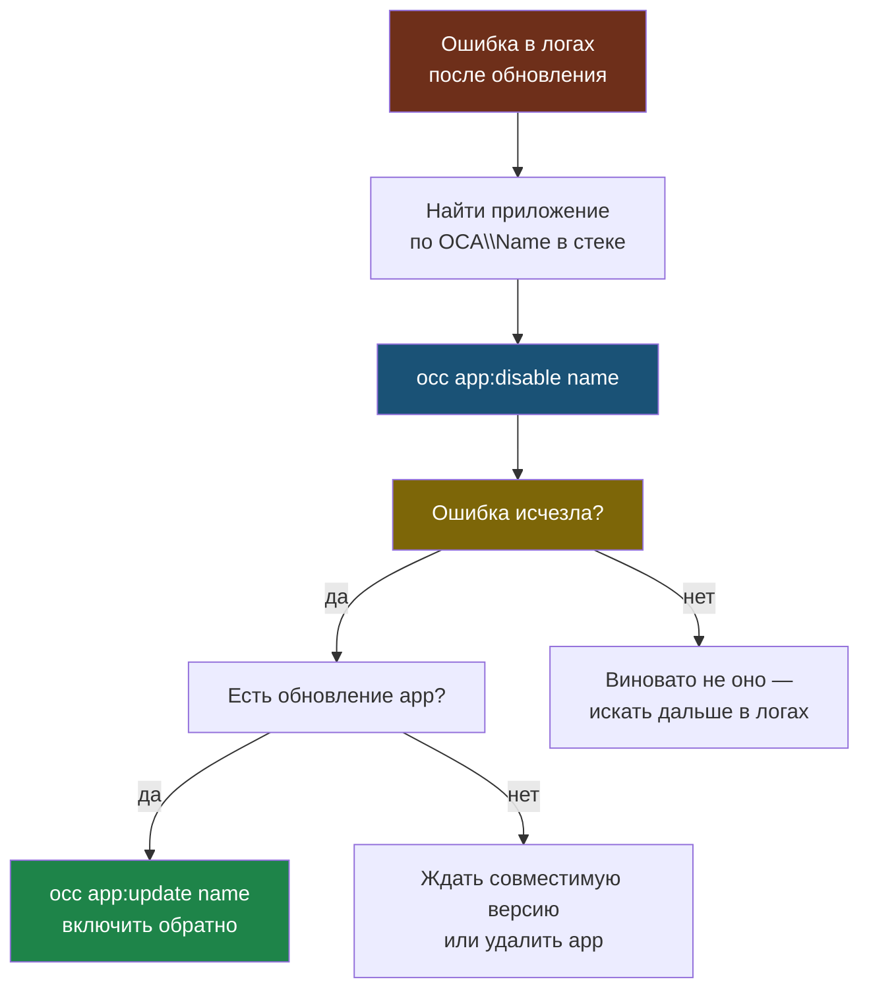

# Глава 3: Приложения

> **Цель:** понимать, что приложения могут ломать Nextcloud не хуже системных обновлений.

---

## 3.1 Список приложений

```bash
occ app:list
```

Раздели приложения:

| Приложение | Нужно? | Критичность | Комментарий |
|---|---|---|---|

---

## 3.2 Установка и отключение

```bash
occ app:install notes
```

# Пример вывода:
```
notes enabled
```

```bash
occ app:enable notes
```

# Пример вывода:
```
notes enabled
```

```bash
occ app:update --all
```

# Пример вывода:
```
notes updated
calendar updated
contacts updated
deck updated
tasks is up to date
files_pdfviewer is up to date
viewer is up to date
photos updated
Update done
```

```bash
occ app:disable notes
```

```bash
occ app:remove cadviewer
```

# Пример вывода:
```
cadviewer removed
```

Перед удалением проверь, не хранит ли приложение важные данные.

---

## 3.3 Несовместимость

После обновлений приложение может вызвать ошибки PHP или deprecated API. Алгоритм:

1. посмотреть логи;
2. временно отключить приложение;
3. проверить, исчезла ли ошибка;
4. найти обновление или альтернативу;
5. удалить только после понимания последствий.

Пример строки ошибки в `docker logs` из-за проблемного приложения:

```
2024-04-28T11:23:14+00:00 nextcloud.ERROR: Error PHP Recoverable fatal error: Argument 1 passed to OCA\CadViewer\Controller\DisplayController::__construct() must be of the type string, null given, called in /var/www/html/apps/cadviewer/lib/AppInfo/Application.php on line 42 {"app":"PHP","method":"GET","url":"/apps/dashboard/"} []
```

Как читать эту строку:
- `nextcloud.ERROR` — уровень ошибки: это критично, не просто предупреждение;
- `OCA\CadViewer\...` — виновное приложение (`cadviewer`);
- `AppInfo/Application.php on line 42` — точное место в коде;
- `"url":"/apps/dashboard/"` — при каком запросе сломалось;
- причина: приложение получило `null` вместо строки — скорее всего несовместимо с текущей версией Nextcloud.

Действие: `occ app:disable cadviewer`.

Алгоритм разбора несовместимости как дерево решений:



---

## 3.4 Практика

Выбери одно необязательное приложение и изучи его: версия, включено ли, есть ли ошибки в логах. Не тренируйся на критичном приложении с реальными данными.

---

> **Если что-то пошло не так:**
>
> **Симптом:** после установки или обновления приложения в логах появились ошибки, Nextcloud открывается с задержкой или выдаёт белую страницу.
>
> ```bash
> # Смотреть свежие ошибки
> docker logs nextcloud-aio-nextcloud --tail=100 2>&1 | grep -i "error\|exception"
>
> # Найти виновное приложение по имени в стеке
> # Например, если в ошибке "OCA\Deck\..." — отключить deck
> occ app:disable deck
>
> # Проверить, исчезла ли ошибка
> docker logs nextcloud-aio-nextcloud --tail=20 2>&1 | grep -i error
>
> # Если помогло — приложение несовместимо с текущей версией Nextcloud
> # Ждать обновления приложения или удалить
> ```
>
> **Симптом:** `occ app:install someapp` выдаёт `not found` или `incompatible`.
>
> ```bash
> # Проверить точное имя приложения на apps.nextcloud.com
> # Или посмотреть доступные:
> occ app:list --shipped
> ```
