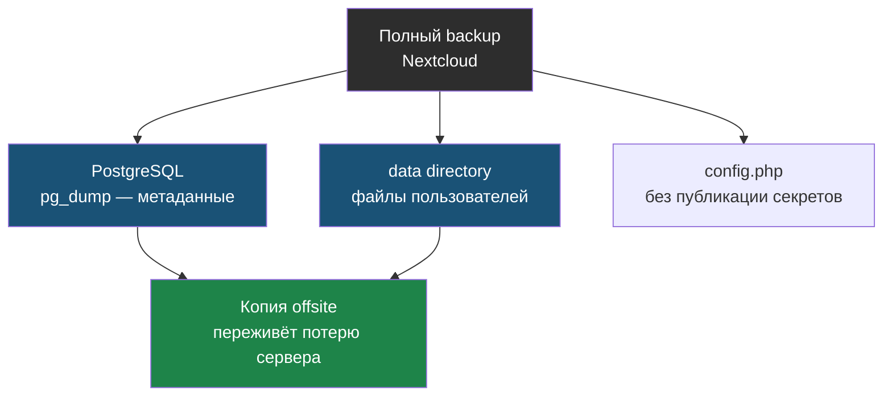
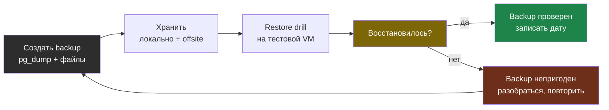

# Глава 5: Бэкапы и restore drill

> **Цель:** backup не считается рабочим, пока ты не проверил восстановление.

---

**Аналогия:** Бэкап без restore drill — как огнетушитель с сорванной пломбой. Может быть, он сработает. А может, давление давно упало. Узнаешь в самый неподходящий момент. Restore drill — это ты сам, в спокойной обстановке, проверяешь: огнетушитель работает.

---

## 5.1 Что нужно защищать

- данные пользователей;
- PostgreSQL;
- `config.php` без публикации секретов;
- настройки AIO;
- custom apps/themes, если есть.

Что входит в полный бэкап Nextcloud — три обязательные части:



---

## 5.2 Варианты

| Вариант | Плюсы | Минусы | Когда использовать |
|---|---|---|---|
| AIO backup | штатно для AIO | надо изучить restore | основной вариант |
| pg_dump + files | понятно вручную | риск неконсистентности | обучение и доп. контроль |
| VPS snapshot | быстро | не заменяет app backup | перед обновлением |
| offsite backup | переживёт потерю сервера | сложнее | для важных данных |

---

## 5.3 Maintenance mode

Перед ручным консистентным бэкапом часто включают:

```bash
occ maintenance:mode --on
# backup
occ maintenance:mode --off
```

Если забыл выключить:

```bash
occ maintenance:mode --off
```

---

## 5.4 Пример ручного бэкапа (pg_dump + файлы)

```bash
#!/bin/bash
BACKUP_DIR="/data/backups/nextcloud"
DATE=$(date +%Y-%m-%d_%H%M)

mkdir -p "$BACKUP_DIR"

# Включить maintenance mode
docker exec --user www-data nextcloud-aio-nextcloud php occ maintenance:mode --on

# Дамп базы
docker exec nextcloud-aio-database \
  pg_dump -U nextcloud nextcloud_database \
  | gzip > "$BACKUP_DIR/db-$DATE.sql.gz"

# Выключить maintenance mode
docker exec --user www-data nextcloud-aio-nextcloud php occ maintenance:mode --off

echo "Backup done: $BACKUP_DIR/db-$DATE.sql.gz"
ls -lh "$BACKUP_DIR/db-$DATE.sql.gz"
```

# Пример вывода скрипта:
```
Maintenance mode enabled
Maintenance mode disabled
Backup done: /data/backups/nextcloud/db-2024-04-28_0300.sql.gz
-rw-r--r-- 1 root root 287M Apr 28 03:01 /data/backups/nextcloud/db-2024-04-28_0300.sql.gz
```

```bash
ls -lh /data/backups/nextcloud/
```

# Пример вывода:
```
total 1.7G
-rw-r--r-- 1 root root 271M Apr 21 03:01 db-2024-04-21_0300.sql.gz
-rw-r--r-- 1 root root 279M Apr 24 03:01 db-2024-04-24_0300.sql.gz
-rw-r--r-- 1 root root 287M Apr 28 03:01 db-2024-04-28_0300.sql.gz
```

---

## 5.5 Проверка целостности бэкапа

Минимальная проверка без восстановления:

```bash
file /data/backups/nextcloud/db-2024-04-28_0300.sql.gz
```

# Пример вывода:
```
db-2024-04-28_0300.sql.gz: gzip compressed data, last modified: Sun Apr 28 03:01:22 2024, max compression
```

Если файл повреждён — вывод будет `data` или ошибка. Дополнительно:

```bash
zcat /data/backups/nextcloud/db-2024-04-28_0300.sql.gz | head -5
```

# Пример вывода (первые строки корректного дампа):
```
--
-- PostgreSQL database dump
--

-- Dumped from database version 15.5
```

---

## 5.6 Restore drill

Restore drill — тест восстановления на отдельном стенде. Не на боевом Nextcloud.

Цикл «бэкап считается рабочим только после проверки восстановления»:



Минимальная проверка:

- backup-файл существует;
- размер похож на реальный;
- архив открывается;
- dump БД читается;
- на тестовой VM понятен порядок восстановления.

Пример восстановления дампа (на тестовой машине):

```bash
docker exec -i nextcloud-aio-database \
  psql -U nextcloud nextcloud_database \
  < <(zcat /data/backups/nextcloud/db-2024-04-28_0300.sql.gz)
```

# Пример вывода (сокращённый):
```
SET
SET
SET
SET
SET
 set_config
------------

(1 row)

...
ALTER TABLE
ALTER TABLE
```

---

## 5.7 Практика

Опиши свой backup plan:

| Что | Где backup | Как часто | Как восстановить | Когда проверял |
|---|---|---|---|---|

Практика завершена только если есть дата последней проверки восстановления или план, когда ты её сделаешь.

---

> **Если что-то пошло не так:**
>
> **Симптом:** backup-скрипт упал на `pg_dump` с ошибкой `could not connect to database`.
>
> ```bash
> # Скорее всего контейнер базы недоступен или перегружен
> docker ps | grep database
>
> # Включить maintenance mode ПЕРЕД дампом, чтобы база не была занята
> occ maintenance:mode --on
>
> # Повторить pg_dump
> ```
>
> **Симптом:** `zcat backup.sql.gz | head -5` выдаёт `gzip: stdin: unexpected end of file`.
>
> Файл повреждён — скрипт был прерван в процессе. Этот бэкап непригоден. Проверь предыдущий, и разберись почему скрипт упал (место на диске, таймаут).
>
> ```bash
> df -h
> dmesg | tail -20
> ```
