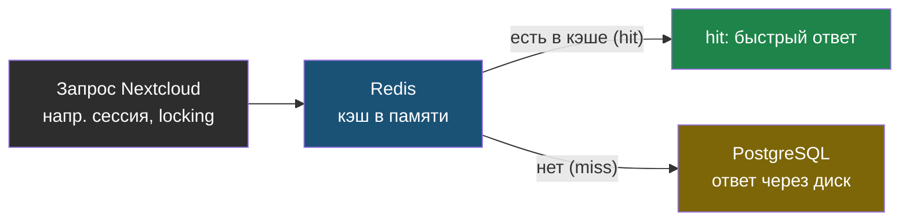
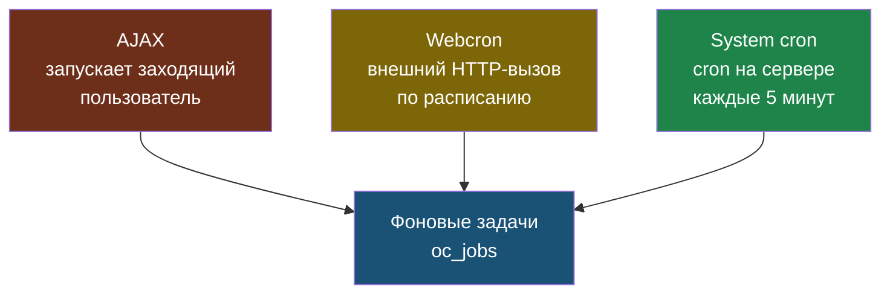

# Глава 6: Redis, cron и производительность

> **Цель:** понимать базовые причины медленной работы Nextcloud.

---

**Аналогия:** Redis — как почтовый ящик у двери. Когда Nextcloud нужен ответ на частый вопрос (например, «залогинен ли пользователь»), он сначала смотрит в ящик, а не идёт каждый раз в базу через весь коридор. Если ящик пуст или сломан — каждый запрос идёт «в базу через коридор», и всё тормозит.

---

## 6.1 Redis

Redis помогает с кэшем и file locking.

```bash
docker exec nextcloud-aio-redis redis-cli ping
```

# Пример вывода:
```
PONG
```

Если не `PONG` — Redis недоступен (смотри раздел «Если что-то пошло не так»).

```bash
docker exec nextcloud-aio-redis redis-cli info | grep -E "used_memory_human|keyspace_hits|keyspace_misses|connected_clients"
```

# Пример вывода:
```
used_memory_human:47.23M
connected_clients:8
keyspace_hits:1482934
keyspace_misses:12847
```

**Как читать:** `keyspace_hits` должны значительно превышать `keyspace_misses`. В примере выше соотношение ~115:1 — Redis работает эффективно. Если hits и misses примерно равны — кэш почти не помогает, возможно Redis слишком часто очищается или неправильно настроен.

Откуда берётся ускорение — Redis отвечает раньше, чем запрос дойдёт до БД:



Проверка настроек Redis в Nextcloud:

```bash
occ config:system:get redis
```

# Пример вывода:
```
Array
(
    [host] => nextcloud-aio-redis
    [port] => 6379
    [timeout] => 0
    [password] =>
    [dbindex] => 0
)
```

---

## 6.2 Фоновые задачи

В Nextcloud есть три подхода:

| Режим | Как работает | Оценка |
|---|---|---|
| AJAX | при заходе пользователей | плохо для сервера |
| Webcron | внешний HTTP-вызов | компромисс |
| System cron | cron на сервере | лучший вариант |

Проверь предупреждения в админке и документации AIO.

Три способа запускать фоновые задачи — что их триггерит:



AJAX плох тем, что задачи выполняются, только пока кто-то заходит; ночью встанут. System cron — лучший вариант: запускается по расписанию независимо от посетителей.

---

## 6.3 Индексы и ремонт

```bash
occ db:add-missing-indices
occ maintenance:repair
occ files:scan --all --unscanned
```

`files:scan --all` может быть тяжёлой командой. Не запускай её часто на большой инсталляции без причины.

---

## 6.4 Практика

Проверь Redis, режим фоновых задач и предупреждения в админке. Запиши найденное в документацию.

---

> **Если что-то пошло не так:**
>
> **Симптом:** в Admin → Overview (или `occ system:check`) появились предупреждения про file locking, session, или Redis недоступен.
>
> ```bash
> # Проверить статус контейнера Redis
> docker ps | grep redis
>
> # Если не запущен — запустить
> docker start nextcloud-aio-redis
>
> # Проверить логи
> docker logs nextcloud-aio-redis --tail=30
>
> # Перезапустить Redis (крайний случай — сбросит кэш, это нормально)
> docker restart nextcloud-aio-redis
>
> # После перезапуска проверить
> docker exec nextcloud-aio-redis redis-cli ping
> ```
>
> **Симптом:** Nextcloud стал значительно медленнее без видимой причины.
>
> ```bash
> # Проверить Redis (кэш)
> docker exec nextcloud-aio-redis redis-cli ping
>
> # Проверить место на диске
> df -h
>
> # Посмотреть предупреждения
> occ system:check
>
> # Проверить индексы БД
> occ db:add-missing-indices
>
> # Посмотреть режим cron в админке или через occ
> occ config:app:get core backgroundjobs_mode
> ```
>
> **Симптом:** `docker exec nextcloud-aio-redis redis-cli ping` зависает.
>
> Redis не отвечает. Контейнер может быть в состоянии OOM-kill или зависания:
> ```bash
> docker stats nextcloud-aio-redis --no-stream
> docker logs nextcloud-aio-redis --tail=20
> docker restart nextcloud-aio-redis
> ```
