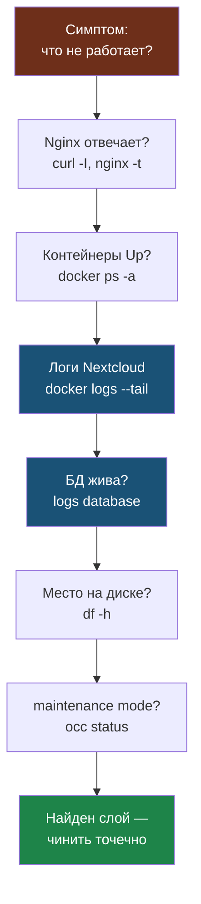
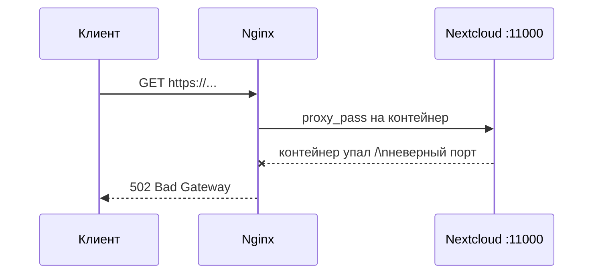

# Глава 7: Диагностика

> **Цель:** идти от симптома к слою, а не перезапускать всё подряд.

---

**Аналогия:** Диагностика Nextcloud — как осмотр пациента. Сначала меришь температуру (`docker ps`), потом слушаешь сердце (`docker logs`), потом анализы (`occ status`). Неопытный врач сразу делает операцию. Опытный — ищет симптом, который укажет на слой.

---

## 7.1 Алгоритм

1. Что именно не работает?
2. Открывается ли Nginx?
3. Живы ли контейнеры?
4. Что в логах Nextcloud?
5. Жива ли БД?
6. Есть ли место на диске?
7. Не включён ли maintenance mode?

Тот же алгоритм как дерево: идём по слоям от внешнего к внутреннему, пока не найдём виноватый.



---

## 7.2 Команды

```bash
docker ps
```

# Пример вывода (всё хорошо):
```
NAMES                              STATUS          PORTS
nextcloud-aio-mastercontainer      Up 5 days       0.0.0.0:8080->8080/tcp
nextcloud-aio-nextcloud            Up 5 days       0.0.0.0:11000->80/tcp
nextcloud-aio-database             Up 5 days
nextcloud-aio-redis                Up 5 days
```

# Пример вывода (проблема — nextcloud упал):
```
NAMES                              STATUS
nextcloud-aio-mastercontainer      Up 5 days
nextcloud-aio-nextcloud            Exited (1) 2 minutes ago
nextcloud-aio-database             Up 5 days
nextcloud-aio-redis                Up 5 days
```

```bash
docker logs nextcloud-aio-nextcloud --tail=100
```

# Пример вывода (без ошибок):
```
2024-04-28 09:12:01 [INFO] Nextcloud is not in maintenance mode.
2024-04-28 09:12:01 [INFO] cron run done
2024-04-28 09:13:01 [INFO] cron run done
2024-04-28 09:14:01 [INFO] cron run done
```

# Пример вывода (с ошибкой):
```
2024-04-28 11:23:14 [error] [no app in context] Error PHP Fatal error: Uncaught Error: Call to a member function getStorage() on null in /var/www/html/apps/deck/lib/DAV/...
#0 /var/www/html/lib/private/Files/Node/Node.php(136): ...
2024-04-28 11:23:14 [error] [no app in context] {"reqId":"abc123","level":3,"time":"2024-04-28T11:23:14+0000","remoteAddr":"172.18.0.1","user":"admin","app":"PHP","method":"GET","url":"/apps/deck/","message":"..."}
```

```bash
docker logs nextcloud-aio-nextcloud 2>&1 | grep -i error
```

# Пример вывода:
```
2024-04-28 11:23:14 [error] Error PHP Fatal error: Uncaught Error: Call to a member function...
2024-04-28 11:25:02 [error] [files] Unable to read file at /mnt/ncdata/admin/files/Documents/old.docx
```

```bash
docker logs nextcloud-aio-database --tail=100
docker logs nextcloud-aio-redis --tail=50
df -h
occ status
occ system:check
```

Nginx:

```bash
sudo nginx -t
sudo journalctl -u nginx --since "1 hour ago"
```

---

## 7.3 Типовые проблемы

| Симптом | Проверить | Частое действие |
|---|---|---|
| сайт не открывается | Nginx, DNS, контейнер | `nginx -t`, `docker ps` |
| белая страница | app logs | отключить проблемное app |
| ошибки БД | database logs | проверить контейнер/диск |
| медленно | Redis, cron, disk | проверить warnings |
| maintenance mode | `occ status` | `occ maintenance:mode --off` |

---

## 7.4 Runbook «Nextcloud не открывается»

Конкретный пошаговый алгоритм с командами и ожидаемым результатом:

**Шаг 1: Проверить DNS и внешний доступ**

```bash
curl -I https://nextcloud.yourdomain.com
```

Ожидаемо: `HTTP/2 200` или `HTTP/2 302`. Если `Could not resolve host` — проблема в DNS. Если `Connection refused` или таймаут — идём дальше.

**Шаг 2: Проверить Nginx**

```bash
sudo nginx -t
sudo journalctl -u nginx --since "30 min ago" | tail -20
```

Ожидаемо: `nginx: configuration file /etc/nginx/nginx.conf test is successful`. Если ошибка — исправить конфиг Nginx.

**Шаг 3: Проверить контейнеры**

```bash
docker ps -a | grep nextcloud
```

Ожидаемо: все контейнеры в статусе `Up`. Если какой-то `Exited` — читать логи этого контейнера.

**Шаг 4: Читать логи Nextcloud**

```bash
docker logs nextcloud-aio-nextcloud --tail=50 2>&1
```

Ожидаемо: только `[INFO]` строки. Если есть `[error]` или `[fatal]` — читать сообщение, найти виновное приложение, отключить.

**Шаг 5: Проверить базу данных**

```bash
docker logs nextcloud-aio-database --tail=20
docker exec -it nextcloud-aio-database psql -U nextcloud -c "SELECT 1;"
```

Ожидаемо: `?column? = 1`. Если база не отвечает — смотри раздел про PostgreSQL.

**Шаг 6: Проверить место на диске**

```bash
df -h
docker system df
```

Ожидаемо: использование менее 90%. Если диск заполнен — Nextcloud не сможет писать логи и работать.

**Шаг 7: Проверить maintenance mode**

```bash
occ status
```

Ожидаемо: `maintenance: false`. Если `true`:

```bash
occ maintenance:mode --off
```

---

## 7.5 Ошибка 502 Bad Gateway

Если браузер показывает `502 Bad Gateway`:

- **Nginx работает** — иначе была бы ошибка соединения;
- **Nextcloud (контейнер) не отвечает** — Nginx не может достучаться до него.

Где именно рвётся цепочка при 502:



То есть Nginx жив (он и вернул 502), а вот апстрим — контейнер Nextcloud — недоступен или указан не тот порт.

```bash
# Проверить контейнер
docker ps | grep nextcloud-aio-nextcloud

# Посмотреть логи — там будет причина падения
docker logs nextcloud-aio-nextcloud --tail=50

# Если контейнер Exited — запустить через AIO или:
docker start nextcloud-aio-nextcloud
```

Если контейнер запустился, но 502 не уходит — проверь что порт в конфиге Nginx совпадает с портом контейнера:

```bash
docker ps --format "{{.Names}}\t{{.Ports}}" | grep nextcloud-aio-nextcloud
```

---

## 7.6 Практика

Создай runbook «Nextcloud не открывается» из 7 шагов. В каждом шаге должна быть команда и ожидаемый результат.
