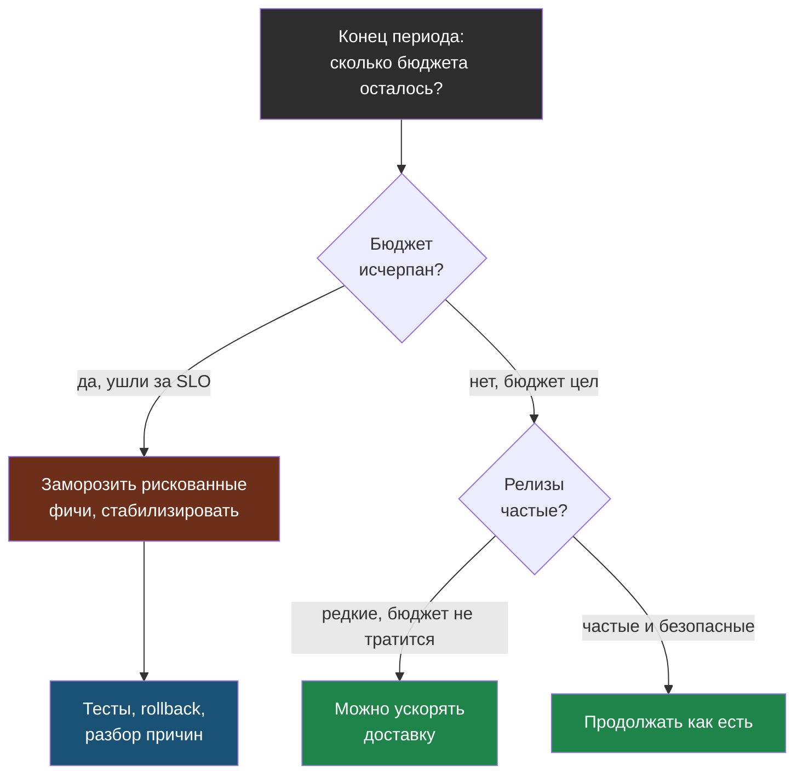

# Глава 5: Error budget

> **Цель:** понять, как балансировать скорость изменений и надёжность.

---

## 5.1 Что такое error budget

Error budget — это "бюджет ошибок", который остаётся после выбранного SLO.

Если SLO = 99%, значит за период допустимо 1% плохого времени или плохих запросов. Это не разрешение ломать сервис специально. Это способ принимать решения без паники.

---

## 5.2 Простой расчёт

```text
SLO: 99.5% доступность за 30 дней
30 дней × 24 часа × 60 минут = 43 200 минут
43 200 × 0.5% = 216 минут ≈ 3.6 часа
```

Если сервис упал на 4 часа, бюджет исчерпан. Значит, новые фичи стоит притормозить и заняться стабильностью.

Если за месяц было 30 минут недоступности из 216, бюджет почти цел. Можно продолжать релизы.

---

## 5.3 Зачем это нужно

Без error budget спор выглядит так:

```text
разработка: хотим быстрее выкатывать фичи
эксплуатация: нельзя, всё сломается
```

С error budget спор становится измеримым:

```text
бюджет почти исчерпан -> стабилизируем
бюджет есть -> можно выпускать изменения
```

---

## 5.4 Таблица решений

| Ситуация | Что делать |
|---|---|
| бюджет быстро тратится после релизов | меньше фич, больше тестов и rollback |
| бюджет не тратится, релизы редкие | можно ускорять доставку |
| нет измерений | сначала мониторинг |
| пользователи всё равно жалуются | SLI выбран неправильно |

Эта таблица — по сути политика error budget. В виде дерева решений она показывает, как один и тот же сигнал ведёт к разным действиям:



---

## 5.5 Практика

Посчитай error budget для 30 дней:

| SLO | Допустимый плохой процент | Минуты за 30 дней |
|---|---|---|
| 99% | 1% | 432 минуты |
| 99.5% | 0.5% | 216 минут |
| 99.9% | 0.1% | 43.2 минуты |

Ответь: какой уровень реалистичен для твоего проекта и почему? Если ты один и без дежурства, 99.9% может быть слишком дорогой целью.