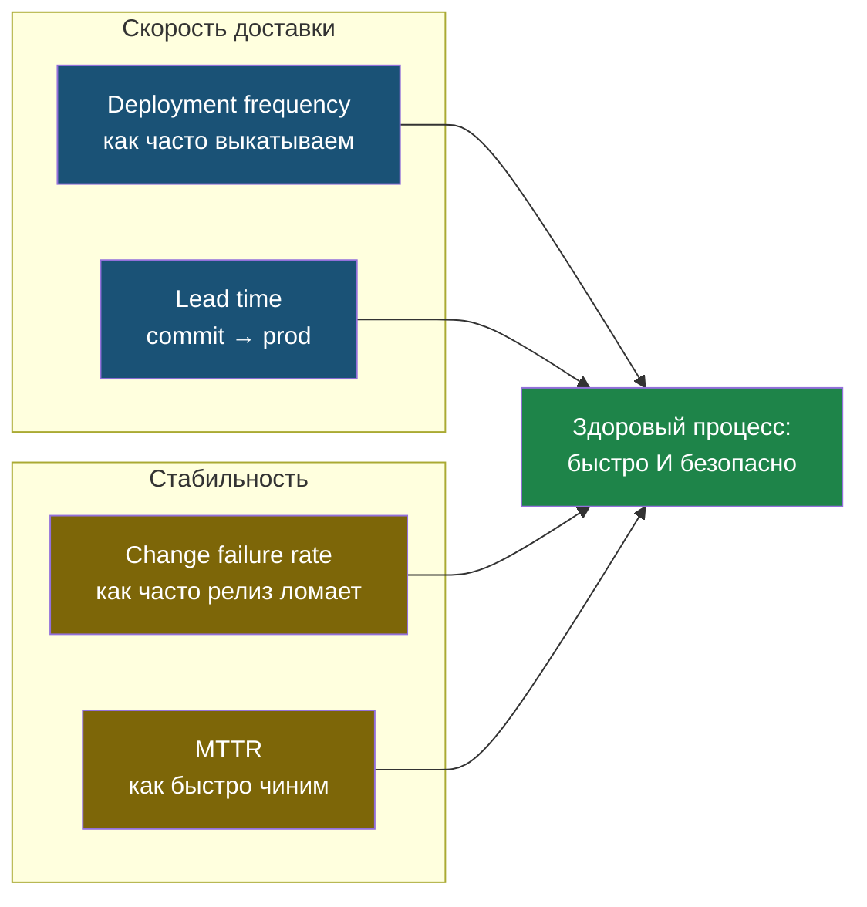

# Глава 6: DORA-метрики без KPI-театра

> **Цель:** измерять процесс доставки изменений, не превращая метрики в наказание.

---

## 6.1 Четыре метрики

DORA выделяет четыре важные метрики:

| Метрика | Простой вопрос |
|---|---|
| Deployment frequency | как часто мы выкатываем изменения? |
| Lead time for changes | сколько времени от commit до prod? |
| Change failure rate | как часто релиз ломает сервис? |
| MTTR | как быстро восстанавливаемся после сбоя? |

Они полезны не потому, что модные. Они показывают узкие места.

Четыре метрики делятся на две пары: одна про скорость доставки, другая про стабильность. Здоровый процесс держит обе стороны, а не жертвует одной ради другой:



---

## 6.2 Как не испортить метрики

Плохое использование:

```text
кто деплоит меньше всех — плохой сотрудник
у кого инцидент — виноват
нужно любой ценой деплоить чаще
```

Хорошее использование:

```text
почему релизы редкие?
почему восстановление занимает час?
почему каждый четвёртый релиз ломает прод?
что в процессе мешает людям работать безопасно?
```

Метрика должна улучшать систему, а не пугать людей.

---

## 6.3 Пример оценки учебного проекта

```text
Deployment frequency:  1 раз в 2 недели
Lead time:             3 дня от commit до prod
Change failure rate:   2 из 8 релизов сломали что-то = 25%
MTTR:                  около 40 минут
```

Вывод:

- деплой редкий;
- ошибки релизов слишком частые;
- восстановление относительно быстрое;
- главный шаг — добавить smoke-test и сделать деплой меньше по размеру.

---

## 6.4 Для одного человека

Даже если ты один, можно вести простой журнал релизов:

| Дата | Что выкатил | Был сбой? | Время восстановления | Вывод |
|---|---|---|---|---|

Через месяц ты увидишь не ощущения, а факты.

---

## 6.5 Практика

Оцени один свой проект:

| Метрика | Моё значение | Что улучшить |
|---|---|---|
| Deployment frequency | | |
| Lead time | | |
| Change failure rate | | |
| MTTR | | |

Выбери одну метрику для улучшения. Не пытайся улучшать всё сразу.