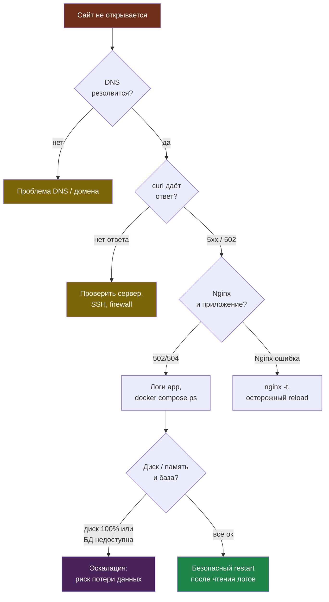
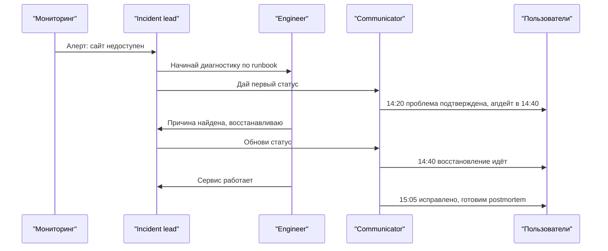

# Глава 8. Инциденты: runbook, playbook, postmortem

Инцидент — это ситуация, когда сервис работает хуже, чем должен: сайт не открывается, бот не отвечает, деплой сломал продакшен, база данных не запускается, диск закончился, сертификат истёк.

Главная мысль этой главы:

> Инцидент нельзя превращать в героический хаос. Его нужно превращать в понятную процедуру.

Для этого нужны три документа:

- **runbook** — что делать в конкретной технической ситуации;
- **playbook** — как организовать работу людей во время инцидента;
- **postmortem** — что произошло, почему и как не повторить.

---

## 8.1. Зачем нужны runbook'и

Плохой вариант:

> «Сайт упал. Все бегают. Один человек что-то помнит. Второй пишет заказчику. Третий перезапускает всё подряд».

Хороший вариант:

> «Есть инструкция. Сначала проверяем DNS, потом Nginx, потом приложение, потом базу, потом диск. Каждый шаг понятен».

Runbook нужен не для красоты. Он нужен, чтобы:

- не зависеть от памяти одного человека;
- не делать опасные действия в панике;
- быстрее находить причину;
- обучать новых людей;
- одинаково решать повторяющиеся проблемы.

---

## 8.2. Минимальный шаблон runbook'а

Хороший runbook должен отвечать на вопросы:

1. **Как понять, что проблема именно эта?**
2. **Что проверить сначала?**
3. **Какие команды можно выполнять безопасно?**
4. **Какие действия опасны и требуют подтверждения?**
5. **Как восстановить работу?**
6. **Когда звать более опытного человека?**
7. **Что записать после решения?**

Пример структуры:

```markdown
# Runbook: <название проблемы>

## Симптомы
- Что видит пользователь.
- Что видит мониторинг.
- Какие ошибки в логах.

## Быстрая проверка
- Команда 1.
- Команда 2.
- Что считается нормой.

## Возможные причины
1. Причина А.
2. Причина Б.
3. Причина В.

## Безопасные действия
- Действия, которые можно выполнять без риска потери данных.

## Опасные действия
- Действия, которые можно делать только после бэкапа/согласования.

## Восстановление
- Пошаговый план возврата сервиса в рабочее состояние.

## Эскалация
- Когда и кому передавать проблему.

## Что записать после инцидента
- Время начала.
- Время восстановления.
- Причина.
- Что исправили.
- Что нужно улучшить.
```

---

## 8.3. Пример runbook: сайт не открывается

### Симптомы

Пользователь пишет:

> «Сайт не открывается».

Возможные варианты:

- домен не резолвится;
- сервер недоступен;
- Nginx не отвечает;
- приложение упало;
- база данных недоступна;
- закончился диск;
- истёк TLS-сертификат.

### Шаг 1. Проверить домен

```bash
nslookup example.com
```

Если домен не резолвится — проблема может быть в DNS.

### Шаг 2. Проверить HTTP-ответ

```bash
curl -I https://example.com
```

Примеры:

- `200` — сайт отвечает;
- `301/302` — редирект;
- `403` — запрещено;
- `404` — страница не найдена;
- `500` — ошибка приложения;
- `502/504` — часто проблема между Nginx и приложением.

### Шаг 3. Проверить сервер

```bash
ssh user@example.com
```

Если SSH не работает, возможны:

- сервер выключен;
- IP недоступен;
- firewall заблокировал доступ;
- проблемы у хостинга.

### Шаг 4. Проверить Nginx

```bash
sudo systemctl status nginx
sudo nginx -t
```

Если конфигурация сломана:

```bash
sudo nginx -t
```

Сначала исправить ошибку, только потом перезапускать:

```bash
sudo systemctl reload nginx
```

### Шаг 5. Проверить приложение

Для Docker Compose:

```bash
docker compose ps
docker compose logs --tail 100 app
```

Для systemd-сервиса:

```bash
sudo systemctl status my-app
sudo journalctl -u my-app -n 100 --no-pager
```

### Шаг 6. Проверить диск и память

```bash
df -h
free -h
```

Если диск заполнен на 100%, приложение может не писать логи, базу или временные файлы.

### Безопасное восстановление

Безопасные действия:

```bash
sudo systemctl reload nginx
docker compose restart app
```

Но даже перезапуск лучше делать осознанно: сначала посмотреть логи, чтобы не стереть важную информацию о причине.

### Когда эскалировать

Эскалировать нужно, если:

- есть риск потери данных;
- база данных повреждена;
- проблема длится дольше допустимого времени;
- непонятно, что именно сломалось;
- нужно выполнять опасные команды.

Порядок диагностики идёт от внешнего к внутреннему — от DNS к базе, чтобы не чинить приложение, когда на самом деле лёг сервер:



---

## 8.4. Пример runbook: база данных PostgreSQL не запускается

Это один из самых важных runbook'ов, потому что база данных обычно хранит реальные данные пользователей.

### Симптомы

- приложение пишет `connection refused`;
- контейнер PostgreSQL постоянно перезапускается;
- в логах есть `database system is shut down`, `permission denied`, `no space left on device`, `could not open file`;
- сайт отвечает ошибкой 500 или 502.

### Правило безопасности

Перед действиями с базой данных запомните:

> С базой данных нельзя работать в режиме «давай что-нибудь удалим и перезапустим».

Безопасно:

- смотреть статус;
- читать логи;
- проверять свободное место;
- проверять конфигурацию;
- делать копию/снимок перед изменениями.

Опасно:

- удалять volume;
- менять владельца файлов рекурсивно;
- чистить директорию данных;
- запускать восстановление поверх существующей базы;
- выполнять миграции без бэкапа.

### Шаг 1. Проверить контейнер

```bash
docker ps -a | grep postgres
```

Если контейнер в состоянии `Restarting`, смотрим логи:

```bash
docker logs postgres --tail 100
```

### Шаг 2. Проверить место на диске

```bash
df -h
docker system df
```

Если диск заполнен, сначала ищем, что можно безопасно удалить.

Относительно безопасно:

```bash
docker image prune -f
```

Но нельзя бездумно удалять volumes:

```bash
# НЕ выполнять в панике:
# docker volume rm postgres_data
```

Volume может содержать единственную копию базы.

### Шаг 3. Проверить права на файлы

```bash
docker inspect postgres | grep -A 20 'Mounts'
```

Если PostgreSQL пишет `permission denied`, не надо сразу выполнять `chown -R`.

Сначала нужно:

1. остановить приложение, которое пишет в базу;
2. сделать снимок сервера или копию volume;
3. понять, под каким UID/GID должен работать PostgreSQL;
4. проверить путь к volume;
5. только потом менять права.

Пример диагностической команды:

```bash
ls -la /var/lib/docker/volumes/postgres_data/_data/
```

Опасная команда, только после бэкапа и проверки пути:

```bash
# ВНИМАНИЕ: пример, не копировать вслепую.
# sudo chown -R 999:999 /var/lib/docker/volumes/postgres_data/_data/
```

Почему это опасно: если ошибиться в пути или UID, можно сделать базу ещё менее рабочей.

### Шаг 4. Сделать аварийную копию volume

Перед восстановлением или правкой файлов полезно сделать копию volume на уровне файлов.

Пример для Docker volume:

```bash
docker run --rm \
  -v postgres_data:/data:ro \
  -v /backups:/backups \
  alpine \
  tar czf /backups/postgres_data_emergency_$(date +%F_%H-%M).tar.gz -C /data .
```

Если есть возможность сделать snapshot у хостинга — лучше сделать и его.

### Шаг 5. Восстановление из нормального бэкапа

Восстановление нужно делать не «поверх живой базы», а по плану.

Общий безопасный порядок:

1. объявить maintenance window;
2. остановить приложение;
3. сохранить аварийную копию текущего состояния;
4. поднять чистую базу в новом volume или на отдельном сервере;
5. восстановить dump;
6. проверить приложение на тестовом подключении;
7. переключить приложение;
8. оставить старый volume до полной уверенности.

Примерная идея:

```bash
# 1. Остановить приложение, но не удалять данные.
docker compose stop app

# 2. Создать новый volume для восстановления.
docker volume create postgres_restore_test

# 3. Поднять временный PostgreSQL и восстановить dump.
# Команды зависят от вашего compose-файла, версии PostgreSQL и формата бэкапа.
```

Важный вывод:

> Удаление старого volume допустимо только тогда, когда новая база проверена, приложение работает, а бэкап точно есть.

### Эскалация

Звать более опытного специалиста нужно, если:

- PostgreSQL пишет о повреждении файлов;
- нет свежего бэкапа;
- неясно, какой volume используется;
- нужно восстановить данные после удаления;
- база критична для бизнеса.

---

## 8.5. Пример runbook: CI/CD pipeline упал

CI/CD — это цепочка автоматической проверки и деплоя кода. Если она падает, не всегда сломан продакшен, но команда может потерять возможность выпускать исправления.

### Симптомы

- pull request не проходит проверки;
- деплой остановился;
- тесты красные;
- сборка Docker-образа падает;
- нет доступа к registry;
- секреты не подставились.

### Шаг 1. Определить стадию падения

Обычно pipeline состоит из стадий:

1. checkout;
2. install dependencies;
3. lint;
4. tests;
5. build;
6. push image;
7. deploy.

Не надо читать весь лог сверху вниз. Сначала найдите стадию, где появился первый настоящий error.

### Шаг 2. Классифицировать ошибку

| Тип ошибки | Пример | Что делать |
|---|---|---|
| Код | тест не прошёл | чинить код или тест |
| Зависимости | пакет не скачался | проверить lock-файл, registry, сеть |
| Секреты | `unauthorized` | проверить переменные CI |
| Инфраструктура | runner offline | проверить runner |
| Деплой | SSH/registry недоступен | проверить доступы и сервер |

### Шаг 3. Проверить, воспроизводится ли локально

```bash
npm test
npm run build
```

или для Python:

```bash
pytest
```

Если локально тоже падает — проблема, скорее всего, в коде.

Если локально работает, а в CI нет — сравнить:

- версию Node/Python;
- переменные окружения;
- lock-файлы;
- команды запуска;
- доступ к внешним сервисам.

### Шаг 4. Проверить секреты без раскрытия

Нельзя печатать секреты в лог.

Плохо:

```bash
echo $PRODUCTION_TOKEN
```

Лучше проверить сам факт наличия:

```bash
test -n "$PRODUCTION_TOKEN" && echo "token exists"
```

### Шаг 5. Если упал деплой

Проверить доступ к серверу:

```bash
ssh -o BatchMode=yes user@example.com true
```

Проверить место на сервере:

```bash
ssh user@example.com 'df -h'
```

Проверить состояние приложения:

```bash
ssh user@example.com 'docker compose ps'
```

### Безопасное восстановление

Если pipeline упал до деплоя — продакшен, скорее всего, не изменился.

Если pipeline упал во время деплоя:

1. проверить текущую версию на сервере;
2. проверить healthcheck;
3. при необходимости откатиться на предыдущий образ;
4. не запускать повторный деплой вслепую, пока причина непонятна.

---

## 8.6. Playbook инцидента

Runbook отвечает на вопрос:

> «Что технически делать?»

Playbook отвечает на вопрос:

> «Как людям работать во время аварии?»

Минимальные роли:

| Роль | Что делает |
|---|---|
| Incident lead | ведёт инцидент, принимает решения |
| Engineer | чинит техническую проблему |
| Communicator | пишет пользователям/руководству |
| Scribe | фиксирует время, действия и факты |

В маленькой команде один человек может выполнять несколько ролей. Но роли всё равно полезно назвать.

---

## 8.7. Правила коммуникации во время инцидента

Плохое сообщение:

> «Всё плохо, сайт умер, разбираемся».

Хорошее сообщение:

> «С 14:20 часть пользователей не может открыть сайт. Мы проверяем приложение и базу данных. Следующее обновление дадим в 14:40».

Шаблон обновления:

```text
Статус: проблема подтверждена / причина найдена / восстановление идёт / исправлено.
Влияние: кого затрагивает.
Что делаем: 1–2 конкретных действия.
Следующее обновление: время.
```

Главное правило:

> Во время инцидента лучше коротко и регулярно сообщать факты, чем долго молчать и ждать идеального ответа.

Как это выглядит во времени, когда роли работают параллельно (в маленькой команде их совмещает один человек, но порядок тот же):



---

## 8.8. Postmortem

Postmortem — это разбор после инцидента.

Цель postmortem — не найти виноватого, а улучшить систему.

Хороший postmortem содержит:

- что произошло;
- кого затронуло;
- когда началось;
- когда восстановили;
- как обнаружили;
- первопричину;
- что помогло;
- что мешало;
- какие задачи нужно сделать.

Шаблон:

```markdown
# Postmortem: <название инцидента>

## Кратко
Что произошло в 2–3 предложениях.

## Влияние
Кого затронуло и насколько сильно.

## Хронология
- 14:20 — первые жалобы.
- 14:25 — подтверждена проблема.
- 14:40 — найдена причина.
- 15:05 — сервис восстановлен.

## Причина
Техническая и организационная причина.

## Что сработало хорошо
- ...

## Что сработало плохо
- ...

## Что сделаем
| Задача | Ответственный | Срок |
|---|---|---|
| Добавить alert | Иван | 2026-05-20 |
```

---

## 8.9. Blameless-подход

Blameless означает:

> Мы не ищем, кого наказать. Мы ищем, почему система позволила ошибке стать аварией.

Плохо:

> «Петя сломал прод».

Лучше:

> «Деплой можно было запустить без автоматических тестов и без canary. Поэтому ошибка попала в продакшен».

Такой подход честнее и полезнее. Люди всегда будут ошибаться. Задача инженерной культуры — строить систему, которая выдерживает человеческие ошибки.

---

## 8.10. Практика

### Задание 1

Напишите runbook для ситуации:

> «Telegram-бот не отвечает пользователям».

Обязательно добавьте:

- симптомы;
- первые проверки;
- безопасные команды;
- опасные действия;
- восстановление;
- эскалацию.

### Задание 2

Напишите короткий playbook для инцидента:

> «После деплоя сайт начал отдавать 500 ошибку».

Назначьте роли и напишите первые 3 сообщения для команды.

### Задание 3

Напишите postmortem по вымышленной аварии:

> «Сайт был недоступен 40 минут из-за заполненного диска».

Добавьте минимум 5 задач, которые помогут не повторить проблему.

---

## 8.11. Самопроверка

Ответьте на вопросы:

1. Чем runbook отличается от playbook?
2. Почему нельзя чинить базу данных без бэкапа?
3. Зачем нужен postmortem?
4. Что означает blameless?
5. Почему во время инцидента важна регулярная коммуникация?
6. Какие действия с Docker volume опасны?
7. Почему повторный деплой вслепую может ухудшить ситуацию?

---

## Вывод

Инциденты неизбежны. Вопрос не в том, случатся ли они, а в том, как команда на них отреагирует.

Сильная команда отличается не тем, что у неё никогда ничего не ломается. Сильная команда:

- быстро замечает проблему;
- действует по инструкции;
- не паникует;
- честно сообщает статус;
- восстанавливает сервис;
- после аварии улучшает систему.

Runbook, playbook и postmortem — это простые инструменты, которые превращают хаос в управляемую работу.
