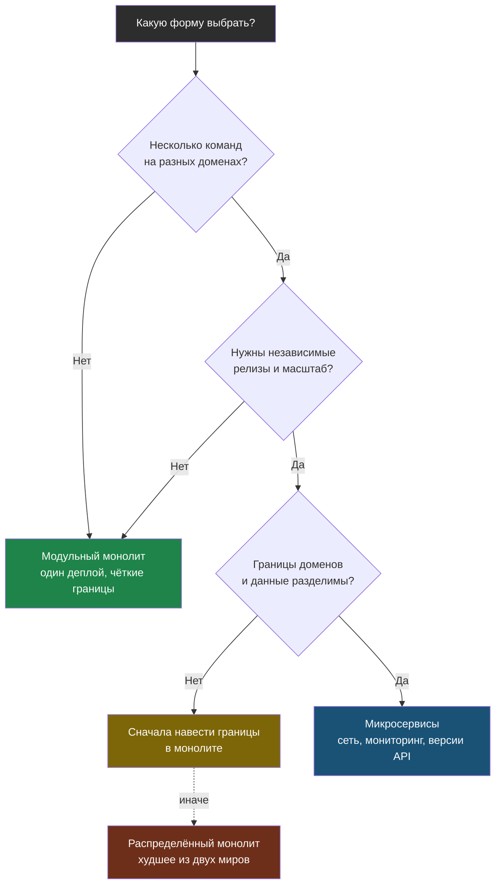

# Глава 1: Монолит, модульный монолит и микросервисы

> **Цель:** выбирать форму приложения без религии и моды.

---

## 1.1 Монолит

Монолит — приложение, которое деплоится как одна единица.

Это не плохо само по себе. Для одного человека или маленькой команды монолит часто лучший старт:

- один деплой;
- одна база;
- проще локальный запуск;
- меньше сетевых ошибок;
- проще логика транзакций.

Проблема монолита не в том, что он один. Проблема, когда внутри нет границ и всё зависит от всего.

---

## 1.2 Модульный монолит

Модульный монолит — один деплой, но внутри есть понятные модули:

```text
app
  users
  billing
  notifications
  admin
```

Модули не лезут напрямую в чужие внутренности. Это даёт порядок без сложности микросервисов.

---

## 1.3 Микросервисы

Микросервисы — несколько сервисов, которые можно независимо разрабатывать, деплоить и масштабировать.

Они полезны, когда:

- разные команды владеют разными частями;
- сервисы имеют разные нагрузки;
- нужны независимые релизы;
- границы доменов понятны.

Но они добавляют:

- сеть;
- распределённые ошибки;
- сложный мониторинг;
- версионирование API;
- больше деплоев;
- сложность данных.

---

## 1.4 Распределённый монолит

Это худший вариант: сервисов много, но они всё равно жёстко завязаны друг на друга.

Признаки:

- один сервис нельзя обновить без всех остальных;
- одна общая база на всех;
- падение одного сервиса ломает весь продукт;
- нет независимой ответственности;
- много сетевых вызовов без пользы.

---

## 1.5 Сравнение

| Подход | Когда подходит | Плюсы | Минусы | Главный риск |
|---|---|---|---|---|
| Монолит | маленький продукт | просто деплоить | может разрастись | хаос внутри |
| Модульный монолит | растущий проект | порядок без сети | нужна дисциплина | нарушить границы |
| Микросервисы | несколько команд/доменов | независимые релизы | сложная эксплуатация | сеть и данные |
| Распределённый монолит | ошибка дизайна | почти нет | всё сложно | худшее из двух миров |

Выбор формы можно представить как дерево решений: на старте почти всегда выигрывает модульный монолит, а к микросервисам стоит идти только при реальной потребности в независимых релизах.



---

## 1.6 Практика

Опиши свой проект:

| Вопрос | Ответ |
|---|---|
| Это один деплой или несколько? | |
| Есть ли границы модулей? | |
| Есть ли общая БД? | |
| Можно ли обновить часть независимо? | |
| Что проще: улучшить монолит или делить? | |

Вывод: если ты один, почти всегда начни с хорошего модульного монолита.