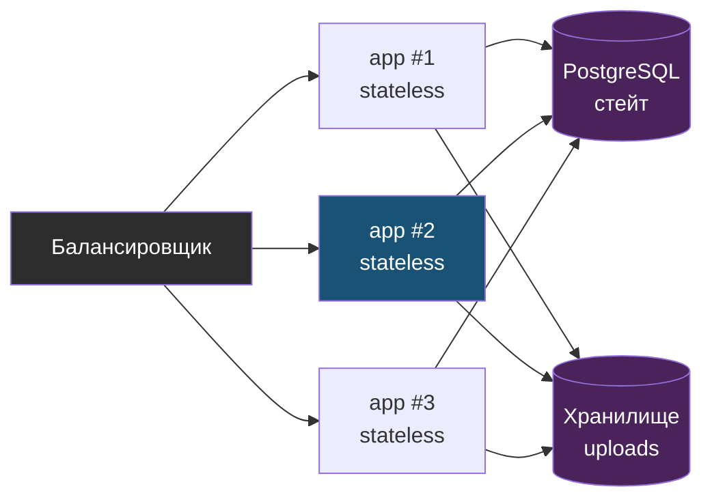

# Глава 2: Stateless и stateful

> **Цель:** понять, где в системе живёт состояние и почему его нельзя терять.

---

## 2.1 Stateless

Stateless-компонент не хранит важное состояние внутри себя. Его можно остановить, пересоздать, заменить новой версией.

Пример:

```text
web container -> обрабатывает HTTP -> ходит в БД -> сам ничего важного не хранит
```

Такой контейнер удобно деплоить и масштабировать.

Именно потому, что важное состояние вынесено наружу, stateless-приложение можно запускать в нескольких экземплярах за балансировщиком и пересоздавать любой из них без потери данных:



---

## 2.2 Stateful

Stateful-компонент хранит данные, которые нельзя просто потерять.

Примеры:

- PostgreSQL volume;
- uploads directory;
- Redis с сессиями;
- очередь задач;
- локальные файлы пользователя;
- SQLite-файл.

Stateful-компоненты требуют backup, проверки восстановления и аккуратных миграций.

---

## 2.3 Типовая ошибка с Docker

Плохо:

```text
пользователь загрузил файл
файл лежит внутри контейнера
контейнер пересоздали
файл исчез
```

Хорошо:

```text
uploads -> volume или внешнее хранилище
app container -> можно пересоздать
backup -> отдельно проверяется
```

---

## 2.4 Redis не всегда "просто cache"

Redis может быть:

- cache, который можно потерять;
- session storage, потеря которого разлогинит пользователей;
- очередь задач, потеря которой потеряет задания;
- lock storage, сбой которого создаст гонки.

Поэтому нельзя писать "Redis неважен" без понимания роли.

---

## 2.5 Практика

Составь карту состояния:

| State | Где хранится | Можно потерять? | Как backup? | Как восстановить? |
|---|---|---|---|---|
| БД | Docker volume | нет | pg_dump/snapshot | restore drill |
| uploads | `/data/uploads` | нет | rsync/backup | copy back |
| cache | Redis | иногда | не нужен/нужен | restart/reload |

Проверка: каждое важное состояние должно иметь ответ "как восстановить".