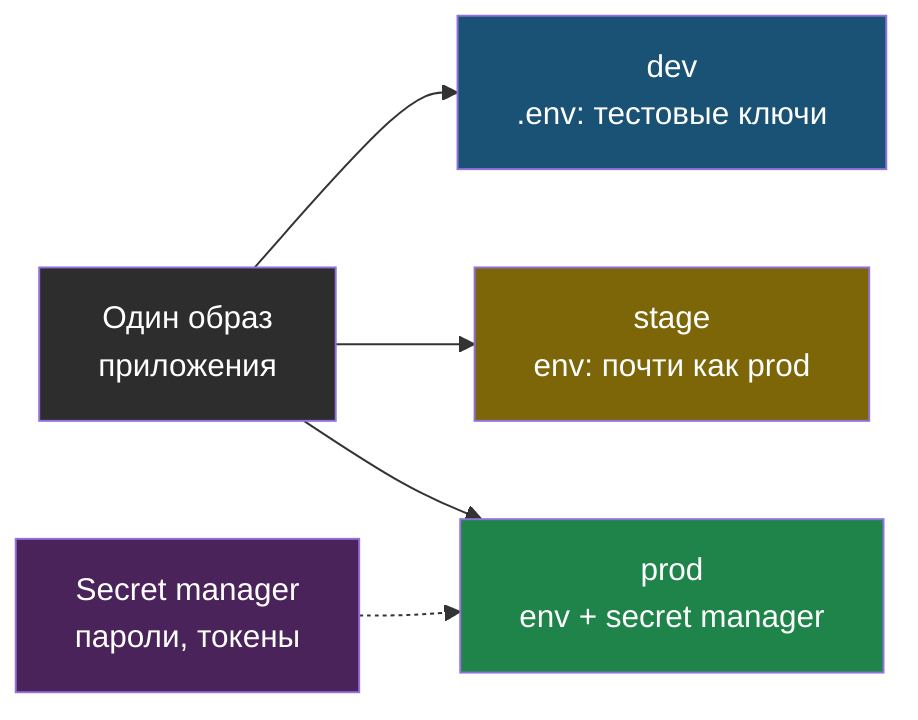

# Глава 3: Конфигурация и секреты

> **Цель:** сделать сервис переносимым между dev, stage и prod.

---

## 3.1 Почему config в коде мешает эксплуатации

Если адрес БД, пароль, домен или путь зашиты в код, приложение трудно переносить.

Плохо:

```python
DB_HOST = "localhost"
DB_PASSWORD = "supersecret"
UPLOAD_DIR = "/home/user/project/uploads"
```

В Docker `localhost` внутри контейнера означает сам контейнер, а не базу. Пароль в коде попадёт в Git. Путь может не существовать на сервере.

---

## 3.2 Env vars и config file

Обычные настройки можно хранить в config file или env vars. Секреты — отдельно и аккуратно.

Пример `.env.example`:

```env
APP_ENV=production
APP_PORT=3000
DATABASE_URL=postgres://user:password@db:5432/app
REDIS_URL=redis://redis:6379/0
LOG_LEVEL=info
```

В `.env.example` не должно быть настоящих паролей.

---

## 3.3 Секреты

Секреты:

- пароли БД;
- API tokens;
- private keys;
- session secret;
- SMTP password.

Правила:

- не коммитить в Git;
- не печатать в логи;
- не вставлять в скриншоты;
- иметь план ротации;
- хранить в менеджере паролей или secret manager.

---

## 3.4 Разные окружения

```text
dev   -> локальная БД, тестовые ключи
stage -> почти как prod, но без реальных пользователей
prod  -> реальные данные и осторожные изменения
```

Сервис должен позволять менять настройки без изменения кода.

Один и тот же образ должен запускаться в любом окружении — отличаются только переменные окружения и источник секретов, а не код:



---

## 3.5 Практика

Создай `CONFIG-INVENTORY.md`:

| Переменная | Для чего | Secret? | Где задаётся | Значение по умолчанию |
|---|---|---|---|---|
| DATABASE_URL | подключение к БД | да | `.env` | нет |
| LOG_LEVEL | уровень логов | нет | `.env` | info |
| APP_PORT | порт приложения | нет | compose | 3000 |

Проверка: если человек без тебя не может понять, какие настройки нужны, inventory не готов.