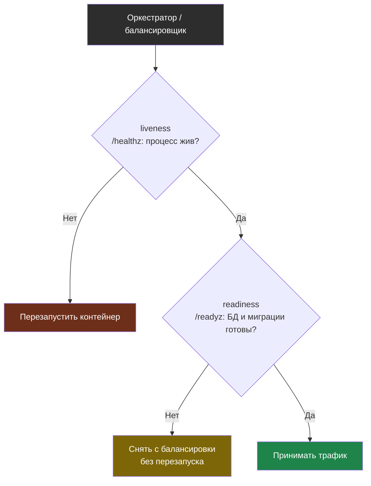
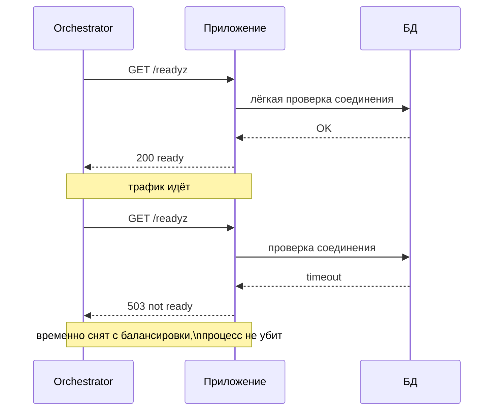

# Глава 4: Healthcheck, readiness и liveness

> **Цель:** научить систему понимать, жив ли сервис и готов ли он принимать трафик.

---

## 4.1 Healthcheck для человека и машины

Healthcheck — простой способ спросить у сервиса: "ты жив?".

Пример:

```text
GET /healthz -> 200 OK
```

Но один endpoint не всегда отвечает на все вопросы. Процесс может быть жив, но БД недоступна. Или БД недоступна временно, а перезапуск приложения не поможет.

---

## 4.2 Healthz, readyz, liveness

| Endpoint | Что проверяет | Кто использует |
|---|---|---|
| `/healthz` | процесс жив | человек, Docker, мониторинг |
| `/readyz` | сервис готов принимать трафик | балансировщик, Kubernetes |
| liveness | процесс не завис навсегда | orchestrator |

Простая схема:

```text
/healthz -> приложение отвечает
/readyz  -> приложение + БД + миграции готовы
/metrics -> метрики для мониторинга
```

Разные пробы решают разные задачи: liveness отвечает на вопрос «нужно ли перезапустить процесс», а readiness — «можно ли слать трафик прямо сейчас». Важно их не путать.



Как выглядит регулярный опрос пробы во времени — orchestrator периодически дёргает endpoint, а приложение отвечает быстро и без тяжёлых запросов:



---

## 4.3 Ошибки

Плохой healthcheck:

```text
всегда возвращает 200
делает тяжёлый SQL-запрос
зависит от внешнего API оплаты
падает из-за временной сетевой ошибки и перезапускает рабочий процесс
```

Хороший healthcheck лёгкий, быстрый и понятный.

---

## 4.4 Docker healthcheck

Пример:

```yaml
services:
  app:
    image: myapp
    healthcheck:
      test: ["CMD", "curl", "-f", "http://localhost:3000/healthz"]
      interval: 30s
      timeout: 5s
      retries: 3
```

Это не заменяет мониторинг снаружи. Контейнер может быть healthy внутри, но домен всё равно недоступен из интернета.

---

## 4.5 Практика

Спроектируй:

| Endpoint | Что проверяет | Что не проверяет |
|---|---|---|
| `/healthz` | процесс app | БД, внешние API |
| `/readyz` | БД, миграции | медленные внешние сервисы |

Проверка: readiness может временно вернуть not ready без перезапуска всего приложения.