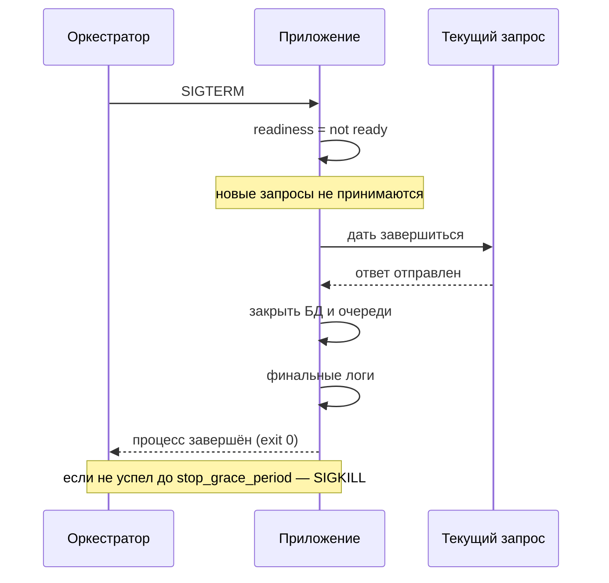

# Глава 5: Graceful shutdown и startup

> **Цель:** понять, что остановка и запуск сервиса — часть архитектуры.

---

## 5.1 Что происходит при остановке

Когда Docker, systemd или Kubernetes хочет остановить процесс, он обычно отправляет сигнал `SIGTERM`. Хорошее приложение не должно просто умереть сразу.

Правильное поведение:

1. перестать принимать новые запросы;
2. дать текущим запросам завершиться;
3. закрыть соединения с БД и очередями;
4. записать финальные логи;
5. завершиться до timeout.

Последовательность аккуратной остановки во времени: после `SIGTERM` приложение сначала перестаёт принимать новое, доводит текущие запросы до конца и только потом закрывает соединения и выходит. Если оно не уложилось в `stop_grace_period`, оркестратор присылает `SIGKILL`.



---

## 5.2 Почему это важно

Без graceful shutdown пользователь может отправить форму, а процесс завершится посередине. Итог:

- потерянный запрос;
- частично записанные данные;
- ошибка оплаты;
- повторная отправка;
- непонятный баг.

При редких релизах это кажется мелочью. При частых релизах становится постоянным источником ошибок.

---

## 5.3 Startup

Запуск тоже важен. Контейнер может стартовать, но сервис ещё не готов:

- миграции не применены;
- cache прогревается;
- соединение с БД ещё не установлено;
- external API недоступно.

Поэтому нужен readiness, а не просто "процесс запустился".

---

## 5.4 Compose и systemd

В Docker Compose можно задавать timeout остановки:

```yaml
services:
  app:
    stop_grace_period: 30s
```

В systemd есть `TimeoutStopSec`.

Но настройка timeout бесполезна, если само приложение не обрабатывает остановку аккуратно.

---

## 5.5 Практика

Заполни чеклист:

| Проверка | Как понять | Что улучшить |
|---|---|---|
| приложение ловит SIGTERM? | logs/code/docs | |
| перестаёт принимать новые запросы? | readiness | |
| закрывает БД? | logs | |
| сколько секунд на остановку? | compose/systemd | |
| есть readiness после старта? | endpoint | |

Проверка: у сервиса должен быть понятный план остановки и запуска.