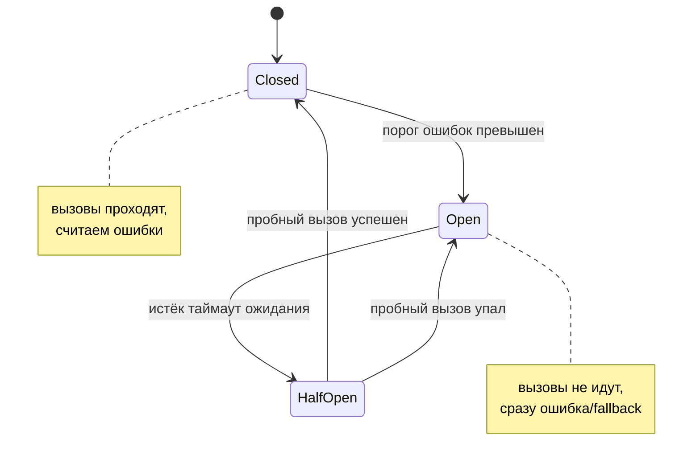

# Глава 7: Retry, timeout и circuit breaker

> **Цель:** понять, как защита от временной ошибки может усилить аварию.

---

## 7.1 Timeout

Timeout отвечает на вопрос: сколько мы готовы ждать.

Без timeout запрос может зависнуть навсегда:

```text
app -> external API -> нет ответа -> worker занят -> очередь растёт -> всё тормозит
```

Правило: любой внешний вызов должен иметь timeout.

---

## 7.2 Retry

Retry полезен, если ошибка временная: сеть мигнула, сервис вернул 503, соединение оборвалось.

Но retry опасен, если:

- повторяется сразу;
- повторяется много раз;
- нет backoff;
- ошибка не временная;
- операция не идемпотентна.

Пример плохого retry: оплата карты повторилась дважды.

---

## 7.3 Backoff и jitter

Backoff — увеличивать паузу между попытками:

```text
1 сек -> 2 сек -> 4 сек -> 8 сек
```

Jitter — добавить случайность, чтобы все клиенты не повторяли запрос одновременно.

Как это выглядит в виде последовательности повторов: после каждой неудачи пауза растёт, к ней добавляется случайный сдвиг, а число попыток ограничено — иначе retry превратится в новую аварию:

```mermaid
sequenceDiagram
    participant A as Приложение
    participant E as Внешний сервис
    A->>E: запрос (попытка 1)
    E-->>A: 503
    Note over A: ждать 1с + jitter
    A->>E: запрос (попытка 2)
    E-->>A: 503
    Note over A: ждать 2с + jitter
    A->>E: запрос (попытка 3)
    E-->>A: 200 OK
    Note over A,E: успех; иначе — стоп после лимита попыток
```

---

## 7.4 Circuit breaker

Circuit breaker похож на автоматический выключатель. Если внешний сервис явно болеет, мы временно перестаём его дёргать и быстро возвращаем ошибку или fallback.

Это защищает и наше приложение, и зависимость.

У предохранителя три состояния. В **closed** вызовы идут как обычно, но при накоплении ошибок он переходит в **open** и быстро отдаёт ошибку или fallback. Через паузу он пробует одно состояние **half-open**: если пробный вызов успешен — возвращается в closed, если нет — снова open.



---

## 7.5 Сравнение

| Паттерн | Зачем | Риск неправильного применения |
|---|---|---|
| Timeout | не ждать вечно | слишком маленький ломает нормальные запросы |
| Retry | пережить временный сбой | усилить нагрузку |
| Backoff | дать системе восстановиться | слишком долгие задержки |
| Circuit breaker | быстро отказывать при аварии | скрыть реальную проблему |
| Bulkhead | изолировать часть ресурсов | сложнее архитектура |

---

## 7.6 Практика

Для трёх зависимостей укажи policy:

| Зависимость | Timeout | Retry | Что делать при ошибке |
|---|---|---|---|
| платежи | 3 сек | 1-2 с idempotency key | показать статус pending |
| email | 10 сек | 3 с backoff | отправить позже |
| внешний API | 2 сек | 0-1 | показать fallback |

Проверка: ни одна зависимость не должна ждать бесконечно.