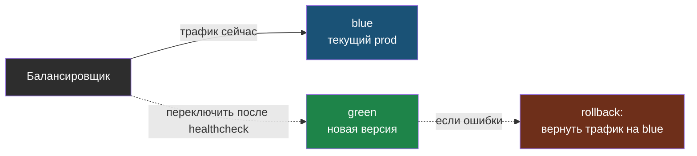

# Глава 10: Стратегии деплоя и rollback

> **Цель:** понять, как архитектура влияет на способ выкатывать изменения.

---

## 10.1 In-place deploy

Самый простой вариант:

```text
остановить старую версию -> поставить новую -> запустить
```

Плюсы: просто.

Минусы: возможен downtime, rollback может быть ручным.

Для маленького проекта это нормально, если есть backup, checklist и короткое окно обновления.

---

## 10.2 Rolling deploy

Rolling deploy обновляет экземпляры по очереди.

Подходит, если:

- приложение stateless;
- старая и новая версия совместимы;
- есть readiness;
- миграции не ломают старый код.

Если новая версия требует несовместимой БД, rolling deploy опасен.

---

## 10.3 Blue-green

```text
blue  -> текущая prod-версия
green -> новая версия
```

Шаги:

1. поднять green;
2. проверить healthcheck;
3. переключить трафик;
4. держать blue для быстрого rollback;
5. удалить blue позже.

Плюс: быстрый rollback.

Минус: нужно больше ресурсов и аккуратность с БД.

Суть в том, что обе версии живут одновременно, а переключение трафика — это одно действие на балансировщике. Если с green что-то не так, трафик возвращают на blue, который всё это время остаётся целым:



---

## 10.4 Canary

Canary — сначала пустить маленькую часть трафика на новую версию.

```text
5% пользователей -> v2
95% пользователей -> v1
```

Если ошибок нет, увеличиваем долю. Если есть — откатываем.

Для одного сервера canary часто избыточен, но принцип полезен: сначала проверять изменение на малой аудитории.

---

## 10.5 Feature flags

Feature flag позволяет включать функцию без нового деплоя.

Плюсы:

- можно выключить плохую функцию быстро;
- можно включать постепенно;
- можно тестировать скрыто.

Минусы:

- флаги надо чистить;
- код становится сложнее;
- можно запутаться в комбинациях.

---

## 10.6 Практика

Выбери стратегию:

| Проект | Реалистичная стратегия | Почему | Rollback |
|---|---|---|---|
| личный сайт | in-place + backup | один сервер | git checkout + restart |
| важный API | blue-green | нужен быстрый rollback | switch traffic |

Проверка: rollback должен быть описан до деплоя, а не после аварии.