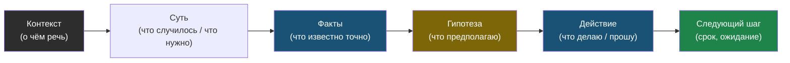

# Глава 1: Базовая формула ясной мысли

> **Цель:** получить универсальный шаблон для технического сообщения.

---

## 1.1 Формула

```text
1. Контекст — о чём речь
2. Суть — что случилось или что нужно
3. Факты — что известно точно
4. Гипотеза — что предполагаю
5. Действие — что делаю или прошу
6. Следующий шаг — срок, ожидание, решение
```

Эта формула подходит для чата, issue, письма, задачи ИИ и устного объяснения.

Поток мысли по формуле выглядит так: каждый шаг подготавливает следующий, и собеседник движется от «о чём вообще речь» к «что мне сделать».



---

## 1.2 Шаблон

```text
Контекст:
Проблема/цель:
Что известно:
Что проверил:
Моя гипотеза:
Что нужно:
Следующий шаг:
```

Не всегда нужно заполнять все поля. Но если мысль сложная, лучше заполнить больше.

---

## 1.3 Пример статуса

Плохо:

> Пока не готово, разбираюсь.

Лучше:

> Задача по деплою ещё не готова. Приложение собирается, но после запуска контейнер падает из-за подключения к БД. Я проверил compose-сеть и имя сервиса. Сейчас проверяю переменную `DATABASE_URL`. Следующий статус дам в 16:00.

Почему лучше:

- понятно, что именно не готово;
- видно прогресс;
- есть следующий шаг;
- собеседник не остаётся в неопределённости.

---

## 1.4 Пример просьбы о ревью

Плохо:

> Посмотри, норм?

Лучше:

> Посмотри, пожалуйста, `docker-compose.yml`. Я добавил Redis и healthcheck. Хочу проверить две вещи: не открыл ли Redis наружу и корректно ли app ждёт Redis перед стартом. Особенно посмотри секции `ports`, `depends_on`, `healthcheck`.

---

## 1.5 Практика

Напиши 5 сообщений:

1. проблема на сервере;
2. просьба о ревью;
3. вопрос по ошибке;
4. статус задачи;
5. предложение решения.

Проверка: в каждом сообщении должно быть понятно, что ты хочешь от адресата.