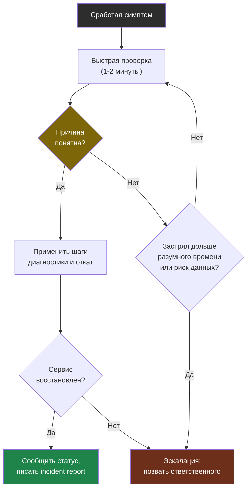

# Глава 9: Runbook и incident report

> **Цель:** разделить срочное сообщение во время аварии и постоянные документы после неё.

---

## 9.1 Чем отличается от главы 3

Глава 3 — это сообщение в чат, пока проблема горит.

Эта глава — документы, которые остаются после:

- runbook: что делать в следующий раз;
- incident report: что произошло и какие выводы.

---

## 9.2 Runbook

Шаблон:

```markdown
# Сервис не открывается

## Симптом
Что видит пользователь.

## Быстрая проверка
Команды на 1-2 минуты.

## Шаги диагностики
Пошагово.

## Частые причины
Список.

## Как откатить
Конкретные действия.

## Когда эскалировать
Кого звать и когда.
```

Плохой runbook:

> Посмотреть логи и починить.

Хороший runbook:

```bash
curl -I https://example.com
sudo nginx -t
docker ps
docker logs app --tail=100
df -h
```

Runbook ведёт человека по дереву: быстрая проверка → диагностика → откат, и отдельной веткой — эскалация, если своими силами не выходит.



---

## 9.3 Incident report

Шаблон:

```markdown
# Incident report

## Что случилось
## Влияние
## Timeline
## Причина
## Что помогло
## Что мешало
## Action items
```

Action item должен быть конкретным:

Плохо:

> Быть внимательнее.

Лучше:

> Добавить preflight-check обязательных env перед restart. Ответственный: Иван. Срок: 2026-05-15. Проверка: deploy падает, если `DATABASE_URL` пустой.

---

## 9.4 Практика

Для инцидента 502 напиши:

1. runbook "сайт отдаёт 502";
2. incident report после сбоя;
3. 3 action items.

Проверка: каждый action item должен менять систему, а не требовать "быть внимательнее".