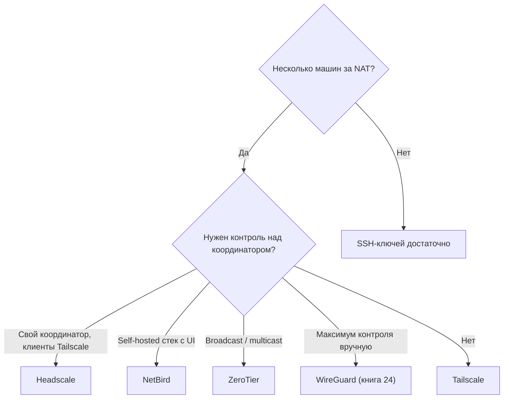
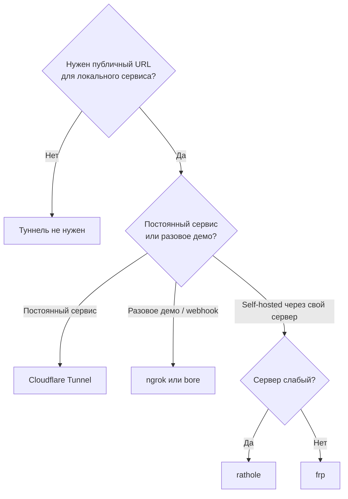

> ⏱ Время чтения: ~5 мин.

# Глава 1: Сеть, VPN и доступ

## Что вы узнаете

- как дать себе безопасный доступ к серверам без проброса портов;
- что брать для VPN и mesh-сетей, а что — избыточно;
- зачем нужны обратные туннели и когда они оправданы.

---

## Категория 1: VPN / mesh-сети

### Зачем

Когда у тебя больше одной машины за NAT — домашний сервер, VPS, рабочий ноутбук — нужен способ соединить их в единую защищённую сеть. VPN или mesh даёт каждой машине стабильный адрес и шифрованный канал, независимо от того где она физически находится. Без этого остаётся либо открывать порты наружу, либо городить бастион.

### Дефолт

**Tailscale** `SaaS` `★` `Docker: да`
Настраивается за 5 минут: установил агент, вошёл через аккаунт, все машины видят друг друга по именам. Работает за любым NAT, не требует своего сервера-координатора, поддерживает MagicDNS — не нужно помнить IP. Для homelab и стартапа — первый и последний ответ на вопрос «как попасть на свои серверы».

### Альтернативы

| Инструмент | Метки | RAM (прим.) | Когда брать |
|------------|-------|-------------|-------------|
| WireGuard напрямую | `self-hosted` `★★` | ~5 МБ | Нужен полный контроль: свой сервер, своя конфигурация, никакого внешнего координатора. Корпоративный compliance, аудит трафика, site-to-site между офисами |
| Headscale | `self-hosted` `★★` | ~50 МБ | Хочешь Tailscale-клиенты, но координатор на своём сервере. Убирает зависимость от Tailscale-облака, сохраняет совместимость с родными клиентами |
| ZeroTier | `self-hosted` `★★` | ~100 МБ | Виртуальная Layer-2 сеть, поддерживает broadcast и multicast (Tailscale не поддерживает). Нужен когда приложение требует сетевого вещания |
| NetBird | `self-hosted` `★★` | ~100 МБ | Весь mesh — координатор, UI, relay — разворачивается на твоём железе. Выбор когда Tailscale-облако неприемлемо и нужен полностью self-hosted стек с веб-интерфейсом |

### Когда НЕ нужно

**Когда НЕ нужно (homelab):** один публичный сервер с SSH-ключами — и никакого VPN. Если машина имеет белый IP и ты единственный пользователь, mesh-сеть добавляет сложность без пользы. SSH + `~/.ssh/config` + ключи закрывают 90% задач homelab.

### Отсылка в курс

WireGuard — протокол, лежащий в основе Tailscale и большинства mesh-решений — разобран подробно в **книге 24**.

---

## Категория 2: Туннели (доступ без открытых портов)

### Зачем

Иногда нужно показать что-то работающее на локальной машине — заказчику, коллеге, сервису с вебхуком. Открывать порт в роутере, настраивать NAT-проброс, получать сертификат — всё это долго. Обратный туннель решает задачу за секунды: локальный процесс получает публичный URL и остаётся доступным снаружи без изменений в сетевой инфраструктуре.

### Дефолт

**Cloudflare Tunnel** `SaaS` `★` `Docker: да`
Без открытых портов, без белого IP, без правил в firewall. Устанавливаешь `cloudflared`, прописываешь сервис — и он получает публичный URL через Cloudflare-инфраструктуру. Базовый уровень бесплатен, трафик проходит через CDN Cloudflare с TLS. Для постоянно работающих сервисов без публичного IP — лучший выбор.

### Альтернативы

| Инструмент | Метки | RAM (прим.) | Когда брать |
|------------|-------|-------------|-------------|
| bore | `self-hosted` `★` | ~5 МБ | Rust-туннель в один бинарник, проще frp/rathole для разработки. Минимальная настройка, подходит для локальной разработки и быстрых демо |
| ngrok | `SaaS` `★` | ~20 МБ | Быстрое демо или webhook-отладка. Один бинарник, секунда до публичного URL. Бесплатный tier достаточен для разовых задач, но URL меняется при перезапуске |
| frp | `self-hosted` `★★` | ~15 МБ | Self-hosted туннель через свой сервер-посредник. Проксирует TCP/UDP/HTTP, гибко настраивается. Нужен VPS как relay-сервер |
| rathole | `self-hosted` `★★` | <5 МБ | То же что frp, но написан на Rust: минимальное потребление памяти и CPU. Выбор когда relay-сервер маломощный или экономишь ресурсы |

### Когда НЕ нужно

**Когда НЕ нужно (homelab / стартап):** если сервер уже имеет публичный IP и нужный порт открыт — туннель только добавляет задержку и точку отказа. Nginx напрямую и готово.

---

## Как выбрать за 30 секунд

**VPN / mesh:**

**Туннели:**

---

## Чек-лист для самопроверки

- [ ] Знаю чем Tailscale отличается от WireGuard напрямую и когда какой выбрать
- [ ] Понимаю когда VPN избыточен и SSH-ключей достаточно
- [ ] Могу объяснить зачем нужны туннели и чем Cloudflare Tunnel отличается от ngrok
- [ ] Знаю куда идти за подробным разбором WireGuard (книга 24)

---

## Ключевые тезисы

- Для homelab и стартапа без специфических требований — Tailscale, вопрос закрыт.
- WireGuard напрямую — когда нужен контроль над координатором или корпоративный аудит.
- Туннели (Cloudflare Tunnel, frp) — для временного доступа и разработки, не для постоянного продакшна.
- Один публичный сервер с SSH-ключами не нуждается ни в VPN, ни в туннеле.

---
*Следующая глава: [Глава 2 — Reverse proxy и веб](chapter-02.md)*
