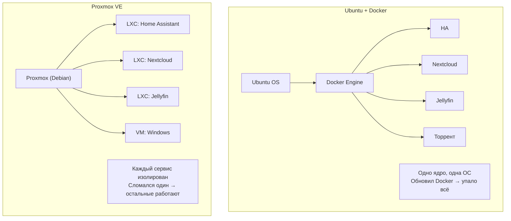
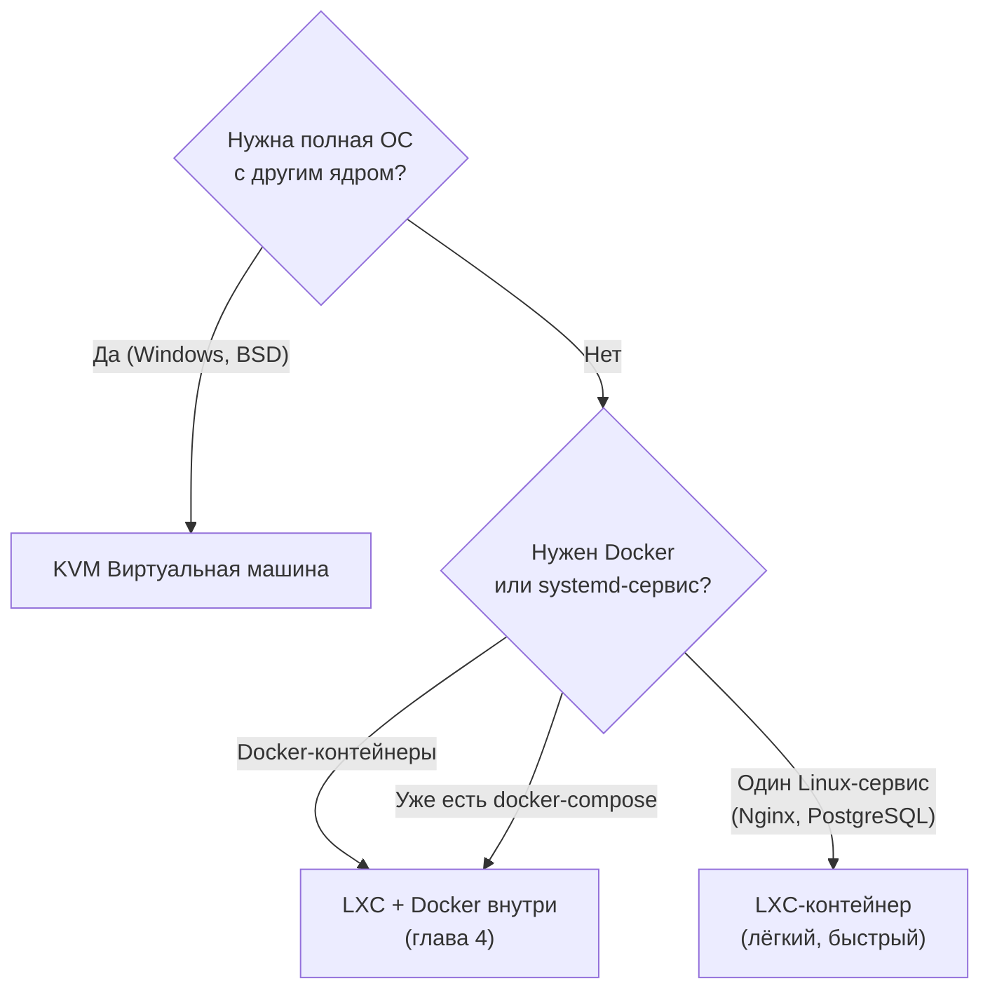

# Глава 0: Зачем Proxmox, если есть Ubuntu с Docker

> **Что вы узнаете:**
> - чем гипервизор типа 1 отличается от обычной ОС и от VirtualBox;
> - когда Proxmox решает реальные проблемы, а когда он избыточен;
> - что конкретно меняется при переходе с Ubuntu+Docker на Proxmox;
> - как выглядит типичный домашний сервер через год — и почему без гипервизора это становится хаосом.

---

## 0.1 Начнём с честного вопроса

У тебя есть Ubuntu с Docker. Там крутятся Nextcloud, Jellyfin и несколько других контейнеров. Всё работает. Зачем вообще Proxmox?

Короткий ответ: пока у тебя один-два сервиса и один пользователь — он не нужен. Но сервер растёт. Сначала один контейнер, потом пять, потом хочется Home Assistant, и вдруг выясняется что один сервис съел всю память и всё остальное тормозит. Или обновил ядро — и что-то перестало подниматься. Или нужно быстро откатиться, а снапшота нет.

Proxmox решает именно эти проблемы. Он не делает сервер умнее или быстрее — он даёт контроль над тем, что уже есть.

---

## 0.2 Что такое гипервизор

**Гипервизор** — это программное обеспечение, которое управляет виртуальными машинами. Он разделяет физические ресурсы сервера (CPU, RAM, диски) между изолированными окружениями.

Есть два типа:

```text
Тип 1 (bare-metal):
  Железо → Гипервизор → VM/LXC
  Proxmox, ESXi, Hyper-V
  Нет промежуточной ОС — гипервизор сам является "операционной системой"

Тип 2 (hosted):
  Железо → ОС (Windows/Ubuntu) → Гипервизор → VM
  VirtualBox, VMware Workstation, Parallels
  Работает поверх обычной ОС
```

Proxmox VE — гипервизор типа 1. Он ставится на чистое железо и сам является базовой системой. Поверх него уже запускаются виртуальные машины (KVM) и контейнеры (LXC).

**Почему это важно?**

Гипервизор типа 2 (VirtualBox) — это просто программа на вашей Ubuntu. Если Ubuntu зависла, VirtualBox тоже завис. Если Ubuntu обновилась и что-то сломалось — все VM недоступны.

Proxmox — это сам хост. Он не зависит от ОС поверх которой работает, потому что он и есть ОС. Uptime измеряется месяцами.

---

## 0.3 Ubuntu + Docker vs Proxmox: честное сравнение

| Параметр | Ubuntu + Docker | Proxmox |
|----------|----------------|---------|
| Порог входа | Низкий — знакомо | Средний — новый интерфейс |
| Изоляция сервисов | Только сетевая | Полная: CPU, RAM, диск, сеть |
| Снапшоты системы | Нет | Да, за секунды |
| Бэкапы с расписанием | Нужен сторонний инструмент | Встроены в интерфейс |
| Запустить Windows | Нет | Да (KVM VM) |
| Ограничить RAM одному сервису | Ограниченно (cgroups) | Легко через интерфейс |
| Один сервис сожрал CPU | Остальные тормозят | Устанавливаем приоритет |
| Восстановление после поломки | Переустановка | Откат из снапшота за 2 минуты |
| Нужен для 1-2 сервисов | Да, достаточно | Избыточен |

Если коротко:

```text
Ubuntu + Docker:
  + просто
  + знакомо
  + нет лишнего слоя
  - всё в одном пространстве
  - один контейнер тормозит — все тормозят
  - нет снапшотов всей системы
  - обновил ядро — сломал всё

Proxmox:
  + изоляция каждого сервиса
  + снапшоты и бэкапы за секунды
  + запустить Windows рядом с Linux
  + лёгкое восстановление
  + Docker прекрасно работает внутри LXC
  - ещё один слой для понимания
  - избыточен для одного сервиса
  - требует выделенного железа
```

Вот как выглядит ключевое отличие на практике — что происходит с сервисами при одном сбое в каждой из моделей:



На схеме видно, что в модели Ubuntu+Docker все сервисы висят на одном движке и разделяют одно ядро — проблема в любом звене цепочки затрагивает всех. В Proxmox каждый LXC-контейнер и VM — это независимый «кирпичик»: упал один, остальные продолжают работать. Именно эта изоляция становится принципиальной, когда сервисов становится больше трёх-четырёх.

---

## 0.4 Как выглядит домашний сервер через год

Начинается невинно: Nextcloud и Plex. Потом приходит Home Assistant. Потом хочется Vaultwarden, Gitea, AdGuard Home. Через год сервер выглядит примерно так:

```text
Один Ubuntu-сервер:
  - Docker: Nextcloud, Jellyfin, Vaultwarden, Gitea, AdGuard Home
  - Home Assistant (нужен доступ к USB-устройствам)
  - Торрент-клиент (жрёт диск и сеть)
  - Nginx как reverse proxy
  - Все конфиги вперемешку в /opt
  - Бэкапы? "Когда-нибудь настрою"
```

Что происходит в этой схеме:

- **Один сервис упал** — изучаешь логи в хаосе из десяти `docker-compose.yml`.
- **Home Assistant нужен USB** — пробрасываешь устройство напрямую в контейнер, потом начинаются проблемы с правами.
- **Торрент занял всю память** — Nextcloud недоступен, Jellyfin буферизует.
- **Обновляешь ядро** — Docker-network ломается, надо пересоздавать.
- **Хочешь откатиться** — снапшота нет, придётся чинить вручную.

С Proxmox та же нагрузка выглядит иначе:

```text
Proxmox Host (16GB RAM, SSD + HDD):
  CT 100: Docker LXC — Nextcloud, Jellyfin, Vaultwarden    (лимит 4GB RAM)
  CT 101: AdGuard Home LXC                                  (256MB RAM)
  CT 102: Nginx Proxy Manager LXC                           (512MB RAM)
  CT 103: Gitea LXC                                         (1GB RAM)
  VM 200: Home Assistant OS                                  (balloon: 1-2GB)
  VM 201: Windows (тестирование)                            (balloon: 2-4GB)
```

Торрент занял всю память внутри CT 100? Остальные контейнеры не заметили — у каждого свой лимит. Home Assistant OS работает в официальной VM — никаких проблем с USB. Хочешь обновить Nextcloud — снапшот, обновление, если что-то сломалось — откат за две минуты.

---

## 0.5 LXC, KVM, Docker: что, когда и зачем

Новичку кажется, что это одно и то же. Это не так.

```text
Docker-контейнер:
  - одно приложение, одна задача
  - нет init-системы (systemd), нет cron внутри
  - быстро поднять и удалить
  - отличный выбор для микросервисов

LXC-контейнер (в Proxmox):
  - полноценная мини-система
  - работает systemd, cron, SSH
  - можно установить Docker внутрь
  - ближе к "лёгкой виртуальной машине"
  - разделяет ядро с хостом (быстро, мало overhead)

KVM виртуальная машина:
  - своё полное ядро
  - максимальная изоляция
  - можно запустить Windows, любую ОС
  - чуть больше overhead по RAM и CPU
  - нужна когда LXC не подходит
```

Золотое правило для домашнего сервера:
- **Docker-сервисы** → запускать внутри LXC с Docker (не напрямую на хосте Proxmox)
- **Home Assistant** → только в KVM VM или на отдельном железе (официальная поддержка)
- **Windows** → KVM VM
- **Всё остальное** → LXC

Если коротко, то выбор между LXC, KVM и Docker сводится к простому дереву решений — вот как это работает на практике:



На схеме видно, что KVM задействуется только тогда, когда нужно своё отдельное ядро — для Windows, BSD или любой нестандартной ОС. Во всех остальных случаях LXC является предпочтительным вариантом: он легче, быстрее стартует и потребляет меньше ресурсов. Docker при этом не исчезает — он просто переезжает внутрь LXC-контейнера, что сохраняет привычный рабочий процесс и добавляет изоляцию на уровне Proxmox.

---

## 0.6 Когда Proxmox НЕ нужен

Proxmox — не серебряная пуля. Не нужен если:

- У тебя **один-два сервиса** и ты не планируешь расширяться.
- **Меньше 4GB RAM** — Proxmox сам занимает ~500MB, остаётся мало.
- **Тебе не нужна изоляция** — например, пишешь код на ноутбуке.
- Ты хочешь **поставить и забыть** один контейнер — Ubuntu+Docker проще.
- Сервер временный или экспериментальный.

Правило простое: если сейчас один сервис — Ubuntu+Docker. Если планируешь три и больше, хочешь бэкапы с расписанием и не хочешь бояться ломать — Proxmox.

---

## 0.7 Минимальные требования к железу

Proxmox работает на обычном x86-64 железе. Никакого специального оборудования не нужно.

| Параметр | Минимум | Рекомендуется |
|----------|---------|---------------|
| CPU | 2 ядра, x86-64 | 4+ ядра с гипертредингом |
| RAM | 4GB | 16GB и больше |
| Диск (система) | 32GB SSD | 120GB+ SSD |
| Сеть | 100 Mbps | Гигабит |
| Виртуализация в BIOS | VT-x (Intel) или AMD-V | Обязательно |

Отличные варианты железа для домашнего сервера:
- **Mini-PC**: Minisforum, Beelink — тихие, энергоэффективные, 16-32GB RAM
- **Старый десктоп** или рабочая станция — часто отличный вариант
- **Intel NUC** — компактно, поддерживает 64GB RAM
- **Старый ноутбук** — работает, но ограниченное расширение

Важно: **VT-x/AMD-V должна быть включена в BIOS**. Без этого KVM VM не запустятся. LXC работает и без виртуализации, но полноценный Proxmox нужна поддержка от CPU.

```bash
# Проверить поддержку виртуализации в Linux (перед установкой Proxmox)
grep -c 'vmx\|svm' /proc/cpuinfo
# Если вывод > 0 — виртуализация поддерживается
```

---

## 0.8 Что даёт Proxmox, чего нет у Ubuntu

Конкретные функции которые изменят работу с сервером:

**Снапшоты за секунды.** Перед любым обновлением — снапшот. Если что-то сломалось — один клик и ты откатился. Не нужно копировать файлы вручную или помнить что менял.

**Бэкапы из коробки.** Расписание, сжатие, хранение нескольких версий — настраивается в веб-интерфейсе за пять минут. Не нужен rsync, borgbackup или cron с кастомными скриптами.

**Лимиты ресурсов.** Каждый контейнер получает свой лимит RAM и CPU. Один сервис не может «украсть» ресурсы у другого.

**Восстановление одной командой.**
```bash
# Восстановить LXC из файла бэкапа
pct restore 100 /mnt/backup/vzdump-lxc-100-2026_05_22.tar.zst --storage local-lvm
```

**Веб-интерфейс.** Консоль к любому контейнеру, статистика CPU/RAM/диска, логи задач — всё в браузере без SSH.

**Запустить что угодно.** Windows, FreeBSD, macOS (с оговорками), любой Linux — всё работает в KVM VM рядом с LXC-контейнерами.

---

## 0.9 Практика: определи, нужен ли тебе Proxmox

Ответь на эти вопросы прежде чем ставить Proxmox:

| Вопрос | Ответ «да» — в пользу Proxmox |
|--------|-------------------------------|
| Планируешь 3+ сервиса? | Изоляция и лимиты важны |
| Нужен Home Assistant OS? | Лучше в KVM VM |
| Хочешь бэкапы с расписанием? | Встроено в Proxmox |
| Нужна возможность отката? | Снапшоты незаменимы |
| Есть 8GB+ RAM? | Proxmox комфортен |
| Боишься что-то сломать? | Снапшот снимает страх |
| Планируешь Windows рядом с Linux? | Только через KVM |

Если ты ответил «да» на три и более вопросов — Proxmox для тебя. Если «нет» на большинство — оставайся на Ubuntu+Docker, это честный совет.

---

## Чек-лист для самопроверки

- [ ] Понимаю разницу между гипервизором типа 1 (Proxmox) и типа 2 (VirtualBox)
- [ ] Могу объяснить зачем нужна изоляция сервисов и чем помогают лимиты RAM
- [ ] Знаю когда Proxmox избыточен и честно оценил свой случай
- [ ] Понимаю чем LXC-контейнер отличается от Docker-контейнера и KVM VM
- [ ] Проверил поддержку виртуализации на своём железе (VT-x / AMD-V)
