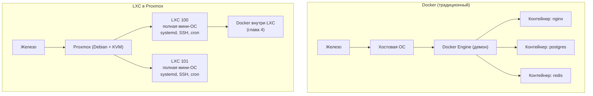
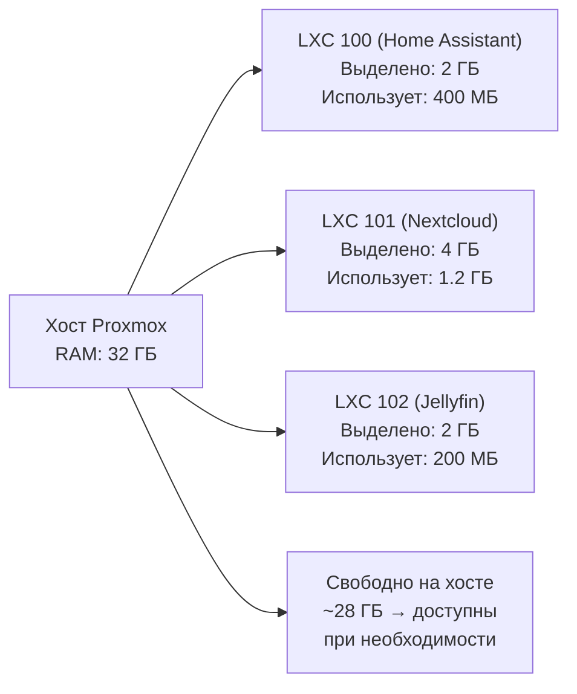

# Глава 3: LXC-контейнеры — основа домашнего сервера

> **Что вы узнаете:**
> - чем LXC-контейнер отличается от Docker-контейнера — и почему это важно;
> - как создавать LXC через веб-интерфейс и через CLI командой `pct create`;
> - как запускать, останавливать, заходить внутрь и выполнять команды в контейнере;
> - как работает динамическое распределение памяти — и что происходит когда её не хватает;
> - что такое OOM Killer, как его увидеть в логах и как снизить riск срабатывания;
> - зачем нужен swap для LXC и когда им не стоит злоупотреблять.

---

## 3.1 LXC vs Docker: в чём разница и когда что использовать

Когда читатель впервые видит LXC-контейнер в интерфейсе Proxmox, первый вопрос обычно такой: «А зачем это, если есть Docker?» Это хороший вопрос.

Docker-контейнер — это упаковка одного процесса. Он запускается, делает своё дело, и умирает вместе с основным процессом. Внутри нет systemd, нет cron, нет SSH. Это его сила — и его ограничение.

LXC-контейнер — это полноценная мини-система. Внутри работает systemd, можно настроить SSH, добавить cron-задачи, поставить несколько сервисов. Это ближе к «лёгкой виртуальной машине», чем к Docker-контейнеру.

```text
Docker-контейнер:
- один процесс / одно приложение
- без init-системы (нет systemd, нет cron)
- умирает вместе с основным процессом
- образ пересобирают при изменениях
- быстро запускается, быстро удаляется

LXC-контейнер:
- полноценная мини-система
- работает systemd, cron, SSH, несколько сервисов
- можно установить Docker внутрь
- управляется как обычный Linux-сервер
- ближе к "лёгкой виртуальной машине"
```

Самая распространённая схема на Proxmox — запускать Docker **внутри** LXC-контейнера. Это звучит странно на первый взгляд, но в этом и есть смысл: LXC даёт изоляцию, лимиты, снапшоты и бэкапы на уровне Proxmox, а внутри работает привычный Docker Compose.

Когда использовать что:

| Задача | Инструмент |
|--------|-----------|
| Запустить Nextcloud, Jellyfin, Gitea через Docker Compose | LXC + Docker внутри |
| Изолированная Linux-система с SSH и systemd | LXC |
| Windows, macOS, нестандартное ядро | KVM VM |
| Максимальная изоляция безопасности | KVM VM |
| Home Assistant OS (официально) | KVM VM |

Чтобы разница в архитектуре стала нагляднее, посмотрим на неё в виде схемы: где находится точка изоляции в Docker и как то же самое устроено в LXC внутри Proxmox.



Ключевое различие: Docker изолирует отдельные процессы внутри одной операционной системы — все контейнеры разделяют одно ядро и одно сетевое пространство хоста. LXC — это полноценная Linux-система со своим пространством имён, своим IP-адресом и системой инициализации; с точки зрения сети она выглядит как отдельная машина. Именно поэтому Docker внутри LXC — естественная комбинация: LXC обеспечивает изоляцию и управляемость на уровне Proxmox, а Docker внутри него работает как обычно.

---

## 3.2 Создание LXC через веб-интерфейс

Прежде чем создавать контейнер, нужен шаблон — образ файловой системы, с которого он поднимается.

**Шаг 1: Скачать шаблон**

В левой панели выбрать хранилище `local` → вкладка **CT Templates** → кнопка **Templates**. Откроется список доступных шаблонов: Debian, Ubuntu, Alpine, CentOS и другие.

Для большинства задач подходит `debian-12-standard` — минимальный Debian 12 без лишних пакетов. Нажать **Download**.

**Шаг 2: Создать контейнер**

Кнопка **Create CT** в правом верхнем углу. Мастер создания:

- **General:** Node, CT ID (например 100), Hostname, Password (root-пароль внутри контейнера).
- **Template:** выбрать скачанный шаблон.
- **Disks:** размер корневого диска, хранилище (local-lvm).
- **CPU:** количество ядер (1-2 для большинства задач).
- **Memory:** лимит RAM и Swap.
- **Network:** bridge `vmbr0`, IP (DHCP для начала, статик — лучше для сервера).
- **DNS:** оставить по умолчанию или указать свой.

Важные настройки на вкладке **Options → Features** после создания:

- **Unprivileged container** — включён по умолчанию, безопаснее. Подходит для большинства задач.
- **Privileged container** — нужен если планируется Docker внутри LXC.
- **Nesting** и **Keyctl** — обязательно включить если будет Docker. Без этих флагов Docker внутри LXC не запустится.

> **Unprivileged vs Privileged:** unprivileged контейнер использует пространство пользователей (user namespaces) — root внутри не равен root снаружи. Это значительно безопаснее. Privileged контейнер получает прямой доступ к ресурсам хоста — нужен для ряда задач, включая Docker.

---

## 3.3 Создание LXC через CLI: команда pct create

Веб-интерфейс удобен для разовых задач. Для воспроизводимости лучше использовать CLI — тогда настройки можно сохранить в скрипт и повторить на другом сервере.

Основная команда:

```bash
# Создаёт LXC-контейнер с ID 100 из шаблона Debian 12.
# Выделяет 1 GB RAM, 2 ядра CPU, диск 8 GB на хранилище local-lvm.
# Сеть через мост vmbr0, IP по DHCP.
pct create 100 local:vztmpl/debian-12-standard_12.7-1_amd64.tar.zst \
  --hostname mycontainer \
  --memory 1024 \
  --cores 2 \
  --net0 name=eth0,bridge=vmbr0,ip=dhcp \
  --storage local-lvm \
  --rootfs local-lvm:8 \
  --password
```

Флаг `--password` предложит ввести пароль интерактивно. Если хочется задать заранее (в скрипте), используют `--password "секрет"` — но это оставляет пароль в истории bash.

Создание privileged контейнера с поддержкой Docker:

```bash
# Privileged контейнер (--unprivileged 0) с Debian 12.
# Features nesting и keyctl нужны для работы Docker внутри LXC.
# Статический IP 192.168.1.101/24, шлюз 192.168.1.1.
pct create 100 local:vztmpl/debian-12-standard_12.7-1_amd64.tar.zst \
  --hostname docker-lxc \
  --memory 2048 \
  --cores 2 \
  --net0 name=eth0,bridge=vmbr0,ip=192.168.1.101/24,gw=192.168.1.1 \
  --storage local-lvm \
  --rootfs local-lvm:20 \
  --features keyctl=1,nesting=1 \
  --unprivileged 0 \
  --password
```

Проверить список доступных шаблонов:

```bash
# Показывает все шаблоны, скачанные в хранилище local
pveam list local
```

Скачать шаблон через CLI:

```bash
# Обновить список доступных шаблонов с серверов Proxmox
pveam update

# Скачать конкретный шаблон на хранилище local
pveam download local debian-12-standard_12.7-1_amd64.tar.zst
```

---

## 3.4 Управление LXC: запуск, остановка, консоль

После создания контейнер находится в состоянии `stopped`. Основные команды управления:

```bash
# Запустить контейнер с ID 100
pct start 100

# Остановить контейнер (мягкая остановка, как shutdown)
pct stop 100

# Перезагрузить контейнер
pct reboot 100

# Принудительно остановить (как выдернуть шнур питания)
# Использовать только если мягкая остановка не помогает
pct stop 100 --skiplock
```

Работа с консолью и командами внутри контейнера:

```bash
# Войти в интерактивную консоль контейнера (как SSH, но без сети)
# Выйти: Ctrl+D или команда exit
pct enter 100

# Выполнить одну команду внутри контейнера без входа в консоль
# Полезно для скриптов и автоматизации
pct exec 100 -- bash -c "apt update && apt upgrade -y"

# Выполнить одну команду и сразу получить результат
pct exec 100 -- hostname
pct exec 100 -- df -h

# Посмотреть список всех контейнеров с их статусом
pct list
```

Пример вывода `pct list`:

```
VMID    Status  Lock    Name
100     running         docker-lxc
101     stopped         nextcloud
102     running         uptime-kuma
```

Дополнительно полезные команды:

```bash
# Показать текущий статус одного контейнера
pct status 100

# Показать конфигурационный файл контейнера
# Этот файл хранится в /etc/pve/lxc/100.conf
pct config 100

# Изменить параметр работающего контейнера (например добавить RAM)
pct set 100 --memory 2048

# Увеличить корневой диск контейнера на 10 GB (уменьшить нельзя)
pct resize 100 rootfs +10G
```

---

## 3.5 Динамическое распределение памяти

Это одна из самых важных особенностей LXC в Proxmox, которую стоит понять правильно.

Когда создаётся LXC с лимитом памяти 2 GB — это **не резервирование**. Proxmox не выделяет и не блокирует 2 GB физической памяти под этот контейнер заранее. Это верхняя граница: контейнер может использовать до 2 GB, но если ему нужно только 400 MB — он займёт только 400 MB.

Это значит, что можно создать два контейнера с лимитами по 4 GB на хосте с 8 GB RAM — и они оба будут нормально работать, если каждый фактически использует по 3 GB. Но если оба одновременно попытаются использовать 4 GB — возникнет нехватка памяти.

```text
Хост: 8 GB физической RAM

CT 100: лимит 4 GB, фактически использует 1.2 GB
CT 101: лимит 4 GB, фактически использует 800 MB
CT 102: лимит 2 GB, фактически использует 400 MB

Итого занято: ~2.4 GB из 8 GB
Все контейнеры работают нормально.
```

Как проверить фактическое потребление памяти контейнерами:

```bash
# Потребление памяти всех контейнеров в реальном времени
# Столбцы: VMID, Status, Name, CPU%, MEM/total, DISK/total, NET
pct list

# Детально по одному контейнеру
pct exec 100 -- free -h

# На уровне хоста — общая картина
free -h
```

В веб-интерфейсе каждый контейнер показывает свой реальный процент использования RAM в столбце справа. Это полезно для понимания реальной нагрузки.

Следующая схема показывает, как выглядит динамическое распределение памяти на практике: хост с 32 ГБ обслуживает несколько контейнеров, каждый из которых имеет свой лимит, но реально занимает значительно меньше.



Суммарные лимиты контейнеров (8 ГБ) превышают фактическое потребление (около 1.8 ГБ) в несколько раз — хост спокойно обслуживает всех, не тратя ресурсы впустую. Balloon-драйвер ядра отдаёт неиспользуемую память обратно хосту, поэтому «зарезервировано по лимиту» и «реально занято» — две разные величины. Опасность возникает только тогда, когда несколько контейнеров одновременно пытаются реализовать свои лимиты — в этот момент физическая RAM заканчивается и включается OOM Killer.

**Рекомендация по выбору лимита:** устанавливать лимит памяти с запасом 20–30% от типичного потребления приложения. Если Nextcloud обычно потребляет около 800 MB — ставить лимит 1024 MB. Слишком жёсткий лимит ведёт к OOM (следующий раздел), слишком щедрый — к ложному ощущению что ресурсы есть, когда их нет.

---

## 3.6 OOM Killer — что происходит когда памяти не хватило

OOM расшифровывается как Out Of Memory — нехватка памяти.

Когда контейнер пытается использовать больше памяти, чем разрешено его лимитом, ядро Linux запускает **OOM Killer** — специальный механизм, который принудительно убивает процессы внутри контейнера чтобы освободить память. Приложение падает без предупреждения, без warning в своих логах — просто исчезает.

Симптомы срабатывания OOM Killer:
- Сервис внутри контейнера перестал работать без видимых причин.
- В логах самого приложения — ничего (процесс убит снаружи).
- Контейнер продолжает работать, но процесс внутри мёртв.

Как найти следы OOM в логах хоста:

```bash
# Искать в буфере ядра — здесь видно момент убийства процесса
# Пример вывода: "Memory cgroup out of memory: Kill process 4821 (php-fpm) score 850 or sacrifice child"
dmesg | grep -i "oom\|killed"

# Искать в системном журнале для конкретного контейнера (CT ID 100)
journalctl -u pve-container@100 | grep -i "oom\|kill"

# Более широкий поиск в системных логах
grep -i "oom\|out of memory" /var/log/syslog | tail -20
```

Что делать если OOM сработал:

1. Найти в логах какой процесс был убит (`dmesg` выше покажет имя).
2. Увеличить лимит памяти контейнера: `pct set 100 --memory 2048`.
3. Или уменьшить потребление приложения (например, настроить лимиты PHP-FPM или heap JVM).

---

## 3.7 Настройка swappiness на хосте

Swappiness — это параметр ядра Linux, который определяет насколько агрессивно система использует своп (swap) вместо физической RAM.

Значение по умолчанию — 60. Это значит: система начнёт использовать своп, когда 40% физической RAM ещё свободно. Для десктопа это нормально. Для сервера с LXC-контейнерами — слишком агрессивно: своп на SSD заметно медленнее RAM, и частое обращение к нему ухудшает производительность.

Проверить текущее значение:

```bash
# Показывает число от 0 до 100 (по умолчанию 60)
cat /proc/sys/vm/swappiness
```

Снизить значение для сервера с LXC:

```bash
# Записать настройку в файл — она сохранится после перезагрузки
echo "vm.swappiness=10" >> /etc/sysctl.d/99-proxmox.conf

# Применить немедленно без перезагрузки
sysctl -p /etc/sysctl.d/99-proxmox.conf

# Проверить что применилось
cat /proc/sys/vm/swappiness
```

Значение `10` означает: своп используется только когда физическая RAM заполнена на 90%. Это разумный компромисс для сервера.

> **Плохо:** оставить swappiness=60 на сервере с LXC. Proxmox начнёт свопировать данные контейнеров на диск даже когда RAM ещё есть — и всё начнёт тормозить.
>
> **Лучше:** `vm.swappiness=10` — система предпочитает RAM, своп использует только как последнее средство.

---

## 3.8 Swap для LXC: подушка безопасности

Swap для LXC — это дополнительный лимит: сколько памяти сверх основного лимита контейнер может «одолжить» через файл подкачки.

Настройка через CLI при создании:

```bash
# --swap 512 означает: контейнер может использовать до 512 MB swap
# Итого доступно приложению: memory (1024) + swap (512) = до 1.5 GB
pct create 100 local:vztmpl/debian-12-standard_12.7-1_amd64.tar.zst \
  --hostname mycontainer \
  --memory 1024 \
  --swap 512 \
  --cores 2 \
  --net0 name=eth0,bridge=vmbr0,ip=dhcp \
  --storage local-lvm \
  --rootfs local-lvm:8
```

Изменить swap для существующего контейнера:

```bash
# Установить 512 MB swap для работающего контейнера
pct set 100 --swap 512

# Отключить swap полностью
pct set 100 --swap 0
```

Через веб-интерфейс: выбрать контейнер → **Hardware** → **Memory** → поле **Swap**.

Проверить использование swap внутри контейнера:

```bash
# Войти в контейнер и проверить
pct enter 100
free -h
```

Пример вывода `free -h` внутри контейнера:

```
               total        used        free      shared  buff/cache   available
Mem:           1.0Gi       412Mi       388Mi       4.0Mi       199Mi       587Mi
Swap:          512Mi         0Mi       512Mi
```

**Важное предупреждение:** не ставить большой swap на SSD без необходимости. Каждая запись в своп на SSD расходует ресурс перезаписи ячеек памяти. Для домашнего сервера на SATA SSD с умеренной нагрузкой это не критично, но для NVMe с интенсивной нагрузкой — лучше решить проблему увеличением RAM или оптимизацией приложения.

Разумная стратегия для LXC:
- Лимит памяти: ожидаемое потребление + 20–30% запас.
- Swap: 256–512 MB как подушка безопасности.
- Если контейнер регулярно использует swap — это сигнал увеличить лимит памяти.

---

## 3.9 Практика: создать и запустить контейнер

Выполнить на хосте Proxmox (через Shell в веб-интерфейсе или SSH):

**1. Скачать шаблон:**

```bash
# Обновить список шаблонов
pveam update

# Скачать Debian 12
pveam download local debian-12-standard_12.7-1_amd64.tar.zst
```

**2. Создать контейнер:**

```bash
pct create 100 local:vztmpl/debian-12-standard_12.7-1_amd64.tar.zst \
  --hostname test-debian \
  --memory 512 \
  --swap 256 \
  --cores 1 \
  --net0 name=eth0,bridge=vmbr0,ip=dhcp \
  --storage local-lvm \
  --rootfs local-lvm:4 \
  --password
```

**3. Запустить и проверить:**

```bash
pct start 100
pct status 100
pct list
```

**4. Зайти внутрь и обновить пакеты:**

```bash
pct enter 100
# Теперь вы внутри контейнера
apt update && apt upgrade -y
free -h         # посмотреть память и swap
df -h           # посмотреть диск
exit            # выйти из контейнера
```

**5. Выполнить команду без входа:**

```bash
pct exec 100 -- bash -c "hostname && free -h"
```

**6. Настроить swappiness на хосте:**

```bash
echo "vm.swappiness=10" >> /etc/sysctl.d/99-proxmox.conf
sysctl -p /etc/sysctl.d/99-proxmox.conf
cat /proc/sys/vm/swappiness
```

**7. Проверить что OOM не было:**

```bash
dmesg | grep -i oom
```

Если вывод пустой — OOM не срабатывал. Хороший знак.

---

## Чек-лист для самопроверки

- [ ] Понимаю разницу между LXC-контейнером и Docker-контейнером
- [ ] Знаю когда LXC, а когда KVM VM
- [ ] Скачал шаблон командой `pveam download` или через веб-интерфейс
- [ ] Создал LXC командой `pct create` с нужными параметрами
- [ ] Запустил контейнер и проверил статус через `pct list`
- [ ] Вошёл в консоль через `pct enter` и выполнил команду
- [ ] Выполнил команду внутри контейнера через `pct exec` без входа в консоль
- [ ] Понимаю разницу между лимитом памяти и резервированием
- [ ] Знаю как найти OOM в логах командой `dmesg | grep -i oom`
- [ ] Настроил `vm.swappiness=10` на хосте
- [ ] Понимаю зачем нужен swap для LXC и почему не стоит им злоупотреблять на SSD
