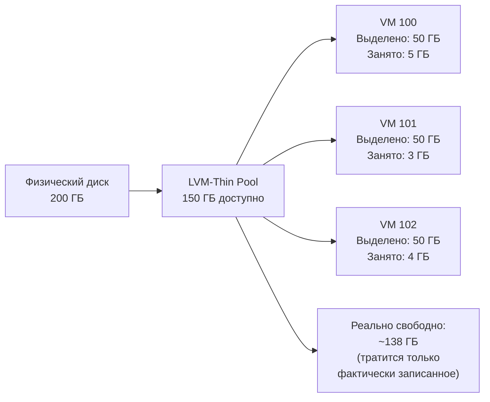
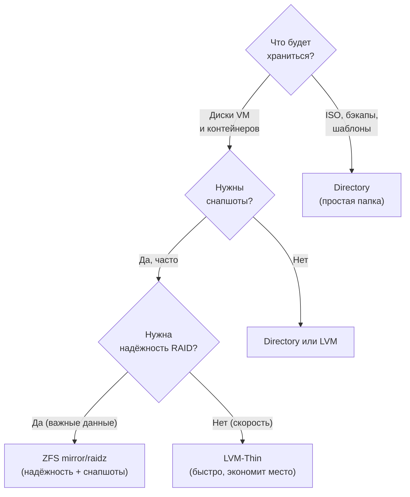

# Глава 7: Хранилища — диски, LVM, ZFS

> **Цель:** разобраться с типами хранилищ в Proxmox, выбрать подходящее под свои задачи и добавить новый диск к работающему серверу.

---

## Что вы узнаете

- Какие типы хранилищ есть в Proxmox и для чего каждый из них.
- Честное сравнение LVM-Thin и ZFS с реальными цифрами.
- Когда выбрать LVM-Thin, а когда ZFS — с конкретными критериями.
- Как добавить второй физический диск к работающему серверу шаг за шагом.
- Как создать ZFS pool из двух дисков (mirror = RAID1).
- Как добавить Directory-хранилище для хранения бэкапов.

---

## 7.1 Что такое хранилище в контексте Proxmox

В Proxmox «хранилище» (storage) — это не просто диск. Это абстракция, которую Proxmox знает как использовать: куда класть образы VM, где держать rootfs контейнеров, куда сохранять бэкапы и ISO.

Когда ты создаёшь LXC и выбираешь `local-lvm` — ты говоришь Proxmox: «корневой диск этого контейнера держи вот в этом хранилище». Когда ставишь задание на бэкап — говоришь: «дампы складывай вот туда».

Важно понять сразу: **разные хранилища подходят для разных задач**. Нет одного «правильного» варианта — есть правильный выбор под конкретный сценарий.

---

## 7.2 Типы хранилищ: обзор

| Тип | Что хранит | Снапшоты VM/LXC | Подходит для |
|-----|-----------|-----------------|--------------|
| **Directory** | ISO, бэкапы, CT-шаблоны, образы qcow2 | Нет (для raw-дисков) | Бэкапы, ISO, дешёвое хранилище |
| **LVM** | Raw-блоки для VM и LXC | Нет | Простые диски без снапшотов |
| **LVM-Thin** | Raw-блоки с thin provisioning | Да (CoW) | Основное хранилище VM/LXC |
| **ZFS** | Датасеты и zvol для VM/LXC | Да (CoW) | Надёжность, RAID, сжатие |
| **NFS / CIFS** | Сетевая папка | Зависит от бэкенда | Сетевой NAS |
| **Ceph** | Распределённое блочное хранилище | Да | Кластер из 3+ серверов |

После установки Proxmox по умолчанию создаётся два хранилища:

- `local` — Directory на `/var/lib/vz/`. Сюда кладут ISO и CT-шаблоны.
- `local-lvm` — LVM-Thin. Сюда идут диски VM и LXC.

Проверить текущее состояние хранилищ:

```bash
# Список хранилищ и их статус
pvesm status

# Пример вывода:
# Name             Type     Status           Total            Used       Available        %
# local            dir      active       47244640        11453116       33380556   24.25%
# local-lvm        lvmthin  active      493412352        33554432      459857920    6.80%
```

---

## 7.3 Directory — простое и надёжное

Directory — это обычная папка на диске. Proxmox умеет хранить там:

- ISO-образы для установки ОС
- CT-шаблоны (tarballs для LXC)
- Бэкапы (vzdump-файлы `.tar.zst`)
- Образы VM в формате qcow2

Снапшоты для qcow2 технически возможны, но медленные — не годятся для production. Для VM лучше LVM-Thin или ZFS.

**Главное применение Directory:** хранение бэкапов на втором диске. Быстро настроить, понятно обслуживать, не требует знания LVM или ZFS.

---

## 7.4 LVM-Thin — быстро и практично

LVM (Logical Volume Manager) — стандартный инструмент управления дисками Linux. В базовом режиме LVM просто нарезает диск на логические тома — без снапшотов.

**LVM-Thin** добавляет thin provisioning: тома «обещают» размер, но занимают реальное место только по мере записи данных. Это позволяет:

- Создавать снапшоты через Copy-on-Write (CoW).
- Выделять виртуально больше места, чем есть физически (overcommit).
- Не резервировать место заранее.

Пример: создал LXC с диском 20 GB — реально на диске занято 1-2 GB пока контейнер пустой. Ещё 10 таких контейнеров на 200GB «виртуального» диска — при 50GB реального места, если реально каждый занимает по 3-5 GB.

Именно этот механизм позволяет «нарезать» из одного пула множество томов суммарным объёмом больше физического места — и при этом пул не переполнится, пока реальные данные не превысят его размер. Диаграмма ниже показывает как это выглядит на практике.



Три VM «обещают» себе по 50 ГБ (150 ГБ суммарно), но реально записали лишь 12 ГБ — пул показывает ~138 ГБ свободных. Если все три VM начнут активно писать данные и суммарно превысят 150 ГБ — пул переполнится и VM получат ошибку записи. Поэтому важно следить за реальным заполнением через `lvs` (колонка `Data%`).

**Проверить состояние LVM-Thin:**

```bash
# Список всех Volume Groups
vgs

# Пример вывода:
#   VG      #PV #LV #SN Attr   VSize    VFree
#   pve       1   3   0 wz--n- <465.76g <16.00g

# Список Logical Volumes (включая thin pool)
lvs

# Пример вывода:
#   LV            VG  Attr       LSize   Pool Origin Data%
#   data          pve twi-aotz-- 416.84g             8.04
#   root          pve -wi-ao----  96.00g
#   swap          pve -wi-ao----   8.00g
```

---

## 7.5 ZFS — надёжность прежде всего

ZFS — это файловая система и менеджер томов в одном. Создавалась для серверов с требованием к целостности данных. В отличие от LVM, ZFS сама управляет дисками, RAID и сжатием.

**Что ZFS умеет из коробки:**

- **Checksums:** каждый блок данных имеет контрольную сумму. ZFS обнаруживает и исправляет тихое повреждение данных (bitrot).
- **RAID без mdadm:** mirror (RAID1), RAIDZ (RAID5), RAIDZ2 (RAID6) встроены.
- **Сжатие:** алгоритм lz4 или zstd включается одной командой и работает прозрачно. Реальная экономия 20-40% для текстов, логов, баз данных.
- **ARC-кэш:** горячие блоки кэшируются в RAM. Чем больше RAM — тем быстрее работает ZFS.

**Ключевой момент про RAM:** ZFS использует ARC (Adaptive Replacement Cache) — часть RAM под кэш данных. По умолчанию это 50% от доступной RAM. На системе с 8 GB ZFS может держать 3-4 GB под кэш. Это нормально — и это именно то, почему ZFS на машинах с малым количеством RAM чувствует себя некомфортно.

Практическая рекомендация от сообщества: **1 GB RAM на каждые 1 TB данных** — это нижняя граница для нормальной работы ZFS. Лучше — больше.

---

## 7.6 Честное сравнение LVM-Thin vs ZFS

Вот реальные цифры, а не маркетинг:

| Параметр | LVM-Thin | ZFS |
|----------|----------|-----|
| Снапшоты | Да (CoW) | Да (CoW) |
| Overhead на RAM | ~10–50 MB (только LVM metadata) | ~1 GB на каждые 1 TB данных (ARC) |
| Overhead по месту | Минимальный (<1%) | +5–15% на метаданные и ZIL |
| Производительность SSD | Отличная | Отличная + сжатие «бесплатно» |
| Производительность HDD | Хорошая | Медленнее без ARC-кэша |
| RAID из коробки | Нет (нужен mdadm) | Да (mirror, RAIDZ, RAIDZ2) |
| Проверка целостности данных | Нет | Да (checksums + scrub) |
| Сжатие данных | Нет | Да (lz4, zstd — прозрачно) |
| Реальный выигрыш по месту | 0% | 20–40% для логов, текстов, баз |
| Защита от bitrot | Нет | Да |
| Сложность настройки | Низкая | Средняя |
| Сложность обслуживания | Низкая | Средняя (нужен scrub раз в месяц) |
| Требования к железу | Минимальные | RAM 8 GB+ желательно |

---

## 7.7 Когда что выбрать

**Выбирай LVM-Thin если:**

- Один диск (SSD). ZFS на одном диске не даёт преимуществ RAID.
- Мало RAM (8 GB и меньше): ZFS ARC будет конкурировать с контейнерами за память.
- Только начинаешь работать с Proxmox — меньше переменных для отладки.
- Простота важнее: поставил и забыл, никакого scrub, никакого tuning.
- Высоконагруженные VM с частой перезаписью (базы данных на один диск).

**Выбирай ZFS если:**

- Два и более дисков — зеркало или RAIDZ защищает от потери диска.
- Хранишь критичные данные: документы, медиатеку, бэкапы данных.
- RAM 16 GB и больше — можно отдать 4–8 GB под ARC, остальное контейнерам.
- Боишься bitrot: старые HDD, дешёвые диски, долгое хранение.
- Важно сжатие: логи, базы данных, текстовые файлы занимают в 1.5–2 раза меньше.

**Практический совет для домашнего сервера:**

```text
Типичный сценарий:
  SSD 500 GB (системный) → LVM-Thin → VM и LXC
  HDD 2 TB (данные)      → Directory → бэкапы, медиатека

Если два одинаковых HDD:
  2× HDD 2 TB            → ZFS mirror → надёжное хранилище с защитой
```

Чтобы легче ориентироваться, пройди по дереву решений: ответь на два-три вопроса и сразу получи рекомендацию.



Дерево охватывает 80% реальных случаев: если хранишь ISO и бэкапы — достаточно простой папки (Directory); если нужны снапшоты и нет критичных требований к отказоустойчивости — LVM-Thin; если два и более дисков с важными данными — ZFS mirror или raidz.

---

## 7.8 Добавляем второй диск: LVM-Thin шаг за шагом

Сценарий: к серверу подключили новый диск (SSD или HDD). Надо добавить его в Proxmox как хранилище для VM и LXC.

**Шаг 1. Найти диск**

```bash
# Показать все блочные устройства и разделы
lsblk

# Пример вывода:
# NAME        MAJ:MIN RM   SIZE RO TYPE MOUNTPOINTS
# sda           8:0    0 465.8G  0 disk
# ├─sda1        8:1    0  1007K  0 part
# ├─sda2        8:2    0     1G  0 part /boot/efi
# └─sda3        8:3    0 464.8G  0 part
#   ├─pve-swap  ...
#   ├─pve-root  ...
#   └─pve-data  ...
# sdb           8:16   0   1.8T  0 disk   ← новый диск, без разделов
```

Новый диск — `sdb`, без разделов и точек монтирования. Убедись что это именно новый пустой диск, а не диск с данными.

**Шаг 2. Создать Physical Volume**

```bash
# pvcreate инициализирует диск как LVM Physical Volume
# Записывает метаданные LVM в начало диска
pvcreate /dev/sdb

# Пример вывода:
#   Physical volume "/dev/sdb" successfully created.
```

Если диск уже использовался — добавь флаг `-ff` (force). Но сначала убедись что данных там нет:

```bash
# Посмотреть есть ли файловая система или разметка
blkid /dev/sdb
file -s /dev/sdb
```

**Шаг 3. Создать Volume Group**

```bash
# vgcreate создаёт группу томов с именем "data-vg" из Physical Volume /dev/sdb
# Имя можно выбрать любое — оно будет видно в интерфейсе Proxmox
vgcreate data-vg /dev/sdb

# Пример вывода:
#   Volume group "data-vg" successfully created
```

**Шаг 4. Создать Thin Pool**

```bash
# lvcreate создаёт thin pool, который займёт 100% свободного места в data-vg
# Имя пула — data-pool
lvcreate -l 100%FREE --thinpool data-pool data-vg

# Пример вывода:
#   Thin pool volume with chunk size 64.00 KiB can address at most <15.88 TiB of data.
#   Logical volume "data-pool" created.
```

**Шаг 5. Добавить хранилище в Proxmox**

Теперь нужно сказать Proxmox про новый пул. Через CLI:

```bash
# pvesm add lvmthin — добавить LVM-Thin хранилище
# data-storage — имя хранилища в интерфейсе Proxmox
# --vgname data-vg — Volume Group
# --thinpool data-pool — имя Thin Pool внутри VG
pvesm add lvmthin data-storage --vgname data-vg --thinpool data-pool

# Проверить что добавилось
pvesm status
```

Или через веб-интерфейс: **Datacenter → Storage → Add → LVM-Thin** — указать VG name и Thin Pool name.

**Проверка:**

```bash
# Убедиться что хранилище active
pvesm status | grep data-storage

# Посмотреть заполненность пула
lvs data-vg
```

Теперь при создании LXC или VM в списке хранилищ появится `data-storage`.

---

## 7.9 Создаём ZFS pool из двух дисков (mirror)

Сценарий: два одинаковых диска `/dev/sdc` и `/dev/sdd`. Цель — зеркало с защитой от потери одного диска.

**Шаг 1. Убедиться что диски чистые**

```bash
lsblk /dev/sdc /dev/sdd
# Оба должны быть без разделов и mount-points
```

**Шаг 2. Создать ZFS pool**

```bash
# zpool create — создать новый ZFS пул
# tank — имя пула (традиционное название, можно любое: data, storage, mirror-pool)
# mirror — тип: RAID1, данные пишутся на оба диска одновременно
# /dev/sdc /dev/sdd — два диска в зеркале
zpool create tank mirror /dev/sdc /dev/sdd

# Proxmox рекомендует использовать id-пути дисков вместо /dev/sdX
# (sdX может смениться после перезагрузки):
# zpool create tank mirror \
#   /dev/disk/by-id/ata-WDC_WD20EZRZ-00Z5HB0_WD-WCC7K... \
#   /dev/disk/by-id/ata-WDC_WD20EZRZ-00Z5HB0_WD-WCC7K...
```

Почему id-пути надёжнее? При добавлении нового диска `/dev/sdb` может стать `/dev/sdc`, а `/dev/sdc` — `/dev/sdb`. ZFS не перепутает диски если использовать стабильные id.

```bash
# Найти id-пути всех дисков
ls -la /dev/disk/by-id/ | grep -v part
```

**Шаг 3. Проверить состояние пула**

```bash
# zpool status — подробный статус: диски, ошибки, деградация
zpool status

# Пример вывода:
#   pool: tank
#  state: ONLINE
# config:
#         NAME        STATE     READ WRITE CKSUM
#         tank        ONLINE       0     0     0
#           mirror-0  ONLINE       0     0     0
#             sdc     ONLINE       0     0     0
#             sdd     ONLINE       0     0     0
# errors: No known data errors

# Размер и заполненность
zpool list

# Пример вывода:
# NAME    SIZE  ALLOC   FREE  CKPOINT  EXPANDSZ   FRAG    CAP  DEDUP    HEALTH  ALTROOT
# tank   1.81T   132K  1.81T        -         -     0%     0%  1.00x    ONLINE  -
```

**Шаг 4. Включить сжатие (рекомендуется)**

```bash
# lz4 — быстрое сжатие, почти нет overhead на CPU
# Работает прозрачно: данные сжимаются при записи, читаются распакованными
zfs set compression=lz4 tank

# Проверить что включилось
zfs get compression tank
```

**Шаг 5. Добавить ZFS pool в Proxmox**

```bash
# pvesm add zfspool — добавить ZFS хранилище
# zfs-mirror — имя хранилища в интерфейсе Proxmox
# --pool tank — имя ZFS пула
pvesm add zfspool zfs-mirror --pool tank

# Проверить
pvesm status | grep zfs-mirror
```

Или через веб-интерфейс: **Datacenter → Storage → Add → ZFS** — указать Pool name.

**Периодическое обслуживание — scrub:**

```bash
# Запустить проверку целостности всех данных в пуле
# Рекомендуется раз в месяц
zpool scrub tank

# Посмотреть прогресс
zpool status tank

# Настроить автоматический scrub через cron (раз в месяц в воскресенье в 02:00):
echo "0 2 * * 0 root zpool scrub tank" > /etc/cron.d/zfs-scrub
```

---

## 7.10 Добавляем Directory для бэкапов

Directory — самый простой способ добавить хранилище для бэкапов. Подходит для второго диска (HDD), сетевой папки или любой точки монтирования.

**Сценарий:** второй HDD смонтирован в `/mnt/backup-hdd`. Нужно добавить его как хранилище для vzdump-бэкапов.

**Шаг 1. Подготовить диск и точку монтирования**

```bash
# Посмотреть диски
lsblk

# Если диск новый — создать файловую систему
mkfs.ext4 /dev/sdb

# Создать точку монтирования
mkdir -p /mnt/backup-hdd

# Добавить в /etc/fstab для автомонтирования при загрузке
echo "/dev/sdb /mnt/backup-hdd ext4 defaults 0 2" >> /etc/fstab

# Смонтировать сейчас
mount -a

# Проверить
df -h /mnt/backup-hdd
```

Лучше использовать UUID вместо `/dev/sdb` в fstab — UUID не меняется при изменении порядка дисков:

```bash
# Найти UUID диска
blkid /dev/sdb

# Пример вывода:
# /dev/sdb: UUID="a1b2c3d4-e5f6-7890-abcd-ef1234567890" TYPE="ext4"

# Использовать в fstab:
echo "UUID=a1b2c3d4-e5f6-7890-abcd-ef1234567890 /mnt/backup-hdd ext4 defaults 0 2" >> /etc/fstab
```

**Шаг 2. Добавить Directory в Proxmox**

```bash
# pvesm add dir — добавить Directory хранилище
# backup-hdd — имя хранилища в интерфейсе
# --path /mnt/backup-hdd — путь к директории
# --content backup — что хранить: backup (vzdump), iso, vztmpl, images
# Можно комбинировать через запятую: backup,iso
pvesm add dir backup-hdd --path /mnt/backup-hdd --content backup

# Проверить
pvesm status
```

Или через веб-интерфейс: **Datacenter → Storage → Add → Directory** → указать путь и Content типы.

**Шаг 3. Настроить бэкапы на это хранилище**

Теперь можно выбрать `backup-hdd` в задании на бэкап: **Datacenter → Backup → Add** → Storage: `backup-hdd`.

---

## 7.11 Типичные ошибки

**Ошибка: ZFS установили на машину с 8 GB RAM**

```text
Симптом: система тормозит, htop показывает что RAM почти полная
Причина: ZFS ARC захватил 3-4 GB памяти
Решение: ограничить ARC
```

```bash
# Ограничить ARC до 2 GB (значение в байтах: 2 * 1024^3 = 2147483648)
echo "options zfs zfs_arc_max=2147483648" > /etc/modprobe.d/zfs.conf
update-initramfs -u

# Применить без перезагрузки
echo 2147483648 > /sys/module/zfs/parameters/zfs_arc_max

# Проверить текущий размер ARC
cat /proc/spl/kstat/zfs/arcstats | grep -E "^size|^c_max"
```

**Ошибка: создал LVM с `lvcreate` без `--thinpool` — нет снапшотов**

```text
Симптом: вкладка Snapshots у VM/LXC неактивна или снапшот не создаётся
Причина: хранилище — обычный LVM, не LVM-Thin
Решение: создать новый LVM-Thin pool, перенести VM
```

**Ошибка: /dev/sdX поменялся после перезагрузки**

```text
Симптом: ZFS pool не монтируется после ребута, zpool status показывает FAULTED
Причина: диски поменяли имена /dev/sdb → /dev/sdc
Решение: использовать /dev/disk/by-id/ при создании пула
```

Если пул уже создан с `/dev/sdX` — можно экспортировать и переимпортировать:

```bash
zpool export tank
zpool import tank    # ZFS сам найдёт диски по внутренним меткам
```

---

## 7.12 Полезные команды для диагностики

```bash
# Состояние всех хранилищ Proxmox
pvesm status

# LVM: все Volume Groups и их заполненность
vgs

# LVM: все Logical Volumes с процентом заполнения thin pool
lvs

# LVM: подробная информация о physical volumes
pvs

# ZFS: состояние всех пулов
zpool status

# ZFS: список пулов с размером и заполненностью
zpool list

# ZFS: список датасетов (файловых систем) внутри пула
zfs list

# ZFS: посмотреть свойства пула (compression, atime и др.)
zfs get all tank | grep -E "compression|atime|dedup|recordsize"

# Диски: показать все блочные устройства
lsblk

# Диски: файловые системы и точки монтирования
df -h

# Диски: место занятое образами VM и LXC
du -sh /var/lib/vz/
```

---

## Практика

1. Выполни `pvesm status` и запиши текущее состояние хранилищ.
2. Выполни `lvs` и найди thin pool — посмотри на процент заполнения (Data%).
3. Добавь Directory хранилище (`/var/lib/pve-backup` подойдёт для теста без второго диска):
   ```bash
   mkdir -p /var/lib/pve-backup
   pvesm add dir local-backup --path /var/lib/pve-backup --content backup
   pvesm status
   ```
4. Убедись что новое хранилище появилось в **Datacenter → Storage**.
5. (Если есть второй диск) Добавь его как LVM-Thin или Directory по инструкции из этой главы.

---

## Чек-лист для самопроверки

- [ ] Могу объяснить разницу между Directory, LVM, LVM-Thin и ZFS в двух предложениях для каждого
- [ ] Знаю почему ZFS требует больше RAM и как это ограничить
- [ ] Могу выполнить `pvesm status`, `lvs`, `zpool status` и понять вывод
- [ ] Знаю команды `pvcreate`, `vgcreate`, `lvcreate --thinpool` и их порядок
- [ ] Знаю как создать ZFS mirror из двух дисков и почему лучше использовать id-пути
- [ ] Добавил хотя бы одно хранилище в Proxmox (через CLI или веб-интерфейс)
- [ ] Понимаю когда выбрать LVM-Thin, а когда ZFS — с конкретными критериями
- [ ] Знаю как настроить автомонтирование через `/etc/fstab` с UUID
