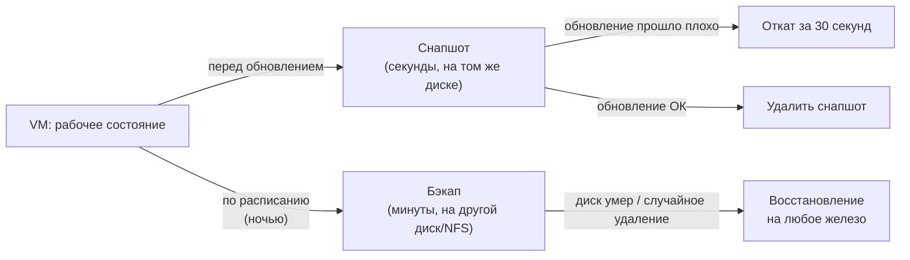
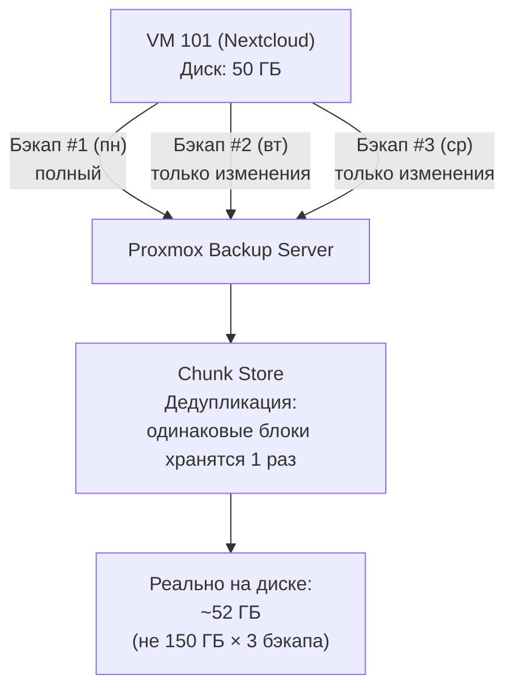

# Глава 8: Снапшоты и бэкапы

> **Цель:** никогда не терять данные и уметь восстановиться за минуты, а не часы.

---

## Что вы узнаете

- В чём принципиальная разница между снапшотом и бэкапом — и почему одно не заменяет другое.
- Как создавать снапшоты и откатываться через CLI и веб-интерфейс.
- Как настроить автоматические бэкапы по расписанию через Datacenter → Backup.
- Что такое Proxmox Backup Server, чем он отличается от vzdump и когда он нужен.

---

## 8.1 Снапшот или бэкап — в чём разница

Это первое, что нужно понять правильно. Многие путают эти два инструмента, используют только один — и потом жалеют.

```text
Раньше:
один LXC с Nextcloud → обновил пакеты → всё сломалось → нет снапшота → 
разбираться часами что именно не так

С Proxmox:
один LXC с Nextcloud → снапшот перед обновлением (2 сек) → обновил → 
сломалось → откат за 10 секунд
```

**Снапшот** — это мгновенный «срез» состояния контейнера или VM прямо сейчас. Proxmox запоминает текущее состояние файловой системы и сохраняет разницу (delta). Работает это через механизм Copy-on-Write: новые данные записываются в отдельное место, старые остаются нетронутыми.

Снапшот делается за секунды. Откат — тоже за секунды. Но есть важное ограничение: снапшот хранится на том же физическом диске, что и контейнер. Если диск сломается — снапшот пропадёт вместе с данными.

**Бэкап** — это полная копия контейнера или VM в отдельный файл (`.tar.zst`). Файл можно сохранить на другой диск, NAS или облако. Бэкап создаётся дольше (минуты), занимает реальное место, но именно он защищает от сгоревшего диска или уничтоженного сервера.

```text
Снапшот:
  + мгновенный (секунды)
  + без прерывания работы контейнера
  + удобен перед экспериментами
  - хранится на том же диске
  - НЕ защищает от потери железа
  - для LXC нужен LVM-Thin или ZFS

Бэкап (vzdump):
  + полная копия в отдельный файл
  + можно хранить на другом диске, NAS, S3
  + можно перенести на другой сервер
  + защищает от любой аварии
  - занимает место (размер контейнера × количество копий)
  - медленнее (несколько минут)
```

**Правило:** снапшот — для быстрого отката. Бэкап — для настоящей защиты данных. Нужны оба.

Чтобы лучше понять когда применять каждый инструмент, посмотри на временну́ю линию типичного рабочего дня с VM:



Снапшот — это не резервная копия. Он хранится на том же физическом диске, что и сама VM или контейнер. Если диск выйдет из строя — снапшот исчезнет вместе со всеми данными. Именно поэтому снапшоты и бэкапы решают разные задачи и дополняют друг друга, а не заменяют.

---

## 8.2 Снапшоты — создание и откат

### Через CLI

```bash
# Создать снапшот LXC-контейнера 100 с именем "before-update"
# Имя должно быть без пробелов
pct snapshot 100 before-update --description "Before nginx update $(date +%Y-%m-%d)"
```

Эта команда создаёт снапшот контейнера с ID 100. Флаг `--description` позволяет добавить пояснение — через месяц будет понятно зачем он создавался. Без описания список снапшотов превращается в загадку.

```bash
# Посмотреть список снапшотов контейнера 100
pct listsnapshot 100
```

Пример вывода:
```
             Name        State   RAM       Running  Description
-> current
   before-update        disk                       Before nginx update 2026-05-23
```

```bash
# Откатить контейнер на снапшот before-update
pct rollback 100 before-update
```

Контейнер при этом должен быть остановлен. Proxmox предупредит, если это не так.

Для виртуальных машин команды аналогичны, но через `qm`:

```bash
# Снапшот VM с ID 200
qm snapshot 200 before-win-update --description "Before Windows update 2026-05-23"

# Список снапшотов VM
qm listsnapshot 200

# Откат VM на снапшот
qm rollback 200 before-win-update
```

### Через веб-интерфейс

1. В левой панели выбрать контейнер или VM.
2. Перейти на вкладку **Snapshots**.
3. Нажать **Take Snapshot**, ввести имя и описание.
4. Для отката — выбрать нужный снапшот в списке, нажать **Rollback**.

Веб-интерфейс удобен когда работаешь визуально и хочешь видеть список снапшотов со временем создания.

### Когда делать снапшот

Хорошее правило — снапшот перед любым изменением, которое может что-то сломать:

- Перед обновлением пакетов в контейнере.
- Перед изменением конфига приложения (Nextcloud, Home Assistant).
- Перед мажорным обновлением Proxmox.
- Перед экспериментом, результат которого неизвестен.

```bash
# Быстрый снапшот перед обновлением Nextcloud
pct snapshot 100 nc-before-update --description "Before Nextcloud 28→29"
# Обновить, проверить что всё работает
# Если сломалось — откат:
pct rollback 100 nc-before-update
# Если всё хорошо — удалить старый снапшот (он занимает место):
pct delsnapshot 100 nc-before-update
```

### Ограничения снапшотов

Снапшоты работают только если хранилище их поддерживает:

| Хранилище | Снапшоты LXC | Снапшоты VM |
|-----------|-------------|-------------|
| LVM-Thin  | Да          | Да          |
| ZFS       | Да          | Да          |
| Directory | Нет         | Нет (только бэкапы) |
| LVM (не Thin) | Нет    | Нет         |

Если снапшот недоступен — в веб-интерфейсе кнопка **Take Snapshot** будет серой, а через CLI будет ошибка `storage does not support snapshots`.

---

## 8.3 Автоматические бэкапы по расписанию

Ручной бэкап — это ненастоящий бэкап. Потому что через две недели про него забываешь. Настрой расписание один раз — и бэкапы будут идти сами.

### Настройка через веб-интерфейс

1. Открыть **Datacenter** (самый верхний элемент в левой панели).
2. Перейти в **Backup** → нажать **Add**.
3. Заполнить форму:

```text
Storage:      backup-hdd     ← хранилище для бэкапов (другой диск или NAS)
Schedule:     0 3 * * *      ← каждый день в 03:00 (синтаксис cron)
Mode:         Snapshot        ← режим (подробнее ниже)
Compression:  ZSTD            ← лучшее сжатие, используй его
All VMs/CTs:  ✅              ← бэкапить всё
```

4. В разделе **Retention** настроить политику хранения:

```text
Keep last:     7    ← хранить 7 последних ежедневных бэкапов
Keep Weekly:   4    ← хранить 4 еженедельных
Keep Monthly:  3    ← хранить 3 ежемесячных
```

Итого у тебя будет покрытие на 3 месяца назад при разумном расходе места.

### Режимы бэкапа: Snapshot, Suspend, Stop

Это важный выбор. Он определяет что происходит с контейнером во время создания бэкапа.

**Snapshot** — самый быстрый режим. Контейнер продолжает работать, бэкап снимается с «живой» системы. Данные в оперативной памяти и незафлушенные операции могут не попасть в бэкап. Подходит для большинства случаев, особенно для Docker-контейнеров и веб-сервисов.

**Suspend** — контейнер «засыпает» на время бэкапа (секунды–минуты). Сервис временно недоступен, зато бэкап консистентен. Подходит если нужна гарантия целостности данных, но не хочется полностью останавливать.

**Stop** — контейнер полностью останавливается, делается бэкап, затем запускается снова. Самый надёжный способ — данные точно будут консистентны. Но сервис будет недоступен несколько минут. Подходит для баз данных и приложений с критичным состоянием.

```text
Режим         Скорость    Доступность   Консистентность
Snapshot      Быстро      Сервис работает  Обычно ок, риски есть
Suspend       Средне      Сервис на паузе  Хорошая
Stop          Медленно    Сервис остановлен  Максимальная
```

Для домашнего сервера рекомендация: использовать **Snapshot** для всего кроме баз данных. Для PostgreSQL или MySQL — **Stop** или **Suspend**.

### Ручной бэкап через CLI

Иногда нужно сделать бэкап прямо сейчас, не дожидаясь расписания:

```bash
# Бэкап LXC-контейнера 100 на хранилище backup-hdd, режим snapshot, сжатие zstd
vzdump 100 --compress zstd --storage backup-hdd --mode snapshot
```

Команда `vzdump` — это основной инструмент Proxmox для бэкапов. Она создаёт файл вида `vzdump-lxc-100-2026_05_23-03_00_01.tar.zst` на указанном хранилище.

```bash
# Бэкап всех контейнеров и VM одной командой
vzdump --all --compress zstd --storage backup-hdd --mode snapshot
```

```bash
# Посмотреть список бэкапов на хранилище
pvesm list backup-hdd
```

---

## 8.4 Восстановление из бэкапа

### Через CLI

```bash
# Восстановить LXC-контейнер из файла бэкапа
# Новый ID контейнера: 100
# Файл бэкапа: .tar.zst файл из хранилища
# Хранилище для восстановления: local-lvm
pct restore 100 /mnt/backup-hdd/dump/vzdump-lxc-100-2026_05_23-03_00_01.tar.zst \
  --storage local-lvm
```

После восстановления запустить контейнер:

```bash
pct start 100
```

Для VM — команда `qmrestore`:

```bash
# Восстановить VM с ID 200 из бэкапа
qmrestore /mnt/backup-hdd/dump/vzdump-qemu-200-2026_05_23-03_00_01.vma.zst 200 \
  --storage local-lvm
qm start 200
```

### Восстановление на другой сервер

Если сервер полностью вышел из строя — бэкапы позволяют перенести всё на новое железо:

```bash
# На новом сервере Proxmox
# Скопировать бэкап
scp root@старый-сервер:/mnt/backup-hdd/dump/vzdump-lxc-100-*.tar.zst /tmp/

# Восстановить
pct restore 100 /tmp/vzdump-lxc-100-2026_05_23-03_00_01.tar.zst --storage local-lvm

# Проверить сетевые настройки — IP может конфликтовать с новой сетью
cat /etc/pve/lxc/100.conf
pct start 100
```

### Тестовое восстановление — обязательно раз в месяц

Непроверенный бэкап — не бэкап. Файл может быть, а восстановление — сломано. Проверяй регулярно:

```bash
# Восстановить бэкап под тестовым ID 999, чтобы не конфликтовать с рабочим
pct restore 999 /mnt/backup-hdd/dump/vzdump-lxc-100-2026_05_23-03_00_01.tar.zst \
  --storage local-lvm --hostname test-restore
pct start 999

# Проверить что сервисы поднялись
pct exec 999 -- systemctl status

# Проверить что данные на месте (для Nextcloud — наличие файлов)
pct exec 999 -- df -h
pct exec 999 -- ls /var/www/html/data/

# Удалить тестовый контейнер после проверки
pct stop 999 && pct destroy 999
```

### Восстановление через веб-интерфейс

1. Выбрать нужное хранилище в левой панели.
2. Перейти в **Backups**.
3. Выбрать файл бэкапа, нажать **Restore**.
4. Указать новый ID и хранилище назначения.

---

## 8.5 Proxmox Backup Server — инкрементальные бэкапы

### Что такое PBS и зачем он нужен

`vzdump` — простой и надёжный инструмент. Каждый раз он создаёт полную копию контейнера. Если у тебя Nextcloud с 50GB данных — каждый бэкап занимает 50GB. Семь копий — 350GB только под бэкапы.

Proxmox Backup Server (PBS) решает эту проблему. Это отдельный продукт Proxmox, предназначенный специально для хранения бэкапов с дедупликацией и инкрементальными обновлениями.

```text
Как работает PBS:
  1-й бэкап:   полная копия — 50GB
  2-й бэкап:   только изменения за сутки — может быть 200MB
  3-й бэкап:   ещё изменения — 150MB
  ...
  Итого за 7 дней: ~52GB вместо 350GB
```

PBS использует chunked storage — данные разбиваются на блоки, одинаковые блоки хранятся один раз. Это и есть дедупликация.

Ниже показано как PBS хранит инкрементальные бэкапы одной VM и почему реальное место на диске оказывается намного меньше, чем сумма всех копий:



Каждый бэкап — это не новая полная копия, а набор ссылок на уже сохранённые блоки плюс только новые изменения. При этом каждый бэкап остаётся полноценным: восстановление возможно с любой точки независимо от других копий. Удалить промежуточный бэкап безопасно — PBS пересчитает ссылки и освободит только те блоки, на которые больше никто не ссылается.

### Сравнение vzdump и PBS

| Параметр | vzdump | PBS |
|---|---|---|
| Тип бэкапа | Полная копия каждый раз | Инкрементальный (только изменения) |
| Место на диске | N × полный размер | Первый бэкап + дельты |
| Скорость повторного бэкапа | Одинаково медленно | Намного быстрее |
| Дедупликация | Нет | Да |
| Верификация данных | Нет | Встроенная (checksums) |
| Шифрование | Нет | Да (AES-256) |
| Веб-интерфейс | Через Proxmox | Отдельный интерфейс PBS |
| Сложность настройки | Низкая | Средняя |

### Когда нужен PBS, а когда достаточно vzdump

**vzdump подходит если:**
- 2-4 контейнера в домашнем сервере.
- Данные в контейнерах меняются активно (много новых файлов каждый день).
- Хочется простоты — настроил и забыл.
- Хватает места под полные копии.

**PBS выгоден если:**
- Много контейнеров (от 5-6 и больше).
- Данные меняются мало (конфиги, базы данных со стабильным содержимым).
- Диск для бэкапов ограничен по объёму.
- Нужно шифрование бэкапов (например для офсайта).
- Хочется верификации что бэкапы не повреждены.

### Установка PBS

PBS устанавливается как отдельный сервер — обычно в LXC-контейнере на том же Proxmox или на отдельном мини-ПК.

Через Community Scripts — самый быстрый способ:

```bash
# На хосте Proxmox — в Shell
# Эта команда создаёт LXC с установленным Proxmox Backup Server
bash -c "$(curl -fsSL https://community-scripts.org/ct/proxmox-backup-server.sh)"
```

После установки PBS будет доступен по адресу `https://IP-LXC:8007`.

Вручную — PBS устанавливается как Debian-пакет. Это более правильный путь для production:

```bash
# Внутри Debian LXC — добавить репозиторий PBS
echo "deb http://download.proxmox.com/debian/pbs bookworm pbs-no-subscription" \
  > /etc/apt/sources.list.d/pbs-no-subscription.list

apt update && apt install proxmox-backup-server -y
systemctl enable --now proxmox-backup-daemon
```

### Подключение PBS к Proxmox

После установки PBS нужно подключить его как хранилище в Proxmox:

1. **Datacenter** → **Storage** → **Add** → **Proxmox Backup Server**.
2. Заполнить:
   - **ID:** `pbs-storage`
   - **Server:** IP-адрес LXC с PBS
   - **Username:** `admin@pbs`
   - **Password:** пароль PBS
   - **Datastore:** имя датастора в PBS
3. Нажать **Add**.

После этого PBS появится как обычное хранилище — его можно выбрать в расписании бэкапов (Datacenter → Backup).

### Структура хранения в PBS

PBS хранит бэкапы в датасторах. Каждый датастор — это директория на диске. Внутри PBS для каждого контейнера или VM создаётся namespaced хранилище:

```text
/mnt/datastore/main/
├── ns/                     ← неймспейсы (опционально)
├── ct/                     ← LXC-контейнеры
│   └── 100/                ← ID контейнера
│       ├── 2026-05-23T03:00:00Z/
│       └── 2026-05-24T03:00:00Z/
└── vm/                     ← виртуальные машины
    └── 200/
        └── 2026-05-23T03:00:00Z/
```

### Верификация бэкапов в PBS

Одна из главных причин использовать PBS — встроенная верификация. PBS проверяет контрольные суммы и целостность данных:

```bash
# Запустить верификацию всех бэкапов в датасторе
# Выполнять в консоли PBS или через его веб-интерфейс:
proxmox-backup-manager verify-all
```

В веб-интерфейсе PBS: **Datastore** → **Verify** — кнопка ручной верификации или настройка расписания автоматической.

---

## 8.6 Рекомендуемая схема бэкапов

Для домашнего сервера с 3-5 контейнерами оптимальная схема:

```text
Ежедневно в 03:00:
  vzdump → бэкапы на HDD (второй диск)
  Режим: Snapshot
  Retention: 7 daily, 4 weekly

Раз в месяц:
  Тестовое восстановление одного контейнера под ID 999
  Проверить данные → удалить тестовый контейнер
```

Для сервера с большим числом контейнеров или ограниченным местом добавь PBS:

```text
PBS в LXC (CT 104):
  → Бэкапы всех контейнеров на PBS
  → Дедупликация экономит 50-70% места
  → Верификация раз в неделю
  → Retention: 30 daily, 12 weekly, 6 monthly
```

---

## 8.7 Типичные ошибки

### Ошибка: снапшот не создаётся

**Симптом:**
```
ERROR: storage type 'dir' does not support snapshots
```

**Причина:** хранилище типа Directory не поддерживает снапшоты LXC и VM.

**Решение:** использовать LVM-Thin или ZFS для хранилища контейнеров. Directory можно оставить только для бэкапов и ISO-образов.

---

### Ошибка: нет места под бэкапы

**Симптом:**
```
ERROR: unable to open file '/mnt/backup-hdd/dump/vzdump-lxc-100-...' - No space left on device
```

**Диагностика:**
```bash
df -h /mnt/backup-hdd    # сколько осталось места
pvesm list backup-hdd    # что лежит в хранилище
```

**Решение:** удалить старые бэкапы вручную или уменьшить retention (количество хранимых копий).

```bash
# Удалить конкретный файл бэкапа
rm /mnt/backup-hdd/dump/vzdump-lxc-100-2026_04_01-03_00_01.tar.zst
```

---

### Ошибка: восстановление прерывается

**Симптом:**
```
ERROR: tar: Unexpected EOF in archive
```

**Причина:** файл бэкапа повреждён — часто из-за проблем с диском или прерванной записи.

**Решение:** использовать другую копию бэкапа (если есть weekly/monthly). В будущем — включить верификацию в PBS или настроить `vzdump` с проверкой:

```bash
# Проверить целостность файла бэкапа
zstd -t /mnt/backup-hdd/dump/vzdump-lxc-100-2026_05_23-03_00_01.tar.zst
# Если файл цел — вернёт "OK"
```

---

### Ошибка: контейнер запущен — rollback невозможен

**Симптом:**
```
ERROR: CT is running - unable to rollback
```

**Решение:** сначала остановить контейнер, потом откатиться:

```bash
pct stop 100
pct rollback 100 before-update
pct start 100
```

---

## 8.8 Практика

Сделать следующее:

1. **Создать снапшот** LXC-контейнера с Nextcloud или Docker перед обновлением:
   ```bash
   pct snapshot 100 pre-practice --description "Practice snapshot $(date +%Y-%m-%d)"
   ```

2. **Что-то изменить** внутри контейнера — например создать файл:
   ```bash
   pct exec 100 -- touch /tmp/test-file.txt
   ```

3. **Откатиться** на снапшот и убедиться что файл исчез:
   ```bash
   pct stop 100
   pct rollback 100 pre-practice
   pct start 100
   pct exec 100 -- ls /tmp/test-file.txt  # должна быть ошибка "no such file"
   ```

4. **Настроить автоматический бэкап** через Datacenter → Backup: ежедневно в 03:00, режим Snapshot, compression ZSTD, retention 7 daily.

5. **Сделать ручной бэкап** сейчас и убедиться что файл появился в хранилище:
   ```bash
   vzdump 100 --compress zstd --storage backup-hdd --mode snapshot
   pvesm list backup-hdd
   ```

6. **Провести тестовое восстановление** под ID 999:
   ```bash
   pct restore 999 /mnt/backup-hdd/dump/vzdump-lxc-100-*.tar.zst \
     --storage local-lvm --hostname test-restore
   pct start 999
   pct exec 999 -- df -h
   pct stop 999 && pct destroy 999
   ```

---

## Чек-лист для самопроверки

- [ ] Сделал снапшот LXC, изменил что-то внутри, откатился — изменения исчезли
- [ ] Настроен автоматический бэкап по расписанию (Datacenter → Backup)
- [ ] Понимаю разницу между режимами Snapshot/Suspend/Stop при бэкапе
- [ ] Восстановил контейнер из файла бэкапа командой `pct restore`
- [ ] Провёл тестовое восстановление под ID 999, проверил данные, удалил
- [ ] Знаю в чём разница PBS и vzdump — и когда что использовать
