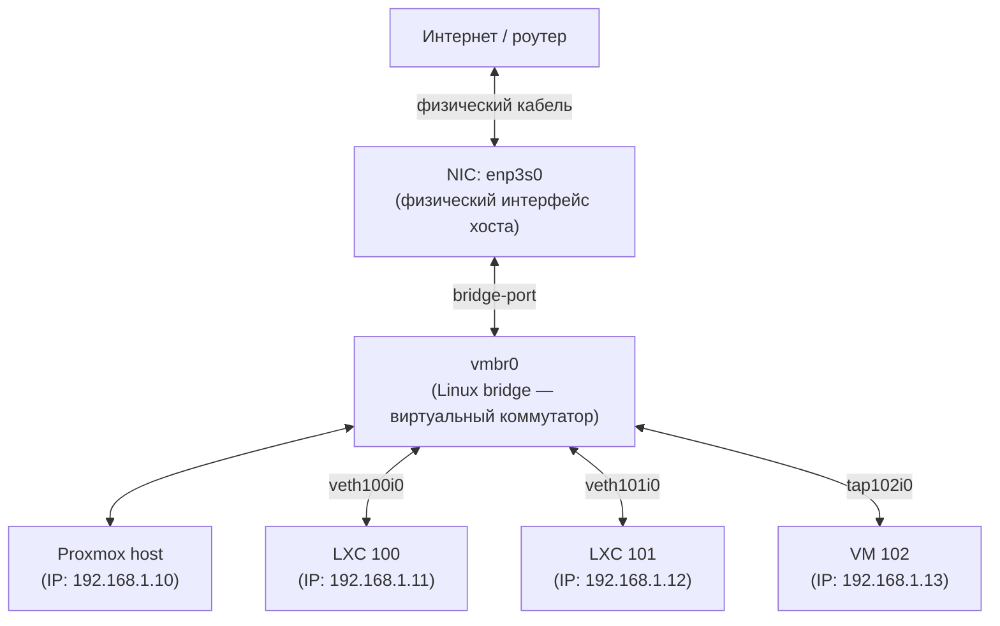
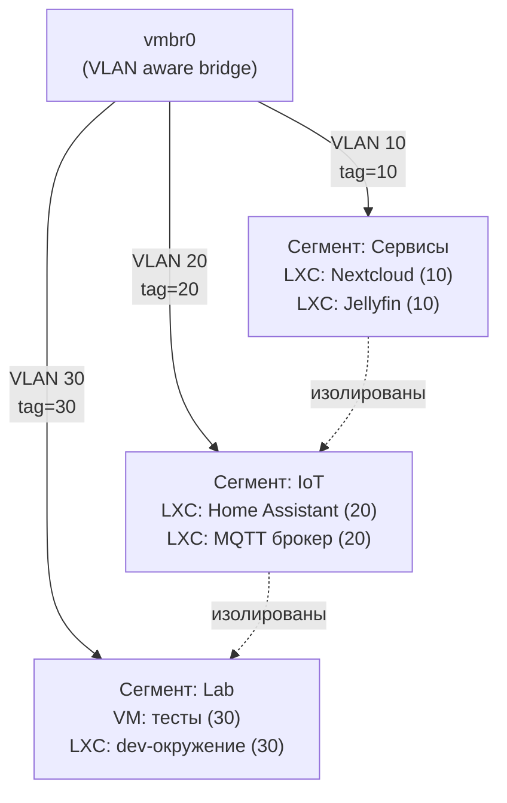

# Глава 9: Сеть в Proxmox

> **Что вы узнаете:**
> - как устроена сетевая модель Proxmox: физический интерфейс → vmbr0 → veth → LXC;
> - как читать и редактировать `/etc/network/interfaces`;
> - почему статический IP лучше DHCP для серверов — и как его назначить;
> - как разбить сеть на три изолированных сегмента с помощью VLAN;
> - как назначить VLAN-тег контейнеру через `tag=`;
> - как включить и настроить встроенный Firewall.

---

## 9.1 Как работает сеть в Proxmox

Когда вы ставите Ubuntu и запускаете Docker, сеть простая: есть физический интерфейс `enp3s0`, Docker создаёт свои мосты `docker0`, и всё работает само. В Proxmox схема чуть сложнее — но только с виду.

Proxmox использует **виртуальный мост** (bridge). Это программный коммутатор внутри ядра Linux. Принцип тот же, что у обычного сетевого коммутатора: несколько портов, трафик коммутируется между ними.

**Схема передачи пакетов:**

```
Физический кабель
      │
  enp3s0           ← физический интерфейс хоста
      │
   vmbr0           ← виртуальный мост (bridge)
   /   \
veth100i0  veth101i0   ← виртуальные интерфейсы (по одному на контейнер)
   │           │
 CT 100      CT 101    ← LXC-контейнеры
(eth0 внутри)(eth0 внутри)
```

Всё что приходит из сети попадает на `enp3s0`, оттуда на мост `vmbr0`, и дальше коммутируется к нужному контейнеру через его `veth`-пару. Контейнер видит обычный интерфейс `eth0` — он не знает что находится внутри Proxmox.

Ниже показан полный путь пакета — от физического кабеля до каждого контейнера и самого хоста Proxmox:



`vmbr0` одновременно является шлюзом хоста Proxmox и точкой подключения всех контейнеров и виртуальных машин. Каждый LXC получает свой `veth`-интерфейс, VM — `tap`-интерфейс. Оба типа ведут себя для моста как обычные порты коммутатора.

**Ключевые термины:**

- `vmbr0` — виртуальный мост, создаётся при установке Proxmox. Хост Proxmox получает IP именно на нём.
- `veth` — пара виртуальных интерфейсов: один конец в хосте (`veth100i0`), другой внутри контейнера (`eth0`). Когда вы запускаете LXC, Proxmox автоматически создаёт эту пару и подключает её к мосту.
- `enp3s0` — реальный физический порт. Он добавляется как порт моста и перестаёт иметь собственный IP.

Сравнение с тем что вы знали раньше:

```
Раньше (Ubuntu + Docker):
enp3s0 → docker0 → veth пары Docker-контейнеров

В Proxmox:
enp3s0 → vmbr0 → veth пары LXC/VM
```

Принцип одинаковый. Разница в том, что `vmbr0` — это настоящий Linux bridge с полным набором возможностей: VLAN, bonding, QoS.

---

## 9.2 Файл `/etc/network/interfaces`

Вся сетевая конфигурация хоста Proxmox хранится в одном файле:

```
/etc/network/interfaces
```

Его можно редактировать вручную или через веб-интерфейс: **Node → Network → Edit**.

**Типовая конфигурация после установки:**

```
auto lo
iface lo inet loopback

auto enp3s0
iface enp3s0 inet manual

auto vmbr0
iface vmbr0 inet static
    address 192.168.1.100/24
    gateway 192.168.1.1
    bridge-ports enp3s0
    bridge-stp off
    bridge-fd 0
```

Разбор каждой строки:

- `auto vmbr0` — поднимать интерфейс автоматически при загрузке.
- `iface vmbr0 inet static` — статический IP (не DHCP).
- `address 192.168.1.100/24` — IP самого хоста Proxmox.
- `gateway 192.168.1.1` — шлюз по умолчанию.
- `bridge-ports enp3s0` — физический интерфейс подключён к мосту как порт.
- `bridge-stp off` — Spanning Tree Protocol отключён (не нужен в простой сети с одним мостом).
- `bridge-fd 0` — forward delay 0 секунд (мост начинает коммутировать немедленно, без задержки).

Почему `enp3s0` имеет `inet manual`, а не статический IP? Потому что его IP теперь принадлежит мосту `vmbr0`. Физический интерфейс — просто «провод» в мост.

**Применить изменения без перезагрузки:**

```bash
# Применить новую конфигурацию сети
ifreload -a

# Проверить что мост поднят и содержит правильные порты
brctl show

# Пример вывода:
# bridge name   bridge id         STP enabled  interfaces
# vmbr0         8000.aabbcc112233 no           enp3s0
```

Изменения в сети через веб-интерфейс требуют нажатия кнопки **Apply Configuration** — она появляется вверху страницы после редактирования.

---

## 9.3 DHCP vs статический IP — почему статика лучше

При создании LXC через мастер или CLI можно указать `ip=dhcp`. Контейнер получит IP от роутера, и всё заработает. Но для серверных задач это создаёт проблему.

**Что происходит с DHCP:**

```
Сегодня: CT 100 получил 192.168.1.105
Через неделю: роутер перезагрузился, обновил таблицу аренды
Завтра: CT 100 получил 192.168.1.118

Результат:
- nginx proxy manager смотрит на 192.168.1.105 — не работает
- бэкап-задача ходит на 192.168.1.105 — не работает
- Tailscale маршруты устарели
- DNS-запись в AdGuard устарела
```

**Статический IP — рекомендация для всех сервисов:**

```
CT 100 (docker-01)   → 192.168.1.101
CT 101 (npm)         → 192.168.1.102
CT 102 (adguard)     → 192.168.1.103
VM 200 (home-assist) → 192.168.1.200
```

Схема назначения IP в `/etc/pve/lxc/100.conf`:

```
net0: name=eth0,bridge=vmbr0,hwaddr=BC:24:11:AA:BB:CC,ip=192.168.1.101/24,gw=192.168.1.1,type=veth
```

Или через CLI при создании:

```bash
# Создать LXC с статическим IP
pct create 100 local:vztmpl/debian-12-standard_12.7-1_amd64.tar.zst \
  --hostname docker-01 \
  --memory 2048 \
  --cores 2 \
  --net0 name=eth0,bridge=vmbr0,ip=192.168.1.101/24,gw=192.168.1.1 \
  --storage local-lvm \
  --rootfs local-lvm:20 \
  --password
```

Изменить IP у существующего контейнера (без пересоздания):

```bash
# Остановить контейнер
pct stop 100

# Изменить сетевую конфигурацию
pct set 100 --net0 name=eth0,bridge=vmbr0,ip=192.168.1.101/24,gw=192.168.1.1

# Запустить
pct start 100

# Проверить
pct exec 100 -- ip addr show eth0
```

**Когда DHCP допустим:**
- Временный тестовый контейнер, который будет удалён через день.
- Хотите быстро проверить что-то и IP не важен.

Во всех остальных случаях — статика.

---

## 9.4 VLAN-изоляция — зачем делить сеть на сегменты

Представьте домашний сервер через год: Proxmox управляет Home Assistant, Nextcloud, торрент-клиентом и умными лампочками. Все они в одной сети `/24`. Если одно IoT-устройство взломают (а умные лампочки обновляются редко) — злоумышленник оказывается в той же сети, что и ваш Proxmox и Nextcloud.

**VLAN (Virtual LAN)** — механизм разделения одного физического сегмента на несколько логических. Каждый пакет получает числовую метку (тег). Устройства разных VLAN не видят друг друга без явного разрешения на маршрутизатор.

**Рекомендуемая схема трёх сегментов:**

```
VLAN 10 — Management   (192.168.10.0/24)
  Proxmox веб-интерфейс :8006
  SSH :22
  Доступ только через Tailscale или с доверенных IP

VLAN 20 — Services     (192.168.20.0/24)
  Nextcloud, Gitea, Vaultwarden, Nginx Proxy Manager
  Доступ из домашней сети и через HTTPS

VLAN 30 — IoT          (192.168.30.0/24)
  Home Assistant, умные розетки, камеры, лампочки
  Не имеет доступа к VLAN 10 и VLAN 20
```

На диаграмме ниже показано как три сегмента сосуществуют на одном физическом мосту, но остаются изолированными друг от друга:



Сплошные стрелки — тегированный трафик от моста к сегменту. Пунктирные — граница изоляции: без явного правила на маршрутизаторе пакет из одного сегмента никогда не попадёт в другой.

Почему именно такое деление:

- **Management** изолирован — взлом Nextcloud не даст доступ к управлению Proxmox.
- **IoT** изолирован — скомпрометированная лампочка не попадёт в сеть с данными.
- **Services** — рабочий сегмент, доступный пользователям.

---

## 9.5 Настройка VLAN на мосту

Для поддержки VLAN мосту нужно разрешить передавать тегированный трафик. Это делается через параметр `bridge-vids`.

**Шаг 1: изменить `/etc/network/interfaces` на хосте**

```
auto lo
iface lo inet loopback

auto enp3s0
iface enp3s0 inet manual

# Основной мост — теперь без IP (IP переходит на VLAN-интерфейсы)
auto vmbr0
iface vmbr0 inet manual
    bridge-ports enp3s0
    bridge-stp off
    bridge-fd 0
    bridge-vids 2-4094

# VLAN 10 — Management: Proxmox сам живёт здесь
auto vmbr0.10
iface vmbr0.10 inet static
    address 192.168.10.1/24

# VLAN 20 — Services
auto vmbr0.20
iface vmbr0.20 inet static
    address 192.168.20.1/24

# VLAN 30 — IoT
auto vmbr0.30
iface vmbr0.30 inet static
    address 192.168.30.1/24
```

**Параметр `bridge-vids 2-4094`** означает: мост разрешает передачу тегированного трафика со всеми VLAN-идентификаторами от 2 до 4094. Без этой строки тегированные пакеты будут отброшены.

**Шаг 2: применить конфигурацию**

```bash
# Применить без перезагрузки
ifreload -a

# Проверить что VLAN-интерфейсы поднялись
ip addr show vmbr0.10
ip addr show vmbr0.20
ip addr show vmbr0.30

# Пример вывода для vmbr0.10:
# 5: vmbr0.10@vmbr0: <BROADCAST,MULTICAST,UP,LOWER_UP> mtu 1500 qdisc noqueue state UP
#     link/ether aa:bb:cc:dd:ee:ff brd ff:ff:ff:ff:ff:ff
#     inet 192.168.10.1/24 brd 192.168.10.255 scope global vmbr0.10
```

**Важно:** после перехода на VLAN-схему, если вы подключаетесь к Proxmox по IP `192.168.1.100` — этот IP больше не существует. Доступ к веб-интерфейсу теперь по `192.168.10.1:8006`. Убедитесь что ваш маршрутизатор тоже настроен на VLAN trunk до порта сервера, иначе потеряете доступ.

Для постепенного перехода можно сначала оставить IP на `vmbr0` и добавить VLAN-интерфейсы параллельно:

```
# Временный вариант: оставить IP на мосту И добавить VLAN
auto vmbr0
iface vmbr0 inet static
    address 192.168.1.100/24
    gateway 192.168.1.1
    bridge-ports enp3s0
    bridge-stp off
    bridge-fd 0
    bridge-vids 2-4094
```

---

## 9.6 Назначение VLAN контейнеру

Каждому LXC или VM можно указать VLAN-тег. Контейнер будет отправлять и принимать трафик только в своём сегменте.

**Назначить Home Assistant в VLAN 30 (IoT):**

```bash
# В конфиге /etc/pve/lxc/200.conf
net0: name=eth0,bridge=vmbr0,tag=30,ip=192.168.30.10/24,gw=192.168.30.1,type=veth
```

Параметр `tag=30` — это VLAN-тег. Proxmox добавит его к исходящим пакетам контейнера и примет входящие только с этим тегом.

**Через CLI:**

```bash
# Остановить контейнер
pct stop 200

# Назначить VLAN 30
pct set 200 --net0 name=eth0,bridge=vmbr0,tag=30,ip=192.168.30.10/24,gw=192.168.30.1

# Запустить
pct start 200
```

**Пример назначения для всех трёх сегментов:**

```bash
# CT 101 — Nginx Proxy Manager → VLAN 20 (Services)
pct set 101 --net0 name=eth0,bridge=vmbr0,tag=20,ip=192.168.20.10/24,gw=192.168.20.1

# CT 102 — AdGuard Home → VLAN 20 (Services, DNS)
pct set 102 --net0 name=eth0,bridge=vmbr0,tag=20,ip=192.168.20.11/24,gw=192.168.20.1

# VM 200 — Home Assistant → VLAN 30 (IoT)
qm set 200 --net0 virtio,bridge=vmbr0,tag=30

# CT 100 — Docker LXC → VLAN 20 (Services)
pct set 100 --net0 name=eth0,bridge=vmbr0,tag=20,ip=192.168.20.20/24,gw=192.168.20.1
```

**Проверка связности:**

```bash
# Войти в контейнер Services и пинговать шлюз своего сегмента
pct exec 100 -- ping -c 3 192.168.20.1

# Убедиться что IoT не пингует Services
pct exec 200 -- ping -c 3 192.168.20.20
# Должно быть: Request timeout (если правила firewall настроены)
```

---

## 9.7 Встроенный Firewall

Proxmox имеет собственный firewall на уровне iptables/nftables. Он работает на трёх уровнях:

- **Datacenter** — глобальные правила для всего кластера.
- **Node** — правила для хоста Proxmox.
- **VM/CT** — правила для конкретного контейнера или VM.

**Включить Firewall:**

1. Datacenter → Firewall → Options → Firewall: **Yes**
2. Для конкретного контейнера: CT → Firewall → Options → Firewall: **Yes**

Пока firewall не включён явно — правила не применяются.

**Базовые правила для хоста Proxmox (VLAN 10 — Management):**

```
Datacenter → Firewall → Add:

Direction  Action  Protocol  DPort   Source              Comment
IN         ACCEPT  TCP       8006    192.168.10.0/24     Proxmox web UI
IN         ACCEPT  TCP       22      192.168.10.0/24     SSH
IN         ACCEPT  -         -       100.64.0.0/10       Tailscale сеть
IN         DROP    -         -       -                   Всё остальное входящее
```

**Правила для VLAN 30 (IoT — максимальная изоляция):**

```
CT 200 → Firewall → Add:

Direction  Action  Macro         Comment
IN         ACCEPT  -  TCP 8123   Home Assistant web
IN         ACCEPT  -  TCP 1883   MQTT broker
OUT        DROP    -  192.168.10.0/24    Нет в Management
OUT        DROP    -  192.168.20.0/24    Нет в Services
OUT        ACCEPT  -  0.0.0.0/0          Интернет разрешён
```

**Через CLI (файлы правил):**

Правила firewall хранятся в `/etc/pve/firewall/`. Структура файлов:

```
/etc/pve/firewall/cluster.fw    ← правила Datacenter
/etc/pve/firewall/100.fw        ← правила для CT 100
/etc/pve/firewall/200.fw        ← правила для VM 200
```

Пример файла `/etc/pve/firewall/200.fw` для Home Assistant:

```ini
[OPTIONS]
enable: 1

[RULES]
IN ACCEPT -p tcp --dport 8123 # HA web
IN ACCEPT -p tcp --dport 1883 # MQTT
OUT DROP -d 192.168.10.0/24   # нет в management
OUT DROP -d 192.168.20.0/24   # нет в services
OUT ACCEPT                    # интернет
```

**Проверить статус firewall:**

```bash
# Просмотреть активные правила iptables
iptables -L FORWARD --line-numbers | head -40

# Статистика совпадений по правилам
iptables -L FORWARD -v -n | head -40

# Проверить что правило работает (счётчик пакетов растёт)
watch -n 2 "iptables -L FORWARD -v -n | grep DROP"
```

---

## 9.8 Диагностика сетевых проблем

**Контейнер не получает сеть:**

```bash
# Внутри контейнера — проверить что интерфейс поднят
pct exec 100 -- ip addr show eth0

# Проверить маршрут по умолчанию
pct exec 100 -- ip route

# Пинг шлюза
pct exec 100 -- ping -c 3 192.168.1.1

# Если шлюз пингуется, но нет интернета — DNS
pct exec 100 -- cat /etc/resolv.conf
pct exec 100 -- ping -c 3 1.1.1.1
```

**Мост не видит трафик:**

```bash
# Проверить что физический интерфейс в мосту
brctl show vmbr0

# Проверить счётчики пакетов на мосту
ip -s link show vmbr0

# Посмотреть ARP-таблицу моста (какие MAC видит мост)
brctl showmacs vmbr0
```

**VLAN-тег не работает:**

```bash
# Убедиться что bridge-vids прописан
grep bridge-vids /etc/network/interfaces

# Посмотреть VLAN-конфиг моста
bridge vlan show

# Пример корректного вывода (VLAN 20 и 30 должны быть видны):
# port    vlan-id
# enp3s0  1
#         10 PVID Egress Untagged
#         20
#         30
# vmbr0   1
```

**Типичные ошибки:**

| Симптом | Причина | Решение |
|---------|---------|---------|
| Контейнер стартует, но нет сети | Неверный шлюз в `gw=` | Проверить `pct config 100` и исправить `gw=` |
| Потерян доступ к Proxmox после изменений сети | IP переехал на VLAN-интерфейс | Подключиться по новому IP или через физическую консоль |
| Контейнеры разных VLAN пингуют друг друга | Маршрутизация на роутере или нет правил firewall | Добавить DROP правила в Proxmox Firewall |
| `bridge-vids` не применился | Старая версия `ifupdown2` | `apt install ifupdown2 -y && ifreload -a` |
| VLAN-интерфейс не поднялся | Отсутствует секция `auto vmbr0.XX` | Добавить `auto vmbr0.10` перед `iface vmbr0.10` |

---

## 9.9 Практика

**Задание 1:** Назначить статический IP двум существующим контейнерам. Убедиться что IP не меняется после `pct stop / pct start`.

**Задание 2:** Добавить в `/etc/network/interfaces` поддержку VLAN 20 и VLAN 30. Применить через `ifreload -a`. Проверить что интерфейсы `vmbr0.20` и `vmbr0.30` поднялись.

**Задание 3:** Создать тестовый контейнер с `tag=20`, назначить ему IP из диапазона `192.168.20.0/24`, проверить пинг до шлюза `192.168.20.1`.

**Задание 4:** Включить Firewall для одного контейнера через веб-интерфейс, добавить одно правило `IN ACCEPT TCP 80`.

---

## Чек-лист для самопроверки

- [ ] Понимаю схему: физический интерфейс → vmbr0 → veth → LXC (могу нарисовать от руки)
- [ ] Могу прочитать `/etc/network/interfaces` и объяснить каждую строку
- [ ] Понимаю зачем нужен `bridge-stp off` и `bridge-fd 0`
- [ ] Назначил статический IP хотя бы одному контейнеру через `pct set`
- [ ] Понимаю почему статика лучше DHCP для сервисов
- [ ] Добавил `bridge-vids 2-4094` и поднял VLAN-интерфейсы
- [ ] Знаю что такое VLAN-тег и как назначить его контейнеру через `tag=`
- [ ] Могу объяснить зачем IoT в отдельном VLAN
- [ ] Включил Firewall и добавил хотя бы одно правило
- [ ] Знаю как проверить мост командами `brctl show` и `bridge vlan show`
