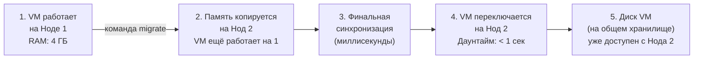
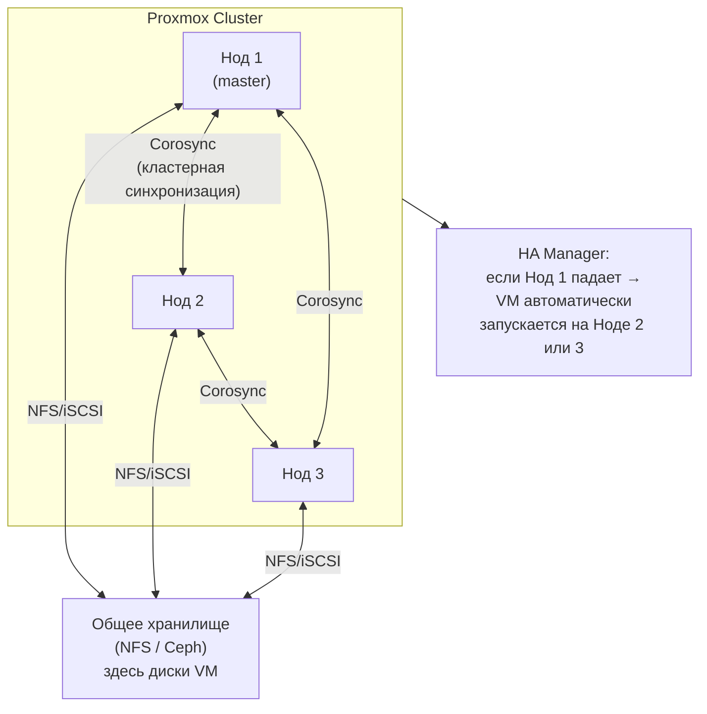

# Глава 15: Введение в кластеризацию

> **Цель:** понять что такое кластер Proxmox и когда он нужен — не настраивать, но знать куда расти.

---

**Что вы узнаете:**
- что такое кластер и чем он отличается от одного узла;
- зачем нужна живая миграция и High Availability;
- почему минимум для кластера — три узла, а не два;
- какие хранилища подходят для кластера;
- когда кластер действительно нужен, а когда достаточно одного сервера с хорошими бэкапами.

---

## 15.1 Что такое кластер Proxmox

Представьте, что у вас три компьютера с Proxmox. Без кластера — это три независимых сервера, у каждого свой интерфейс, свои VM и LXC, они ничего не знают друг о друге. Вы управляете каждым отдельно.

Кластер Proxmox объединяет эти серверы в единую систему:

```text
Без кластера:
  Сервер А — свой интерфейс :8006 — свои VM
  Сервер Б — свой интерфейс :8006 — свои VM
  Сервер В — свой интерфейс :8006 — свои VM

С кластером:
  Сервер А ──┐
  Сервер Б ──┤ → один интерфейс :8006 → управление всеми VM
  Сервер В ──┘
```

Что даёт кластер:
- **Единый веб-интерфейс.** Вы заходите на любой из серверов и видите всё: VM и LXC на всех трёх узлах.
- **Живая миграция (Live Migration).** VM переезжает с одного сервера на другой без остановки — пользователь ничего не замечает.
- **High Availability (HA).** Если один сервер выходит из строя, его VM автоматически запускаются на оставшихся узлах.
- **Общее хранилище.** Все узлы работают с одними и теми же данными.

---

## 15.2 Живая миграция — что это и зачем

Обычная ситуация без кластера: вам нужно обслужить сервер — заменить RAM, почистить вентиляторы. Приходится остановить все VM, сделать работу, запустить снова. Downtime — несколько минут, но он есть.

С кластером и живой миграцией:

```text
До обслуживания:
  Сервер А: VM 100 (работает), VM 101 (работает)
  Сервер Б: VM 200 (работает)

Шаг 1 — мигрировать VM с сервера А на Б:
  qm migrate 100 proxmox-b --online    # VM не останавливается
  qm migrate 101 proxmox-b --online

Шаг 2 — обслужить сервер А (он пустой)

Шаг 3 — вернуть VM обратно или оставить как есть
```

Флаг `--online` означает живую миграцию: VM продолжает работать во время переезда, соединения не рвутся. Технически это работает за счёт того, что содержимое оперативной памяти синхронизируется между узлами по сети в фоне, а переключение происходит за миллисекунды.

Ниже — пошаговая схема того, что происходит внутри при живой миграции. Ключевой момент: VM не останавливается до самого последнего шага, а финальное переключение занимает меньше секунды.



Именно поэтому живая миграция требует общего хранилища: диск VM не переносится — он изначально доступен обоим узлам. Переносится только содержимое оперативной памяти.

**Требование для живой миграции:** общее хранилище. Оба узла должны видеть один и тот же диск VM. Если диски у каждого сервера свои (локальные), живая миграция невозможна — придётся делать обычную с остановкой.

---

## 15.3 High Availability — автоматический перезапуск VM

HA — это страховка от аппаратного сбоя. Допустим, в 3 часа ночи один из ваших серверов умер: сгорел блок питания, вылетела материнская плата. Без HA — все VM на этом сервере мертвы до вашего вмешательства.

С HA Proxmox сам определяет что узел недоступен и запускает его VM на оставшихся серверах:

```text
01:00 — Сервер А работает, на нём VM 100 (Nextcloud)
03:12 — Сервер А падает (нет питания)
03:13 — Кластер фиксирует отсутствие А (нет heartbeat)
03:14 — VM 100 запускается на Сервере Б
03:15 — Nextcloud снова доступен
```

Время восстановления при HA — обычно 1–3 минуты. Это не мгновенно, но автоматически и без вашего участия в 3 часа ночи.

HA настраивается в разделе **Datacenter → HA**:
- **Resources** — список VM и LXC, которые нужно защитить.
- **Groups** — группы узлов, на которых может работать VM (например, только узлы с GPU).
- **Fencing** — механизм изоляции упавшего узла (важно, об этом ниже).

---

## 15.4 Quorum — зачем нужны три узла, а не два

Это самый неочевидный момент в кластеризации. Почему минимум именно три узла?

Представьте кластер из двух серверов. Между ними пропала сеть — оба живы, но не видят друг друга. Каждый думает: «второй упал, я должен взять его VM». В итоге одна и та же VM запускается на двух серверах одновременно и начинает писать в одно хранилище — это катастрофа, потеря и повреждение данных. Такая ситуация называется **split-brain**.

Quorum — механизм голосования, который это предотвращает:

```text
Кластер из 3 узлов, quorum = 2 голоса:

Нормальная работа:
  А: 1 голос ✓
  Б: 1 голос ✓    → 3 голоса > 2 → кластер работает
  В: 1 голос ✓

Сервер А упал:
  А: недоступен    → 0 голосов
  Б: 1 голос ✓    → 2 голоса = 2 → кластер работает, А объявлен offline
  В: 1 голос ✓

Сервер А и Б потеряли связь с В:
  А: 1 голос
  Б: 1 голос       → 2 голоса = 2 → они в большинстве, продолжают работать
  В: 1 голос       → 1 голос < 2 → В уходит в read-only, не принимает решений
```

С двумя узлами при разрыве сети каждый набирает 1 голос из 2 нужных — большинства нет ни у кого, кластер парализован. Три узла решают эту проблему: всегда есть большинство из двух живых.

Схема ниже показывает топологию трёхнодного кластера: как узлы связаны через Corosync, как они используют общее хранилище и что делает HA Manager при падении одного из узлов.



Corosync — это протокол синхронизации состояния кластера. Он отправляет heartbeat между узлами каждые несколько секунд: если узел перестаёт отвечать, кластер фиксирует это и HA Manager принимает решение о переносе VM. Общее хранилище при этом остаётся доступным — VM просто «переоткрывается» на другом узле.

**Fencing (изоляция)** — дополнительная защита: когда кластер решает что узел упал, он посылает ему команду «выключись» через IPMI/iDRAC/STONITH. Это гарантирует что «мёртвый» узел действительно мёртв и не продолжает писать на диск.

---

## 15.5 Общее хранилище — основа кластера

Для живой миграции и HA нужно чтобы все узлы кластера видели одни и те же диски VM. Это называется shared storage.

### Ceph — встроенное распределённое хранилище

Ceph встроен в Proxmox и является самым популярным решением для кластеров среднего и крупного масштаба.

Принцип: данные распределяются по дискам всех серверов с репликацией. Proxmox хранит каждый блок данных на двух или трёх узлах одновременно.

```text
Proxmox cluster (3 узла, у каждого SSD 500GB):

  Сервер А ─── OSD (диск 500GB) ──┐
  Сервер Б ─── OSD (диск 500GB) ──┤ → общий пул ~750GB (с репликацией x2)
  Сервер В ─── OSD (диск 500GB) ──┘

VM 100 disk: блок 1 хранится на А и Б
             блок 2 хранится на Б и В
             блок 3 хранится на А и В
```

Плюсы Ceph:
- Не нужен отдельный NAS — хранилище создаётся из дисков самих серверов.
- При отказе одного узла данные доступны на остальных.
- Масштабируется: добавил сервер — хранилище выросло.

Минусы Ceph:
- Минимум три узла с одинаковыми дисками.
- Требует отдельную сеть для репликации (желательно 10 Гбит).
- Сложная настройка и диагностика.
- Overhead по месту: с репликацией x2 вы теряете половину ёмкости.

Для домашнего сервера с одним узлом — Ceph не нужен и не применим.

### NFS и iSCSI — внешний NAS как shared storage

Альтернатива Ceph — подключить внешнее хранилище (NAS, например Synology или TrueNAS) по сети.

```text
NAS (Synology DS923+)
  ├── NFS share: /volume1/proxmox-vms
  └── iSCSI target: iqn.2024-01.nas:proxmox

Все узлы Proxmox монтируют одно и то же хранилище:
  Сервер А → mount NFS/iSCSI ←→ VM диски
  Сервер Б → mount NFS/iSCSI ←→  (те же)
  Сервер В → mount NFS/iSCSI ←→  (те же)
```

**NFS** — проще в настройке, подходит для менее нагруженных задач. Протокол файловой системы поверх сети.

**iSCSI** — блочное устройство по сети, выглядит для системы как обычный диск. Быстрее NFS, лучше подходит для VM с высокой нагрузкой на I/O.

Добавить NFS в Proxmox: **Datacenter → Storage → Add → NFS**.

---

## 15.6 Когда кластер нужен, а когда — нет

Это честный разговор, потому что многие видят кластер как цель, а не инструмент.

### Когда кластер действительно нужен

- **Несколько физических серверов уже есть.** Если у вас три сервера — кластер даёт единое управление и живую миграцию.
- **Требования к доступности.** Бизнес-сервисы, которые нельзя останавливать даже на время обслуживания железа. RTO (Recovery Time Objective) меньше 5 минут.
- **Горизонтальное масштабирование.** Не хватает ресурсов одного сервера — добавляете узлы в кластер, не переносите сервисы вручную.
- **Команда из нескольких администраторов.** Кластер даёт разграничение прав на уровне всей инфраструктуры, а не отдельных серверов.

### Когда одного узла с хорошими бэкапами достаточно

```text
Домашний сервер:
  Один Proxmox-узел
  + ежедневные бэкапы на второй диск или NAS
  + PBS (Proxmox Backup Server) для инкрементальных бэкапов
  + Tailscale для безопасного доступа

RTO: 15-30 минут (время восстановления из бэкапа)
Стоимость: один сервер
Сложность: базовая
```

Для домашнего использования, малого офиса или стартапа без жёстких требований к uptime — это реалистичный и разумный выбор. Ceph и кластер из трёх узлов — это дополнительная стоимость железа, сложность настройки и обслуживания.

**Правило большого пальца:**

| Ситуация | Решение |
|----------|---------|
| Один сервер, дом / фриланс | Один узел + бэкапы |
| Два сервера, малый бизнес | Один узел + резервный для бэкапов |
| Три сервера и более | Кластер имеет смысл |
| Требования к HA (auto-failover) | Кластер обязателен |
| Нет бюджета на третий сервер | Один узел + хорошие бэкапы |

---

## 15.7 Обзор раздела Datacenter → HA

Зайдите в интерфейс Proxmox и откройте **Datacenter → HA** — даже если у вас один узел. Там три вкладки:

**Resources** — список VM и LXC, которые защищены HA. Для каждого ресурса задаётся:
- `max restart` — сколько раз пробовать перезапустить перед тем как сдаться;
- `max relocate` — сколько раз пробовать переехать на другой узел.

**Groups** — группы узлов для HA. Если VM должна работать только на узлах с GPU или быстрым SSD — создаётся группа из этих узлов, и VM «привязывается» к ней.

**Fencing** — конфигурация STONITH (Shoot The Other Node In The Head). Способы гарантированно выключить упавший узел: IPMI, iDRAC, WoL, управляемая PDU (power distribution unit).

На одном узле HA работать не будет — некуда мигрировать. Но познакомиться с интерфейсом полезно заранее, чтобы не разбираться в этом в момент когда уже нужен кластер.

---

## 15.8 Как создать кластер (без подробностей — только чтобы знать)

Создание кластера — это не эта глава. Здесь только карта:

```bash
# На первом узле — создать кластер
pvecm create my-cluster

# Получить join-команду
pvecm join-info

# На втором и третьем узле — присоединиться
pvecm add 192.168.1.100   # IP первого узла

# Проверить статус кластера
pvecm status
pvecm nodes
```

Важный момент: узлы нужно добавлять до создания на них VM и LXC. Добавить узел с уже существующими VM в кластер — болезненная операция.

---

## Итог главы

Кластер Proxmox — это следующий уровень, а не обязательный. Для большинства домашних серверов и небольших офисов один узел с правильно настроенными бэкапами закрывает большинство потребностей.

Если вы читаете эту книгу и только начинаете — сначала освойте один узел: LXC, VM, бэкапы, мониторинг. Кластер придёт тогда, когда появится второй физический сервер или бизнес-требование к доступности.

```text
Домашний сервер (достаточно):
  Один Proxmox → LXC + VM → бэкапы → Tailscale

Когда вырастете (если вырастете):
  Кластер → Ceph → HA → живая миграция
```

---

## Чек-лист для самопроверки

- [ ] Понимаю разницу между одним узлом и кластером Proxmox
- [ ] Могу объяснить что такое живая миграция и когда она нужна
- [ ] Понимаю что такое quorum и почему минимум 3 узла
- [ ] Знаю чем split-brain опасен и как quorum его предотвращает
- [ ] Понимаю разницу между Ceph и NFS/iSCSI как shared storage
- [ ] Заглянул в раздел Datacenter → HA и понимаю что там настраивается
- [ ] Принял осознанное решение — кластер нужен или пока достаточно одного узла
