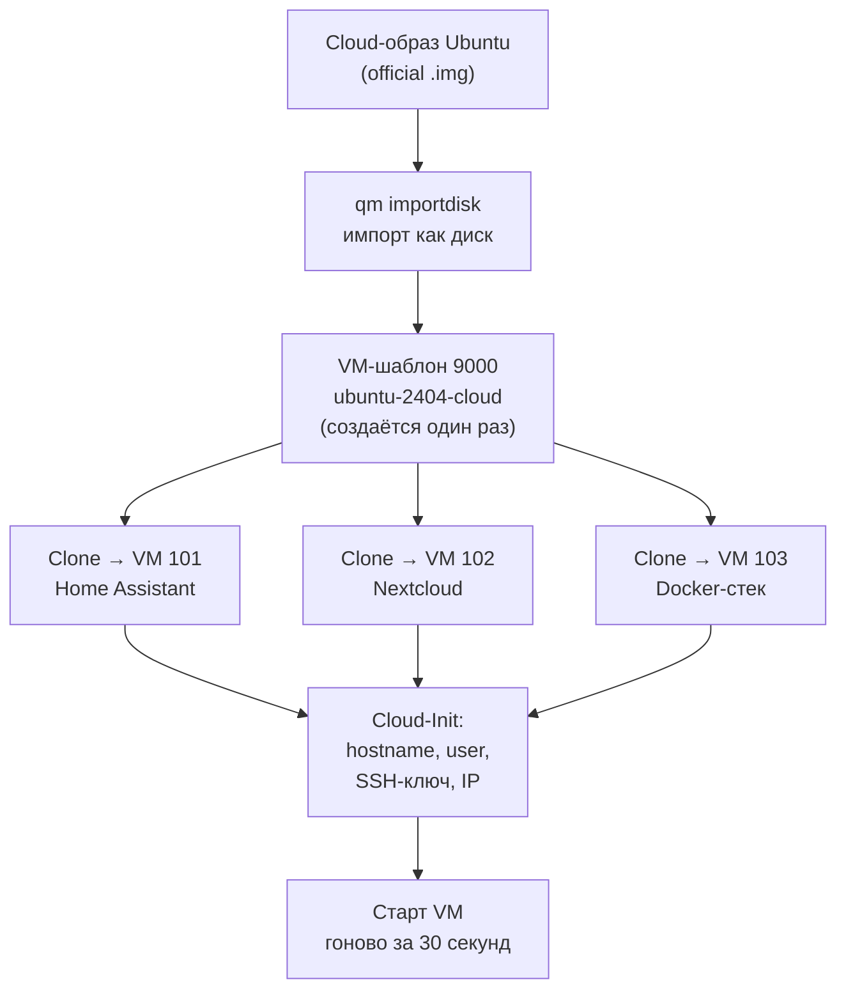

# Глава 21: Cloud-Init — автоматическое создание VM без ISO

> **Что вы узнаете:**
> - что такое Cloud-Init и почему он быстрее ручной установки через ISO;
> - как скачать официальный cloud-образ Ubuntu и превратить его в шаблон за одну сессию в терминале;
> - как клонировать шаблон, задать имя хоста, пользователя, SSH-ключ и IP прямо из Proxmox UI;
> - как создать собственный cloud-образ из существующей VM и превратить его в шаблон.

---

## Контекст

В главе 5 мы создавали VM через ISO: загружали образ, проходили мастер установки, вводили имя хоста, пользователя, настраивали сеть — и так для каждой новой машины. На первую VM это нормально. На пятую — уже раздражает. На двадцатую — невыносимо.

Представь: тебе нужно развернуть три VM — одну для Home Assistant, одну для Nextcloud, одну для Docker-стека. Три раза пройти одни и те же экраны установщика, три раза придумать имя, три раза настроить сеть. При этом все три VM будут на одном дистрибутиве с одинаковой базовой конфигурацией.

Cloud-Init решает эту проблему. Один раз создаёшь шаблон. Дальше клонируешь его и задаёшь параметры — имя, пользователя, SSH-ключ, IP — в веб-интерфейсе Proxmox. VM готова через 30 секунд после первого запуска.

---

## 21.1 Что такое Cloud-Init

Cloud-Init — это механизм первоначальной настройки системы при первом запуске. Не установщик, не скрипт — а стандартный способ передать операционной системе инструкции: «при первом старте сделай вот это».

Производители дистрибутивов — Ubuntu, Debian, Fedora, Alma Linux — публикуют специальные *cloud images*: готовые образы с предустановленным cloud-init внутри. Не ISO-образы для ручной установки, а уже готовые диски с настроенной ОС, которая при первом запуске ждёт инструкций.

Proxmox поддерживает Cloud-Init нативно: он умеет подготовить специальный диск с данными — именем хоста, паролем, SSH-ключами, сетевыми настройками — и передать его VM. Гостевая ОС видит этот диск при старте, читает инструкции и применяет их.

```text
Без Cloud-Init:
  скачать ISO → создать VM → пройти установщик → задать пользователя → настроить сеть
  ≈ 15 минут на одну VM, и всё это вручную

С Cloud-Init:
  скачать cloud-образ → создать шаблон (1 раз) → клонировать → задать параметры в UI
  ≈ 30 секунд на каждую следующую VM
```

Шаблон создаётся один раз. Все VM, которые нужны на Ubuntu 24.04, клонируются из него.

---

## 21.2 Создание шаблона из cloud-образа

Всё делается в терминале Proxmox. Подключись по SSH к серверу или открой Shell в веб-интерфейсе (pve → Shell).

### Шаг 1: скачать cloud-образ

```bash
cd /var/lib/vz/template/iso/
wget https://cloud-images.ubuntu.com/noble/current/noble-server-cloudimg-amd64.img
```

Переходим в папку, где Proxmox хранит ISO-образы. Скачиваем официальный cloud-образ Ubuntu 24.04 Noble — не ISO-установщик, а готовый диск с предустановленной ОС и cloud-init.

### Шаг 2: создать пустую VM

```bash
qm create 9000 \
  --name ubuntu-2404-cloud \
  --memory 2048 \
  --cores 2 \
  --net0 virtio,bridge=vmbr0
```

Создаём пустую VM с ID 9000. ID больше 9000 удобно использовать для шаблонов — они не путаются с обычными VM. `--net0 virtio,bridge=vmbr0` — добавляем сетевой интерфейс с VirtIO, как в главе 5.

### Шаг 3: импортировать образ как диск

```bash
qm importdisk 9000 noble-server-cloudimg-amd64.img local-lvm
```

Берём скачанный `.img` файл и импортируем его как диск для VM 9000 в хранилище `local-lvm`. После этой команды диск появится в VM, но ещё не подключён — он «висит» без точки подключения.

### Шаг 4: подключить диск и настроить загрузку

```bash
qm set 9000 --scsihw virtio-scsi-pci --scsi0 local-lvm:vm-9000-disk-0
```

Подключаем импортированный диск к шине SCSI с VirtIO-контроллером. `--scsi0` означает первое устройство на SCSI-шине. `local-lvm:vm-9000-disk-0` — имя диска, которое присвоил importdisk.

```bash
qm set 9000 --boot c --bootdisk scsi0
```

Говорим VM загружаться с диска `scsi0`. `--boot c` означает «первым устройством загрузки — диск».

### Шаг 5: добавить Cloud-Init диск

```bash
qm set 9000 --ide2 local-lvm:cloudinit
```

Это ключевой шаг. Добавляем специальный виртуальный диск Cloud-Init — именно через него Proxmox будет передавать VM параметры настройки. Без этого диска cloud-init внутри VM не получит никаких данных и VM запустится с дефолтными настройками без пароля и без доступа.

### Шаг 6: включить QEMU Guest Agent

```bash
qm set 9000 --agent 1
```

Включаем поддержку QEMU Guest Agent — как мы делали в главе 5. Cloud-образы Ubuntu поставляются с предустановленным агентом, так что после запуска VM он сразу будет работать.

### Шаг 7: добавить последовательный порт (для консоли)

```bash
qm set 9000 --serial0 socket --vga serial0
```

Cloud-образы не всегда работают с VNC-консолью по умолчанию — они рассчитаны на серийный терминал. Эта команда добавляет последовательный порт и переключает вывод на него, чтобы консоль в Proxmox работала корректно.

### Шаг 8: конвертировать VM в шаблон

```bash
qm template 9000
```

Превращаем VM в шаблон. После этого VM нельзя изменить или запустить напрямую — только клонировать. В веб-интерфейсе шаблон отображается со специальной иконкой и суффиксом `(template)`.

---

Вот как устроен процесс от скачанного образа до работающей VM:



На схеме видно главное преимущество подхода: шаблон создаётся один раз, а из него клонируется любое количество VM. Каждый клон получает свои параметры через Cloud-Init — имя хоста, пользователя, SSH-ключ, IP-адрес — без повторного прохождения установщика. Шаблон остаётся неизменным и может служить основой для десятков виртуальных машин.

---

## 21.3 Настройка Cloud-Init параметров в UI

После клонирования шаблона (об этом — в следующем разделе) у каждой VM появляется вкладка **Cloud-Init** в веб-интерфейсе. Открой VM → Cloud-Init.

**Поля вкладки Cloud-Init:**

| Поле | Что задаём |
|------|-----------|
| User | Имя пользователя, который будет создан при первом запуске. Например: `adelfos` |
| Password | Пароль для этого пользователя. Можно оставить пустым если входить только по SSH |
| DNS domain | Домен для DNS-резолвинга. Обычно оставляют пустым или ставят локальный домен |
| DNS servers | IP-адреса DNS-серверов. Если пусто — используются настройки сети |
| SSH public key | SSH-ключ для авторизации без пароля. Вставляем содержимое `~/.ssh/id_ed25519.pub` |
| IP Config (net0) | Сетевые настройки: DHCP или статический IP |

**Настройка сети** — самое важное поле. Два варианта:

```text
DHCP (рекомендуется для начала):
  IP: dhcp
  VM получит адрес от роутера автоматически

Статический IP:
  IP: 192.168.1.101/24
  Gateway: 192.168.1.1
  VM всегда будет иметь один и тот же адрес
```

Для Home Assistant или Nextcloud лучше задавать статический IP — чтобы адрес не менялся после перезапуска.

После изменения любого параметра нужно нажать кнопку **Regenerate Image** (или **Apply** — зависит от версии Proxmox). Без этого изменения не применятся при следующем запуске.

> Cloud-Init применяет настройки только при первом запуске VM. Если нужно изменить параметры уже работающей VM — измени в UI, нажми Regenerate Image, перезапусти VM. Система применит новые настройки заново.

---

## 21.4 Клонирование шаблона и первый запуск

### Через веб-интерфейс

В боковом меню выбери шаблон (VM 9000) → правая кнопка мыши → **Clone**.

Настройки клонирования:
- **Target node:** тот же нод или другой нод кластера
- **VM ID:** новый ID, например 101
- **Name:** `homeassistant` или `nextcloud`
- **Mode:** Full Clone — обязательно, не Linked Clone

Linked Clone экономит место, но зависит от шаблона — если шаблон удалить, клон сломается. Full Clone — независимая копия диска.

После клонирования открой новую VM → **Cloud-Init** → задай параметры → нажми **Regenerate Image** → запусти VM кнопкой **Start**.

### Через CLI

```bash
qm clone 9000 101 --name homeassistant --full
```

Клонируем шаблон 9000 в новую VM с ID 101 и именем `homeassistant`. Флаг `--full` — полное клонирование диска.

```bash
qm set 101 --ciuser adelfos --sshkeys ~/.ssh/id_ed25519.pub
```

Задаём пользователя `adelfos` и SSH-ключ для авторизации.

```bash
qm set 101 --ipconfig0 ip=192.168.1.101/24,gw=192.168.1.1
```

Устанавливаем статический IP. `--ipconfig0` соответствует первому сетевому интерфейсу `net0`.

```bash
qm resize 101 scsi0 +18G
```

Cloud-образы обычно имеют маленький диск (2–5 ГБ). Расширяем его перед запуском. Команда добавляет 18 ГБ к существующему диску, итого получится ~20 ГБ.

```bash
qm start 101
```

Запускаем VM. При первом старте cloud-init применит все настройки: создаст пользователя, установит SSH-ключ, настроит сеть. Через 30–60 секунд VM будет доступна по SSH.

### Проверка

```bash
# Подождать пока VM запустится и получит IP
qm guest exec 101 -- hostname
```

Или просто зайти по SSH:

```bash
ssh adelfos@192.168.1.101
```

Если всё настроено правильно — сразу попадёшь в систему без пароля по SSH-ключу.

---

## 21.5 Создание кастомного Cloud-Init образа

Стандартный cloud-образ хорош как точка старта. Но иногда нужен шаблон с предустановленными пакетами: Docker, htop, mc, специфические настройки — чтобы каждый новый клон уже содержал всё нужное.

В этом случае создаём собственный образ из существующей VM.

### Шаг 1: подготовить VM

Начни с клона шаблона (VM 9000) или возьми существующую VM. Установи всё что нужно:

```bash
# Внутри VM
apt update && apt upgrade -y
apt install -y docker.io qemu-guest-agent htop mc curl git
systemctl enable qemu-guest-agent
```

### Шаг 2: убедиться что cloud-init установлен

```bash
# Внутри VM
apt install -y cloud-init
```

В Ubuntu cloud-образах cloud-init уже есть. Если делаешь образ из обычной VM — устанавливаем явно.

### Шаг 3: настроить datasource

Cloud-Init должен знать откуда читать данные. Proxmox передаёт их через `NoCloud` или `ConfigDrive`. Убедись, что оба включены:

```bash
# Внутри VM — открыть конфиг cloud-init
cat /etc/cloud/cloud.cfg.d/99-datasource.cfg
```

Если файла нет — создай:

```bash
# Содержимое файла /etc/cloud/cloud.cfg.d/99-datasource.cfg
datasource_list: [ NoCloud, ConfigDrive ]
```

### Шаг 4: убрать Netplan-конфиг

Если в образе есть Netplan-конфиг с жёстко заданными настройками сети — он будет мешать Cloud-Init управлять сетью. Удали его:

```bash
# Внутри VM
rm /etc/netplan/*.yaml
```

Cloud-Init при первом запуске создаст свой Netplan-конфиг на основе заданных параметров.

### Шаг 5: очистить систему

Перед превращением в шаблон нужно очистить всё, что специфично для этой конкретной VM: SSH-ключи хоста, machine-id, логи, кэш cloud-init.

```bash
# Внутри VM — запустить очистку cloud-init
cloud-init clean --logs --seed

# Удалить SSH host keys (будут сгенерированы заново при первом старте)
rm -f /etc/ssh/ssh_host_*

# Сбросить machine-id (иначе у всех клонов будет одинаковый ID)
truncate -s 0 /etc/machine-id
rm -f /var/lib/dbus/machine-id
ln -s /etc/machine-id /var/lib/dbus/machine-id

# Очистить историю bash
history -c && history -w
```

### Шаг 6: выключить VM

```bash
# Внутри VM
poweroff
```

Не перезапускай — именно выключи. После перезапуска cloud-init применил бы настройки, а нам нужна «чистая» система без следов предыдущего запуска.

### Шаг 7: добавить Cloud-Init диск и конвертировать в шаблон

```bash
# На хосте Proxmox
# Добавить Cloud-Init диск (если его ещё нет)
qm set 200 --ide2 local-lvm:cloudinit

# Конвертировать в шаблон
qm template 200
```

Теперь VM 200 — шаблон с предустановленными пакетами. Клонируй из него так же, как из шаблона 9000.

---

## 21.6 Скрипт-автоматизация

На практике никто не вводит восемь команд вручную каждый раз. Оформим создание шаблона в скрипт, который можно запустить на любом Proxmox-сервере:

```bash
#!/bin/bash
# Создание Cloud-Init шаблона Ubuntu 24.04
# Использование: bash create-ubuntu-template.sh

VMID=9000
VMNAME="ubuntu-2404-cloud"
STORAGE="local-lvm"
IMAGE="noble-server-cloudimg-amd64.img"
IMAGE_URL="https://cloud-images.ubuntu.com/noble/current/${IMAGE}"

# Скачиваем образ если ещё не скачан
if [ ! -f "/var/lib/vz/template/iso/${IMAGE}" ]; then
    wget -P /var/lib/vz/template/iso/ "${IMAGE_URL}"
fi

# Удаляем VM если уже существует (пересоздание шаблона)
qm destroy ${VMID} --purge 2>/dev/null || true

# Создаём VM, импортируем образ, настраиваем
qm create ${VMID} --name ${VMNAME} --memory 2048 --cores 2 \
    --net0 virtio,bridge=vmbr0 --agent 1 \
    --serial0 socket --vga serial0

qm importdisk ${VMID} /var/lib/vz/template/iso/${IMAGE} ${STORAGE}

qm set ${VMID} --scsihw virtio-scsi-pci \
    --scsi0 ${STORAGE}:vm-${VMID}-disk-0 \
    --ide2 ${STORAGE}:cloudinit \
    --boot c --bootdisk scsi0

# Конвертируем в шаблон
qm template ${VMID}

echo "Шаблон ${VMID} (${VMNAME}) создан успешно."
```

Сохрани как `create-ubuntu-template.sh`, выполни `bash create-ubuntu-template.sh`. Шаблон готов.

При необходимости обновить шаблон (вышла новая версия Ubuntu) — запусти скрипт снова. Он удалит старый шаблон и создаст новый.

---

## Типичные ошибки

### `command not found: qm`

**Симптом:** пишешь `qm create ...`, получаешь `command not found`.

**Причина:** команды `qm`, `pvecm`, `pvesh` есть только на хосте Proxmox. Если ты подключён к терминалу LXC-контейнера или VM — там их нет.

**Исправление:** открой Shell самого хоста Proxmox (pve → Shell в веб-интерфейсе) или подключись по SSH напрямую к серверу, а не к контейнеру.

---

### VM запускается, но не получает IP-адрес

**Симптом:** VM стартует, в Summary нет IP-адреса, по SSH не подключиться.

**Причина:** не добавлен Cloud-Init диск. Без диска `--ide2 local-lvm:cloudinit` cloud-init внутри VM не получает никаких данных и не настраивает сеть.

**Исправление:**

```bash
# Остановить VM
qm shutdown 101

# Добавить Cloud-Init диск
qm set 101 --ide2 local-lvm:cloudinit

# Запустить снова
qm start 101
```

---

### Cloud-Init не применяет изменённые параметры

**Симптом:** изменил IP или SSH-ключ во вкладке Cloud-Init, перезапустил VM — настройки не применились.

**Причина:** после изменения параметров в UI нужно нажать **Regenerate Image** (в старых версиях Proxmox кнопка называется **Apply**). Без этого Proxmox не обновил Cloud-Init диск с новыми данными.

**Исправление:** VM → Cloud-Init → изменить параметры → нажать **Regenerate Image** → перезапустить VM.

---

### Сеть не работает после клонирования — нет интернета

**Симптом:** VM получила IP, но ping 8.8.8.8 не проходит. В `/etc/netplan/` есть старый конфиг с чужими настройками.

**Причина:** при создании кастомного образа не был удалён Netplan-конфиг исходной VM. Cloud-Init записал свои настройки, но старый конфиг их перекрывает.

**Исправление:**

```bash
# Внутри VM
ls /etc/netplan/
# Удалить все .yaml файлы кроме того, что создал cloud-init (обычно 50-cloud-init.yaml)
rm /etc/netplan/00-installer-config.yaml  # или как называется лишний файл
netplan apply
```

Для предотвращения: при подготовке кастомного образа всегда выполнять `rm /etc/netplan/*.yaml` перед очисткой cloud-init.

---

### После первого запуска VM не знает имя хоста

**Симптом:** зашёл по SSH, команда `hostname` выдаёт что-то вроде `ubuntu` вместо `homeassistant`.

**Причина:** параметр Name в настройках VM и поле Hostname в Cloud-Init — разные вещи. Имя хоста задаётся именно в Cloud-Init, а не через имя VM в Proxmox.

**Исправление:** VM → Cloud-Init → убедись, что поле **Hostname** заполнено. Если поле пустое — cloud-init использует дефолтное имя. Заполни, нажми Regenerate Image, перезапусти VM.

---

## Чек-лист для самопроверки

- [ ] Скачал cloud-образ Ubuntu и создал шаблон VM (ID 9000) через CLI с Cloud-Init диском
- [ ] Склонировал шаблон в новую VM, задал hostname и SSH-ключ через вкладку Cloud-Init
- [ ] VM запустилась и получила корректный IP-адрес без ручной установки ОС
- [ ] Умею изменять параметры Cloud-Init, нажимать Regenerate Image и перезапускать VM
- [ ] Понимаю разницу между cloud-образом (`noble-server-cloudimg-amd64.img`) и ISO-установщиком
