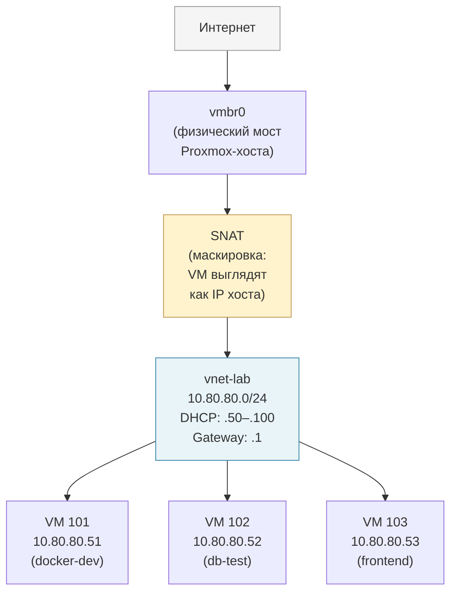

# Глава 22: SDN — виртуальные сети внутри Proxmox

> **Что вы узнаете:**
> - что такое SDN и зачем он нужен, если уже есть vmbr и VLANы из главы 9;
> - как создать изолированную внутреннюю сеть с DHCP через Simple-зону за несколько кликов;
> - как подключить VM к SDN-сети, не трогая физическую инфраструктуру;
> - когда использовать VLAN-зону и в чём её отличие от Simple.

---

## Контекст

В главе 9 мы строили сеть через мосты и VLAN-теги: `vmbr0`, `bridge-vids`, `tag=30` в конфиге контейнера. Это мощный подход — и он никуда не девается. SDN его не заменяет, а дополняет.

Проблема с классической схемой проявляется в конкретных сценариях. Допустим, вы хотите поднять изолированное dev-окружение: несколько VM для тестирования, которые видят только друг друга и выходят в интернет, но недоступны снаружи. Через `vmbr` это требует настройки iptables-правил, DHCP-сервера (dnsmasq от руки), ручной маршрутизации. Ничего невозможного, но порог входа высокий.

Второй сценарий — мультиарендность: у вас несколько «клиентов» или проектов на одном Proxmox, и вы хотите гарантировать что VM одного проекта изолированы от VM другого на сетевом уровне, с удобным управлением из UI.

Для обоих случаев в **Proxmox 8.1** появился встроенный SDN (Software Defined Networking). Это уровень управления поверх привычных мостов: вы создаёте зоны, виртуальные сети и подсети через веб-интерфейс, а Proxmox сам разворачивает нужные правила iptables, настраивает DHCP и маршрутизацию.

---

## 22.1 Что такое SDN и когда он нужен

SDN (Software Defined Networking) — это встроенный в Proxmox «виртуальный коммутатор с мозгами». Вместо того чтобы вручную писать правила iptables и настраивать dnsmasq, вы описываете желаемую топологию сети в интерфейсе Proxmox, а он разворачивает её сам.

Ключевые компоненты SDN:

- **Зона (Zone)** — тип и правила изоляции сети. Определяет как VM могут общаться между собой и с внешним миром. Бывает Simple, VLAN, QinQ, VXLAN, EVPN.
- **Виртуальная сеть (Vnet)** — виртуальный мост внутри зоны. Именно к нему подключаются VM вместо `vmbr0`.
- **Подсеть (Subnet)** — диапазон IP-адресов для Vnet: шлюз, DHCP-диапазон, маршруты.

**Практические сценарии, где SDN удобнее классического подхода:**

**Dev-окружение.** Вы разрабатываете микросервисный стек — несколько VM с разными ролями (база, бэкенд, фронтенд). Нужно чтобы они видели друг друга, но не были доступны с основной сети. С SDN Simple-зоной это делается за 5 минут без единой команды в терминале.

**Мультиарендность.** Вы администрируете Proxmox для нескольких команд или клиентов. Каждому — своя SDN-зона. VM одного клиента физически не могут отправить пакет в сеть другого клиента, это обеспечивается на уровне ядра, не правилами firewall.

**Тестирование сетевых схем.** Создать изолированную сеть, проверить что-то, удалить — и вся конфигурация уходит вместе с зоной. Не нужно чистить iptables вручную.

**Когда SDN не нужен.** Если у вас один Proxmox-хост с классической `vmbr0`-сетью, и все VM просто ходят в интернет через домашний роутер — настраивать SDN смысла нет. Для простых сценариев классические мосты и VLAN из главы 9 проще и прозрачнее.

---

## 22.2 Подготовка: установка зависимостей

SDN в Proxmox использует два внешних компонента: `dnsmasq` для DHCP и DNS внутри SDN-зон, и `frr` (Free Range Routing) для маршрутизации между зонами. Без них Simple-зоны с DHCP не заработают.

**Установить пакеты на хосте Proxmox:**

```bash
apt install -y dnsmasq frr frr-pythontools
```

`dnsmasq` — лёгкий DNS и DHCP-сервер. Proxmox запустит отдельный его экземпляр для каждой SDN-зоны с DHCP.

`frr` — пакет маршрутизации. Нужен для Simple-зон, чтобы обеспечить связность между SDN-сетями и внешним миром.

**Важный нюанс:** скорее всего, `dnsmasq` уже установлен и запущен как системный сервис. Это проблема — Proxmox запускает свои экземпляры dnsmasq на портах, которые системный уже занял. Нужно отключить системный экземпляр:

```bash
# Остановить системный dnsmasq и убрать из автозапуска
systemctl stop dnsmasq
systemctl disable dnsmasq
```

Не удалять пакет — только отключить службу. Proxmox управляет своими экземплярами dnsmasq напрямую, не через systemd.

**Проверить что порты свободны:**

```bash
# Убедиться что порт 53 не занят системным dnsmasq
ss -tulnp | grep ':53'
# В выводе не должно быть dnsmasq
```

Если порт 53 занят каким-то другим сервисом (например, `systemd-resolved`) — это нормально, он не мешает SDN. Проблема только с системным dnsmasq, который слушает на всех интерфейсах.

---

## 22.3 Simple-зона — изолированная сеть с DHCP

Simple-зона — самый простой тип SDN в Proxmox. Она создаёт изолированную виртуальную сеть с собственным DHCP-сервером. VM в этой зоне получают IP автоматически и могут выходить в интернет через SNAT (маскировка за IP хоста Proxmox). Снаружи они недоступны — только инициированные ими соединения проходят.

Создадим зону `internal` с подсетью `10.80.80.0/24`. Все шаги — через веб-интерфейс.

**Шаг 1: Создать зону**

Перейдите: **Датацентр → SDN → Зоны → Добавить → Simple**

В открывшемся окне заполните:

- **ID:** `internal` — имя зоны, используется в путях и логах
- **MTU:** оставить пустым (по умолчанию 1500)
- **Nodes:** выбрать ноды, на которых будет доступна эта зона (обычно все)
- **IPAM:** пока оставить пустым

Нажать **Добавить**.

**Шаг 2: Создать виртуальную сеть (Vnet)**

**Датацентр → SDN → VNets → Добавить**

- **Name:** `vnet-lab` — это будет имя виртуального моста
- **Zone:** `internal` — привязать к только что созданной зоне
- **Tag:** оставить пустым для Simple-зоны (теги используются в VLAN-зоне)
- **VLAN Aware:** не включать

Нажать **Добавить**.

После этого на хосте появится новый сетевой интерфейс `vnet-lab`. Это виртуальный мост, к которому Proxmox будет подключать VM этой зоны.

**Шаг 3: Создать подсеть**

Нажмите на `vnet-lab` в списке VNets, затем **Подсети → Добавить**:

- **Subnet:** `10.80.80.0/24`
- **Gateway:** `10.80.80.1` — этот IP получит сам Proxmox-хост как шлюз для SDN-сети
- **SNAT:** включить галочку — это разрешает VM выходить в интернет через NAT за IP хоста
- **DHCP Ranges:** нажать **Добавить**, указать:
  - Start: `10.80.80.50`
  - End: `10.80.80.100`

Нажать **Добавить**.

**Шаг 4: Применить конфигурацию SDN**

Изменения SDN не применяются немедленно — нужно явно нажать кнопку **Apply** в верхней части страницы SDN.

**Датацентр → SDN → кнопка Apply (вверху)**

Proxmox в этот момент:
1. Создаст виртуальный мост `vnet-lab` на всех указанных нодах
2. Настроит IP `10.80.80.1` на этом мосту (шлюз)
3. Запустит экземпляр dnsmasq с DHCP-диапазоном `10.80.80.50–10.80.80.100`
4. Добавит правила iptables для SNAT

**Шаг 5: Подключить VM к SDN-сети**

Откройте настройки любой VM: **VM → Hardware → Сетевое устройство → Изменить**

В поле **Bridge** выберите `vnet-lab` вместо `vmbr0`. Сохранить, перезапустить VM.

Или через CLI:

```bash
# Изменить сетевой интерфейс VM 101 — подключить к SDN-сети
qm set 101 --net0 virtio,bridge=vnet-lab
```

После перезапуска VM получит IP из диапазона `10.80.80.50–10.80.80.100` по DHCP. Пинг внешнего IP (например, `1.1.1.1`) должен работать через SNAT.

**Проверка:**

```bash
# Войти в консоль VM и проверить полученный IP
ip addr show
# Ожидаемый результат: inet 10.80.80.51/24

# Пинг шлюза SDN
ping -c 3 10.80.80.1

# Пинг интернета (через SNAT)
ping -c 3 1.1.1.1
```

Вот как выглядит архитектура Simple SDN-зоны схематично:



На схеме видно, что VM внутри `vnet-lab` полностью изолированы от основной домашней сети — к ним нельзя обратиться снаружи напрямую. В интернет они выходят через SNAT: с точки зрения внешней сети, все их пакеты приходят с IP самого Proxmox-хоста. Между собой VM в одной SDN-сети видят друг друга напрямую без всякого NAT — как будто подключены к одному коммутатору.

---

## 22.4 VLAN-зона — SDN поверх физических VLAN

VLAN-зона отличается от Simple: она не создаёт новую изолированную сеть, а управляет существующими физическими VLAN через SDN-интерфейс. Это полезно когда у вас уже есть управляемый свич с настроенными VLAN, и вы хотите добавить к ним DHCP и учёт адресов — не трогая конфиг самого свича.

Сравнение с подходом из главы 9:

```
Глава 9 (ручной подход):
  → редактировать /etc/network/interfaces
  → добавить bridge-vids
  → назначить tag=20 в конфиге контейнера
  Минус: нет DHCP, нет учёта адресов, всё вручную

VLAN-зона SDN:
  → создать VLAN-зону в UI, указать bridge
  → создать Vnet с нужным тегом
  → при желании добавить подсеть с DHCP
  Плюс: DHCP и IPAM «в комплекте», управление через UI
```

**Создать VLAN-зону:**

**Датацентр → SDN → Зоны → Добавить → VLAN**

- **ID:** `vlan-zone`
- **Bridge:** `vmbr0` — указать мост, который уже настроен с поддержкой VLAN (должен иметь `bridge-vids 2-4094` в `/etc/network/interfaces`)

Нажать **Добавить**.

**Создать Vnet с VLAN-тегом:**

**Датацентр → SDN → VNets → Добавить**

- **Name:** `vnet-services`
- **Zone:** `vlan-zone`
- **Tag:** `20` — номер VLAN

Нажать **Добавить**, затем **Apply**.

После этого к Vnet можно добавить подсеть с DHCP точно так же, как в Simple-зоне (раздел 22.3, шаг 3). DHCP-сервер будет выдавать адреса VM, подключённым к `vnet-services`, а они будут ходить в сеть с тегом VLAN 20.

**Подключить VM к VLAN-зоне через SDN:**

```bash
# Подключить VM 104 к VLAN-зоне (вместо ручного tag=20)
qm set 104 --net0 virtio,bridge=vnet-services
```

Proxmox сам проставит нужный VLAN-тег — вам больше не нужно указывать `tag=` вручную в конфиге. Теперь это знает зона.

**Ключевое отличие от Simple-зоны:** VLAN-зона не создаёт изоляцию сама по себе — она просто добавляет управление к уже существующей VLAN-инфраструктуре. Если физический свич не настроен на VLAN 20, трафик никуда не пройдёт.

---

## 22.5 IPAM — учёт IP-адресов

IPAM (IP Address Management) — вкладка в SDN-интерфейсе Proxmox, которая показывает кому и какой IP-адрес выдан в ваших SDN-сетях.

Когда VM получает IP от DHCP-сервера SDN, Proxmox фиксирует эту «аренду» в IPAM. Вы видите:

- какой IP выдан
- какому MAC-адресу (и, косвенно, какой VM)
- с каким именем хоста (если VM отправила hostname в DHCP-запросе)

Посмотреть: **Датацентр → SDN → IPAM**

Вкладка IPAM полезна при отладке: если VM не получила IP или получила неожиданный адрес — здесь видно что выдал DHCP-сервер. Также удобно когда VM много: вместо того чтобы заходить в каждую консоль и смотреть `ip addr`, всё видно из одного места.

IPAM также показывает статически зарезервированные адреса, если вы их настраивали в подсети. Зарезервировать IP для конкретного MAC можно прямо здесь: **IPAM → Добавить** — указать MAC и нужный IP. При следующем DHCP-запросе VM получит именно этот адрес.

Для домашнего Proxmox IPAM может казаться излишеством, но в мультиарендной среде или когда SDN-зон несколько — это незаменимый инструмент.

---

## 22.6 Что не разобрано в этой главе

SDN в Proxmox — большая тема. В этой главе намеренно рассмотрен только практический минимум для домашнего и небольшого корпоративного использования.

**Что осталось за кадром:**

**Q-in-Q (QinQ)** — двойная инкапсуляция VLAN. Один VLAN-тег «оборачивается» в другой. Используется у интернет-провайдеров, когда нужно передавать трафик нескольких клиентов (с их VLAN-тегами) через одну магистральную сеть. Для домашнего или малого офисного Proxmox это не нужно.

**VXLAN** — туннелирование Layer 2 поверх Layer 3. Позволяет создавать виртуальные сети между физически разными площадками или через интернет. Нужно когда у вас несколько физических локаций с Proxmox-кластерами и вы хотите чтобы VM разных площадок были в одной L2-сети. Требует отдельной сетевой инфраструктуры.

**EVPN / BGP EVPN** — протокол для распределённых SDN-сетей провайдерского уровня. Это уже область телекоммуникационных операторов и крупных датацентров.

Если вам всё же интересно — официальная документация Proxmox по SDN покрывает все типы зон с примерами конфигураций: [https://pve.proxmox.com/wiki/SDN](https://pve.proxmox.com/wiki/SDN)

---

## Типичные ошибки

**SDN-зона создана, но изменения не применяются — VM не видит новый мост `vnet-lab`**

Причина: после каждого изменения в SDN (создание зоны, Vnet, подсети) необходимо нажимать кнопку **Apply** на странице **Датацентр → SDN**. Без этого изменения существуют только в базе данных Proxmox, но не применены к сетевой конфигурации хоста.

Решение: нажать **Apply**, подождать несколько секунд. Проверить что мост появился:

```bash
ip link show vnet-lab
# Должен быть: vnet-lab: <BROADCAST,MULTICAST,UP,LOWER_UP> ...
```

---

**VM подключена к `vnet-lab`, но не получает IP по DHCP**

Причина: скорее всего, системный `dnsmasq` не был отключён и занимает порт, который нужен SDN. Или пакет `dnsmasq` вообще не установлен.

Решение:

```bash
# Проверить статус системного dnsmasq
systemctl status dnsmasq

# Если запущен — остановить и отключить
systemctl stop dnsmasq && systemctl disable dnsmasq

# Убедиться что dnsmasq установлен
apt list --installed 2>/dev/null | grep dnsmasq

# Применить SDN снова (Apply в UI или через CLI)
pvesh set /cluster/sdn
```

---

**VM получает IP, но не выходит в интернет**

Причина: при создании подсети не была включена галочка **SNAT**. Без неё пакеты от VM с адресом `10.80.80.x` уходят к шлюзу, но обратно не возвращаются — ведь ваш домашний роутер не знает о сети `10.80.80.0/24`.

Решение: отредактировать подсеть — **Датацентр → SDN → VNets → vnet-lab → Подсети → Edit** — включить SNAT. Нажать **Apply**.

Проверить что правило SNAT появилось:

```bash
# Посмотреть правила iptables MASQUERADE
iptables -t nat -L POSTROUTING -v -n | grep 10.80.80
# Должна быть строка с MASQUERADE для 10.80.80.0/24
```

---

**Раздел SDN не отображается в веб-интерфейсе Proxmox**

Причина: SDN появился как стабильная функция в Proxmox **8.1**. В более ранних версиях его нет в стандартном интерфейсе (в 7.x он был доступен только как экспериментальный плагин).

Решение: проверить версию:

```bash
pveversion
# Нужно: pve-manager/8.1.x или выше
```

Если версия ниже — обновить Proxmox через **Node → Updates → Upgrade**.

---

## Чек-лист для самопроверки

- [ ] Установил `dnsmasq` и `frr`, отключил системный экземпляр `dnsmasq` через `systemctl disable`
- [ ] Создал Simple-зону `internal`, Vnet `vnet-lab` и подсеть `10.80.80.0/24` с DHCP-диапазоном и SNAT через UI Proxmox
- [ ] Нажал **Apply** в разделе SDN и убедился что виртуальный мост `vnet-lab` появился на хосте (`ip link show vnet-lab`)
- [ ] Подключил VM к `vnet-lab`, VM получила IP из диапазона `10.80.80.50–10.80.80.100` и выходит в интернет
- [ ] Заглянул во вкладку **IPAM** и вижу кому какой IP выдан в SDN-сети
