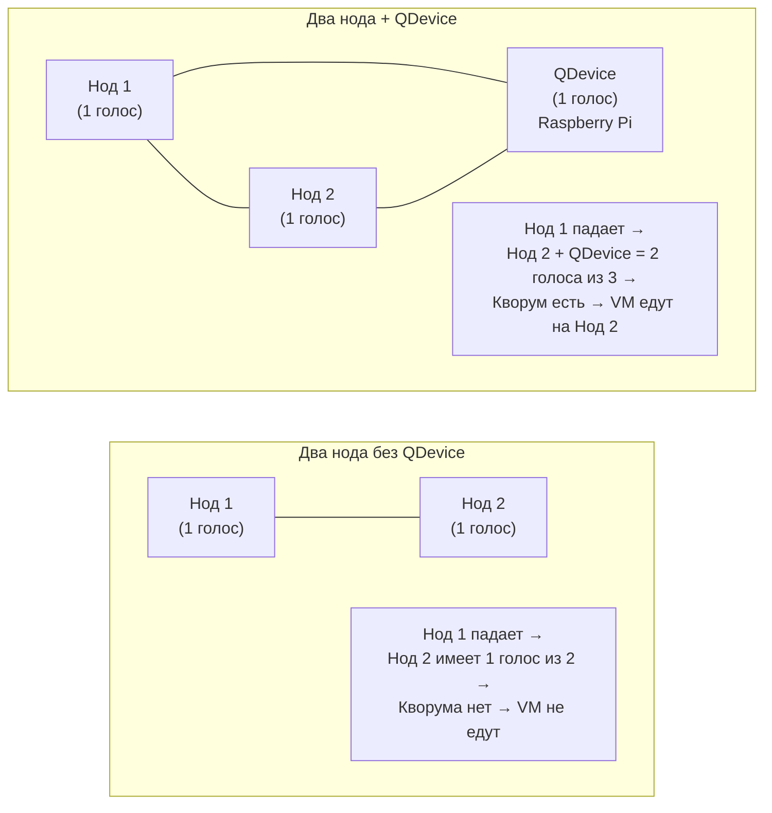

# Глава 23: Кластер из двух нодов + QDevice

---

**Что вы узнаете:**
- почему кластер из двух нодов без QDevice не обеспечивает автоматический failover;
- что такое QDevice и как Raspberry Pi превращается в арбитра кластера;
- как настроить репликацию дисков VM между двумя нодами через ZFS;
- в чём ограничения схемы «два нода + QDevice» и когда она подходит для реальных задач.

---

## Контекст

В главе 15 мы разбирали трёхнодный кластер как эталон: три сервера, quorum из двух, full HA, живая миграция. Это надёжно. Но три физических сервера — это тройная стоимость железа, три источника тепла и шума, три точки обслуживания. Для дома или небольшого офиса это часто избыточно.

Многие приходят к такой схеме: есть два сервера, хочется чтобы при падении одного VM сами переехали на второй. Голый двухнодный кластер этого не даёт — нет кворума, и при потере связи между нодами кластер просто встаёт. Решение называется QDevice: маленькая третья машина, которая не хранит ни одной VM, но участвует в голосовании и делает кворум возможным.

---

## 23.1 Проблема кворума при двух нодах

Представьте двух коллег, которые принимают решение голосованием. Один говорит «да», другой говорит «нет» — ничья. Никто не может победить большинством, и решение не принимается. В кластере та же история: нужно большинство голосов, иначе никаких действий.

При двух нодах quorum требует 2 голоса из 2 доступных. Если между нодами пропала сеть — каждый нод видит только себя и набирает 1 голос. Большинства нет ни у кого. Кластер замирает, VM не мигрируют, HA не срабатывает. Хуже того: каждый нод не знает, упал ли второй или это он сам потерял сеть. Это называется **split-brain** — «раздвоение мозга».

Без QDevice ситуация выглядит именно так: нод 1 падает, нод 2 не уверен что он в большинстве, не берёт VM под управление, и всё стоит до вашего ручного вмешательства.

Вот как выглядит разница схематично:



На схеме слева нод 2 при потере нода 1 остаётся один и не может набрать большинство — кластер встаёт. На схеме справа QDevice добавляет третий голос: при падении нода 1 остаются два живых участника (нод 2 и QDevice), которые составляют большинство и позволяют кластеру продолжить работу и мигрировать VM.

---

## 23.2 Что такое QDevice

QDevice — это небольшая машина с установленным пакетом `corosync-qnetd`. Она подключается к кластеру Proxmox и участвует в голосовании за кворум, но при этом:

- **не хранит** диски виртуальных машин;
- **не запускает** VM или LXC-контейнеры;
- **не является** нодой Proxmox — в интерфейсе вы её не увидите как сервер;
- просто отдаёт свой голос тому ноду, который остался в рабочем состоянии.

Для QDevice подходит практически любая Linux-машина: Raspberry Pi (любой, даже Zero W), старый ноутбук, маленькая VPS за 2 доллара в месяц, виртуальная машина на третьем Proxmox-хосте. Главное требование — стабильная сетевая доступность с обоих нодов Proxmox и Ubuntu или Debian (пакет `corosync-qnetd` есть в стандартных репозиториях).

Raspberry Pi — популярный выбор именно потому что стоит копейки, потребляет 3–5 Ватт и работает годами без обслуживания. В этой главе используем RPi как пример, но все те же шаги работают на любой Linux-машине.

---

## 23.3 Настройка QDevice на Raspberry Pi

Предположим, у вас уже есть двухнодный кластер Proxmox. Если ещё нет — создайте его на первом ноде командой `pvecm create имя-кластера`, затем подключите второй нод через `pvecm add IP-первого-нода`.

### Шаг 1. Подготовить Raspberry Pi

Установите пакет `corosync-qnetd` на Raspberry Pi. Подключитесь к RPi по SSH и выполните:

```bash
apt update && apt install -y corosync-qnetd
```

Этот пакет устанавливает демон `corosync-qnetd`, который слушает входящие соединения от нодов Proxmox и участвует в арбитраже кворума.

### Шаг 2. Разрешить root-вход по SSH на RPi

`pvecm qdevice setup` подключается к RPi под root для первоначальной настройки — обменивается SSH-ключами и регистрирует кластер. Временно (или постоянно — по вашему усмотрению) откройте root-логин:

```bash
# На Raspberry Pi
nano /etc/ssh/sshd_config
```

Найдите строку `PermitRootLogin` и установите значение:

```
PermitRootLogin yes
```

Перезапустите SSH:

```bash
systemctl restart sshd
```

После успешной настройки QDevice можно вернуть `PermitRootLogin prohibit-password` — дальнейшая работа QDevice не требует парольного SSH-входа.

### Шаг 3. Запустить настройку с ноды Proxmox

На первом ноде Proxmox выполните одну команду:

```bash
pvecm qdevice setup 192.168.1.50
```

Здесь `192.168.1.50` — IP-адрес вашего Raspberry Pi. Команда сделает следующее:
- подключится к RPi по SSH от имени root;
- скопирует сертификаты кластера на RPi;
- настроит `corosync-qnetd` на RPi для работы с вашим кластером;
- добавит QDevice в конфигурацию Corosync на обоих нодах Proxmox.

Введите root-пароль RPi когда потребуется. Весь процесс занимает 10–20 секунд.

### Шаг 4. Проверить статус кластера

```bash
pvecm status
```

Вывод должен выглядеть примерно так:

```
Cluster information
-------------------
Name:             mycluster
Config Version:   3
Transport:        knet
Secure auth:      on

Quorum information
------------------
Date:             Sat May 31 14:22:10 2026
Quorum provider:  corosync_votequorum
Nodes:            2
Node state:       Quorate
Q-Device:         configured
Q-Device votes:   1

Votequorum information
----------------------
Expected votes:   3
Highest expected: 3
Total votes:      3
Quorum:           2
Flags:            Quorate Qdevice

Membership information
----------------------
Nodeid  Votes  Qdevice  Name
     1      1    A,V,NMW  pve1 (local)
     2      1    A,V,NMW  pve2
```

Ключевые строки: `Q-Device: configured`, `Total votes: 3`, `Quorum: 2`. Это значит кластер теперь работает с тремя голосами, и для кворума достаточно двух. Если нод 1 или нод 2 упадёт — оставшийся нод плюс QDevice образуют большинство и кластер продолжит работу.

---

## 23.4 Настройка репликации для HA

HA в Proxmox требует чтобы диски VM были доступны на том ноде, куда переедет VM. При отсутствии общего хранилища (Ceph, NFS, iSCSI) — а именно так чаще всего устроен двухнодный домашний кластер — нужна репликация дисков между нодами.

### Почему именно ZFS, не LVM-thin

Proxmox умеет реплицировать только ZFS-тома. LVM-thin хранит данные в виде, который нельзя инкрементально синхронизировать через стандартный механизм Proxmox Replication. Если диски VM лежат на `local-lvm` (LVM-thin) — репликацию настроить не получится, кнопка просто будет серой.

Нужен отдельный ZFS-пул на каждом ноде. Если у вас есть свободный диск (например, `/dev/sdb`) — создайте ZFS-пул прямо из интерфейса Proxmox:

**Нод → Диски → ZFS → Создать: ZFS Pool** → выбрать `/dev/sdb`, тип RAID: Single disk (для одного диска), дать имя, например `zfs-data`.

Повторите на втором ноде с его диском.

### Перенести диск VM на ZFS

Если ваша VM (например, VM 101 с Home Assistant) сейчас на `local-lvm`, перенесите её диск на ZFS:

```bash
qm disk move 101 scsi0 zfs-data --delete
```

Эта команда переносит диск `scsi0` виртуальной машины 101 на хранилище `zfs-data` и удаляет оригинал после успешного переноса (`--delete`). VM при этом должна быть выключена. Перенос занимает время пропорционально размеру диска.

### Создать задание репликации

Откройте **Datacenter → Replication → Добавить**:

- **VM ID:** 101 (ваша VM)
- **Target:** второй нод (например, `pve2`)
- **Schedule:** `*/15` (каждые 15 минут) или `*/5` для более частой синхронизации
- **Rate limit:** оставьте пустым или укажите лимит если не хотите забивать сеть

Нажмите OK. Proxmox немедленно запустит первую полную синхронизацию — она займёт столько времени сколько нужно для передачи всего диска VM. Последующие синхронизации инкрементальные: передаются только изменения за прошедший интервал.

Честное предупреждение: **репликация раз в 5–15 минут означает что данные на целевом ноде могут отставать до 15 минут**. Если нод с VM упадёт прямо между двумя синхронизациями — последние изменения будут потеряны. Для домашних сервисов (Home Assistant, Nextcloud, медиасервер) это обычно приемлемо. Для базы данных с активными транзакциями — нет, подробнее в разделе 23.6.

---

## 23.5 High Availability с двумя нодами

После того как кластер имеет кворум (через QDevice) и репликация настроена — можно включить HA для VM.

### Добавить VM в HA

Откройте **Datacenter → HA → Resources → Добавить**:

- **VM:** 101 (выбрать из списка)
- **Max Restart:** 1 — сколько раз пробовать перезапустить VM на том же ноде прежде чем мигрировать
- **Max Relocate:** 1 — сколько раз пробовать переехать на другой нод
- **State:** started — желаемое состояние: VM должна быть запущена

Нажмите Добавить. Теперь VM 101 защищена HA.

### Как это работает на практике

Proxmox периодически обменивается heartbeat-сигналами между нодами. Если нод 1 перестаёт отвечать дольше определённого времени — кластер объявляет его недоступным и HA-менеджер принимает решение: взять VM с упавшего нода и запустить её на живом ноде.

Перед запуском VM на новом ноде Proxmox применяет последний снапшот репликации — те данные, что были синхронизированы последней.

### Тест: имитация отказа нода

Чтобы убедиться что схема работает, выполните простой тест:

1. Убедитесь что VM 101 работает на ноде 1.
2. Физически отключите сетевой кабель нода 1 (или выключите его питание).
3. Наблюдайте в интерфейсе Proxmox (войдите через IP нода 2).

**Через 1–2 минуты** кластер зафиксирует потерю нода 1. **Через 3–5 минут** VM 101 начнёт запускаться на ноде 2. Итоговое время «от падения до VM снова работает» — обычно 4–6 минут.

Пять минут — это известный минус схемы с HA. В отличие от Ceph (глава 24) где VM продолжает работать мгновенно, здесь есть период простоя пока HA-менеджер убеждается в недоступности нода и запускает VM на втором. Для дома — это вполне приемлемо: вы не проснётесь в 3 ночи чтобы вручную перезапускать VM, она сама поднимется.

---

## 23.6 Когда схема подходит, а когда нет

### Подходит

**Домашний сервер с двумя нодами.** Два мини-ПК или два старых ноутбука — классический сценарий. Home Assistant, Nextcloud, Jellyfin, мониторинг. Потеря 5–15 минут данных при отказе нода — не катастрофа.

**Небольшой офис без критичных баз данных.** Файловый сервер, веб-сайт, корпоративный мессенджер. Сервисы можно позволить перезапустить с минутным простоем.

**Как переходная ступень.** Вы уже купили второй сервер, хотите HA, но третьего пока нет. Два нода + QDevice на RPi — дёшево и работает.

### Не подходит

**База данных с активной записью.** PostgreSQL, MySQL, MongoDB — при потере последних 5–15 минут транзакций данные окажутся в несогласованном состоянии. Клиенты подтвердили запись, но сервер её «не видел». Для баз данных нужен либо Ceph (глава 24) с мгновенной доступностью, либо кластер самой СУБД с синхронной репликацией (Galera Cluster, PostgreSQL streaming replication).

**Финансовые транзакции и POS-системы.** Та же причина: потеря 10 минут операций — это потеря денег и доверия.

**Сервисы с высокими требованиями к RTO.** Если «VM должна быть доступна в течение 30 секунд» — пять минут HA-таймаута неприемлемы.

```text
Подходит:                           Не подходит:
  Home Assistant      ✓               PostgreSQL с клиентами    ✗
  Nextcloud           ✓               Платёжный процессинг      ✗
  Jellyfin            ✓               ERP-система               ✗
  Wiki/заметки        ✓               Любая СУБД под нагрузкой  ✗
  Мониторинг          ✓               RTO < 1 минута            ✗
```

Для критичных сервисов — Ceph + трёхнодный кластер. Это следующая глава.

---

## Типичные ошибки

**Ошибка аутентификации при `pvecm qdevice setup`**

*Симптом:* команда завершается с ошибкой `Permission denied (publickey,password)` или `Host key verification failed`.

*Причина:* на Raspberry Pi не разрешён root-вход по SSH, или `sshd_config` содержит `PermitRootLogin no` (это значение по умолчанию в свежих Raspberry Pi OS с 2022 года).

*Решение:* откройте `/etc/ssh/sshd_config` на RPi, установите `PermitRootLogin yes`, перезапустите `systemctl restart sshd`. После успешной настройки QDevice можно вернуть более ограничительное значение.

---

**Кластер без кворума после добавления QDevice**

*Симптом:* `pvecm status` показывает `Quorate: No` или QDevice отображается как `A,V` без `NMW`.

*Причина:* RPi недоступен с одного из нодов Proxmox. Возможно, RPi и один из нодов находятся в разных подсетях или между ними есть firewall.

*Решение:* проверьте доступность RPi с обоих нодов: `ping 192.168.1.50` с каждого нода. QDevice слушает порт `5403/tcp` — убедитесь что он не заблокирован. На RPi можно проверить: `ss -tlnp | grep 5403`.

---

**Репликация не настраивается — кнопка «Добавить» неактивна или задание не создаётся**

*Симптом:* в **Datacenter → Replication** при попытке добавить VM ничего не происходит или появляется ошибка `storage does not support replication`.

*Причина:* диск VM находится на хранилище типа LVM-thin (обычно `local-lvm`). Proxmox Replication работает только с ZFS.

*Решение:* перенесите диск VM на ZFS-хранилище командой `qm disk move <vmid> <disk> <zfs-storage> --delete`. После переноса репликация станет доступной.

---

**VM не переезжает при отключении нода**

*Симптом:* нод упал, прошло 10 минут, VM так и не запустилась на втором ноде.

*Причина:* VM не добавлена в **Datacenter → HA → Resources**, или репликация для этой VM не настроена, или кластер не имеет кворума (проверить `pvecm status`).

*Решение:* убедитесь что VM есть в списке HA Resources, статус `started`. Проверьте что репликация показывает `OK` в **Datacenter → Replication**. Проверьте кворум — QDevice должен быть доступен.

---

## Чек-лист для самопроверки

- [ ] Понимаю зачем нужен QDevice при двухнодном кластере и что такое split-brain
- [ ] Установил `corosync-qnetd` на Raspberry Pi (или другую Linux-машину) и выполнил `pvecm qdevice setup <IP>`
- [ ] Вывод `pvecm status` показывает три участника (2 нода + QDevice), `Total votes: 3`, `Quorate: Yes`
- [ ] Перенёс диск хотя бы одной VM на ZFS и настроил задание репликации в **Datacenter → Replication**
- [ ] Добавил VM в **Datacenter → HA → Resources** и проверил failover: отключил нод — VM поднялась на втором
