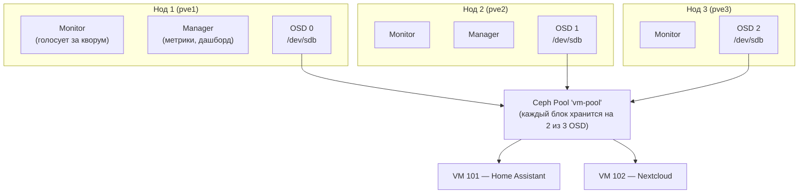

# Глава 24: Ceph — встроенное отказоустойчивое хранилище

> **Цель:** установить Ceph внутри Proxmox-кластера, создать распределённый пул хранения и убедиться что VM продолжает работать даже при падении одного нода.

---

## Что вы узнаете

- Что такое Ceph и чем он принципиально отличается от репликации из главы 23.
- Из каких компонентов состоит Ceph-кластер: Monitor, Manager, OSD, Pool.
- Как развернуть Ceph внутри Proxmox через веб-интерфейс шаг за шагом.
- Когда Ceph действительно нужен, а когда он только добавит сложности без пользы.

---

## Контекст

В главе 23 мы настраивали репликацию дисков через ZFS. Это решение рабочее — но честно говоря, с оговорками. Репликация происходит раз в несколько минут: если нод упал в промежутке между синхронизациями, данные за последние N минут теряются. Для Home Assistant или Nextcloud дома это приемлемо. Для базы данных с активной записью — уже нет.

Ceph решает корневую проблему иначе. Диск виртуальной машины не хранится на одном ноде — он распределён между несколькими физическими нодами одновременно. Каждая операция записи фиксируется на двух-трёх нодах в реальном времени, не «раз в минуту». Если нод падает — VM читает данные с соседних нодов немедленно, без ожидания и без потери записей.

Это та же идея что в главе 15 про кластер, только применённая к хранилищу. Там мы дали кластеру общий мозг, здесь — общее тело.

Важно понимать: Ceph сложнее, чем NFS или ZFS-репликация. Здесь больше движущихся частей, выше требования к железу, больше вещей которые могут пойти не так. Но взамен вы получаете хранилище которое не имеет «узкого горлышка» — ни по надёжности, ни по производительности при масштабировании.

---

## 24.1 Что такое Ceph и как он работает

Ceph — распределённая система хранения. Данные разбиваются на блоки (chunks), каждый блок записывается на несколько физических дисков (OSD — Object Storage Daemon) одновременно. По умолчанию каждый блок хранится на двух OSD (`size=2`). Это значит: одна копия на нод 1, вторая копия на нод 2. Если нод 1 падает — нод 2 отдаёт данные без перерыва.

Proxmox умеет устанавливать и управлять Ceph прямо из своего веб-интерфейса. Не нужно отдельно конфигурировать Ceph, писать конфиги от руки или знать его внутренности. Proxmox берёт эту работу на себя — вы кликаете в UI, он разворачивает кластер.

Посмотрим как выглядит архитектура Ceph в трёхнодном Proxmox-кластере.



На схеме видно как устроена система: каждый нод держит Monitor, Manager и один OSD-диск. Monitor — это процесс-арбитр, он знает карту кластера (где какой OSD, что живой, что нет). Manager собирает метрики и показывает их в дашборде Proxmox. OSD — это сам диск со своим демоном-сторожем, который принимает чтение и запись. Три OSD вместе образуют Pool — виртуальное хранилище, из которого VM берут свои диски. Когда VM 101 пишет данные, они одновременно уходят на два OSD из трёх. Пул решает сам, на какие именно — это называется CRUSH-алгоритм.

---

## 24.2 Требования к Ceph

Прежде чем начинать — честный список требований. Ceph не терпит компромиссов в железе.

**Количество нодов:** минимум три. Это не рекомендация, а необходимость. Мониторам нужен кворум — большинство от числа. При трёх мониторах кластер работает при двух живых. При двух нодах — невозможно определить большинство, Ceph останавливается.

**Диски под OSD:** на каждом ноде нужен отдельный диск — не системный. Диск под Ceph должен быть пуст: без разделов, без файловой системы. Лучший вариант — отдельный SSD или NVMe. HDD тоже работает, но медленнее. Размер дисков желательно одинаковый на всех нодах.

**Сеть:** вот где чаще всего экономят и потом жалеют. Ceph генерирует большой внутренний трафик: каждая запись пересылается между нодами для репликации. На гигабитной сети, общей с VM-трафиком, это заметно тормозит обоих. Идеальный вариант — отдельный сетевой интерфейс 10 Гбит для Ceph-трафика (cluster network). Если нет второго физического интерфейса — хотя бы VLAN, выделенный под Ceph.

**RAM:** Ceph OSD потребляет от 1 до 4 ГБ RAM на диск в зависимости от нагрузки. Три ноды с одним OSD каждый — закладывайте +2–3 ГБ RAM к тому, что уже нужно VM.

**Минимальная конфигурация для тестирования:**

```text
3 нода × (4 ядра CPU, 8 GB RAM, системный SSD 60 GB + чистый диск 50 GB+)
Сеть: гигабит, желательно отдельный интерфейс под Ceph
```

Если чего-то из этого нет — смотрите раздел 24.7 в конце главы.

---

## 24.3 Установка Ceph через веб-интерфейс

Proxmox устанавливает Ceph пошагово прямо из UI. Процесс выглядит повторяющимся, потому что большинство шагов надо сделать на каждом ноде — это нормально для распределённой системы.

### Шаг 1. Установить пакеты Ceph на каждый нод

Зайдите в каждый нод по очереди: **pve1 → Ceph → Install Ceph**.

Откроется мастер установки. Выберите репозиторий **No-Subscription** и версию **Squid** (текущая стабильная на момент написания). Нажмите **Start installation**.

Proxmox скачает и установит пакеты — займёт 1–3 минуты в зависимости от скорости сети. Дождитесь сообщения об успехе.

Повторите на **pve2** и **pve3**. После установки на всех трёх нодах можно переходить к конфигурации.

### Шаг 2. Первоначальная конфигурация

На **pve1** перейдите в **Ceph → Configuration → Initialize Ceph**.

Здесь нужно указать сеть для Ceph-трафика. Если у вас отдельный интерфейс (например, `10.10.20.0/24` на `eth1`) — укажите его в поле **Public Network**. Если сеть одна — укажите вашу основную подсеть (например, `192.168.1.0/24`).

Поле **Cluster Network** — это отдельная сеть для внутренней репликации между OSD. Если есть второй интерфейс — укажите его. Если нет — оставьте пустым, Ceph будет использовать Public Network для всего.

Нажмите **Create Configuration**.

### Шаг 3. Создать мониторы

Монитор — это процесс-арбитр. Он не хранит данные VM, но знает карту всего кластера и голосует за кворум.

На **pve1**: **Ceph → Monitor → Create**. Нод уже выбран — нажмите **Create**.

Перейдите на **pve2**: **Ceph → Monitor → Create**. Повторите на **pve3**.

После создания трёх мониторов в списке появится статус `in quorum` у всех трёх — значит мониторы договорились между собой и кластер «живой».

### Шаг 4. Создать менеджеры

Manager — демон который собирает метрики, показывает их в дашборде Proxmox и управляет некоторыми Ceph-функциями.

На **pve1**: **Ceph → Manager → Create**.

Повторите на **pve2** и **pve3**. Один из менеджеров будет активным (`active`), остальные — в режиме standby. Это нормально.

### Шаг 5. Создать OSD (Object Storage Daemon)

OSD — это диск плюс демон, который им управляет. Один диск = один OSD.

На **pve1**: **Ceph → OSD → Create OSD**.

В списке дисков выберите **чистый диск** (не системный). Proxmox показывает только диски без файловой системы — если нужный диск не виден, возможно на нём ещё есть данные (см. раздел «Типичные ошибки»).

Нажмите **Create**.

Повторите на **pve2** и **pve3**. В итоге должно быть минимум 3 OSD — по одному на каждый нод.

После создания всех OSD статус кластера в **Ceph → Status** станет `HEALTH_OK` — зелёный. Если видите `HEALTH_WARN` — читайте сообщение, чаще всего это clock skew или недостаточно OSD.

### Шаг 6. Создать пул

Пул — это логический контейнер, из которого VM берут дисковое пространство. Физически данные пула разложены по всем OSD.

На любом ноде: **Ceph → Pools → Create Pool**.

Заполните поля:
- **Name:** `vm-pool` (или любое понятное имя)
- **Size:** `2` — количество копий каждого блока. При size=2 один нод может упасть без потери данных. Size=3 надёжнее, но занимает втрое больше места.
- **Min Size:** `1` — минимальное количество копий для разрешения записи. При min_size=1 Ceph будет принимать запись даже когда одна копия недоступна. Для домашнего использования подходит.
- Поставьте галочку **Add as Storage** — Proxmox сразу зарегистрирует пул как хранилище.

Нажмите **Create**. Пул появится в **Datacenter → Storage** с типом `rbd`.

---

## 24.4 Перенос VM на Ceph-пул

Теперь можно перенести диски существующих VM в Ceph. Пока диск VM лежит на `local-lvm` конкретного нода, Live Migration между нодами невозможна — VM нельзя запустить на другом ноде. После переноса на Ceph-пул диск становится доступен всем нодам сразу.

Выберите VM (например, VM 102 — Nextcloud). Откройте вкладку **Hardware**. Кликните на диск (обычно `scsi0`). В верхнем меню появится кнопка **Disk Action → Move Storage**.

В окне переноса выберите:
- **Target Storage:** `vm-pool` (ваш Ceph-пул)
- **Format:** `raw` (рекомендуется для Ceph, qcow2 не нужен — снапшоты делает сам Ceph)
- Галочку **Delete source** — удалить оригинал после копирования (если места мало, можно снять и удалить руками позже)

Нажмите **Move disk**. VM продолжает работать в процессе переноса — это занимает время пропорционально размеру диска. После завершения диск VM физически живёт в Ceph.

Теперь попробуйте Live Migration: выберите VM, нажмите **Migrate**, укажите другой нод. Миграция пройдёт без остановки VM — потому что диск доступен со всех нодов одновременно.

Сравнение с главой 23:
```text
Репликация (глава 23):
  диск хранится на одном ноде → раз в N минут копируется на второй нод
  → при отказе теряются данные за последние N минут
  → Live Migration невозможна (диск привязан к ноду)

Ceph (глава 24):
  диск хранится сразу на 2 нодах одновременно → нет задержки синхронизации
  → при отказе нода данные читаются с соседа мгновенно, без потерь
  → Live Migration работает без даунтайма
```

---

## 24.5 Проверка: что происходит при падении нода

Это самое важное — убедиться что система работает так, как обещала.

Возьмите VM с диском на Ceph-пуле и запустите на ней что-то непрерывное: например, `ping 8.8.8.8` или постоянное обращение к веб-интерфейсу Nextcloud.

Теперь физически отключите сетевой кабель нода, на котором **не запущена** ваша тестовая VM (или выключите этот нод). VM продолжает работать — она запущена на другом ноде, а диск читается с оставшихся OSD.

Через несколько секунд в **Ceph → Status** вы увидите предупреждение: один OSD помечен `down`. Ceph начнёт процесс «заживления» — временно повысит количество копий блоков между оставшимися OSD. Пока нода нет — кластер работает с пониженной репликой.

Если у вас настроен HA (Datacenter → HA), VM которая была запущена на упавшем ноде автоматически переедет на один из живых нодов — примерно через 2–5 минут (это настраиваемый таймаут). Диск VM уже доступен на других нодах, поэтому переезд происходит без вопросов «где данные».

Верните кабель или включите нод. OSD поднимется, Ceph синхронизирует блоки которые изменились за время отсутствия, статус вернётся к `HEALTH_OK`.

---

## 24.6 CephFS — общая файловая система для ISO и бэкапов

Кроме блочного хранилища (RBD, которое мы использовали для VM-дисков) Ceph умеет предоставлять общую файловую систему — CephFS. Это удобно для хранения ISO-образов, шаблонов LXC и бэкапов: файлы лежат в одном месте и доступны всем нодам кластера без NFS-шары.

Для CephFS нужен дополнительный компонент — MDS (Metadata Server). Он управляет метаданными файловой системы (дерево каталогов, права доступа).

Настройка занимает несколько минут:

1. На любом ноде: **Ceph → CephFS → Create CephFS**.
2. Proxmox спросит имя файловой системы и предложит создать MDS автоматически — согласитесь.
3. После создания: **Datacenter → Storage → Add → CephFS**.
4. Выберите только что созданную файловую систему, укажите Content: `iso, vztmpl, backup` — что нужно хранить.

Теперь ISO-образы, скачанные на одном ноде, видны всем нодам кластера. Бэкапы тоже пишутся в одно место. Это намного удобнее чем NFS: не нужно отдельного сервера, нет единой точки отказа.

---

## 24.7 Когда Ceph НЕ нужен

Ceph — мощный инструмент, но это не повод ставить его везде. Честный список ситуаций где Ceph только добавит сложности:

**Один нод.** Ceph требует минимум три нода. На одном сервере Ceph можно формально запустить, но это ничего не даст по надёжности — все три OSD будут на одном железе.

**Дом без критичных сервисов.** Если у вас Home Assistant, Jellyfin и несколько LXC-контейнеров с файлами — ценность Ceph минимальна. Снапшоты и бэкапы из главы 8 дадут достаточную защиту без лишней сложности.

**Нет свободных дисков.** Ceph не работает на системном диске. Если в каждом сервере только по одному диску — Ceph нельзя развернуть без докупки железа.

**Мало RAM.** На 8 GB RAM и без того тесно между VM и Proxmox. Добавить ещё 2–3 GB на OSD-демоны — значит отнять у VM.

**Нет отдельной сети.** Без выделенного интерфейса для Ceph весь репликационный трафик пойдёт через ту же сеть что и VM. Это ощутимо замедлит и Ceph, и VM.

```text
Используй Ceph если:
  ✓ 3+ нода в кластере
  ✓ На каждом ноде есть отдельный диск под OSD
  ✓ Есть (или планируется) отдельная сеть под Ceph
  ✓ Запускаешь сервисы где потеря данных недопустима
  ✓ Нужна Live Migration без даунтайма

Не используй Ceph если:
  ✗ Один нод
  ✗ Нет свободных дисков
  ✗ Всего одна сетевая карта
  ✗ Только домашние некритичные сервисы
```

Для домашнего двухнодного кластера из главы 23 с некритичными сервисами — ZFS-репликация вполне достаточна. Ceph начинает оправдывать свою сложность от трёх нодов и реальных требований к непрерывности работы.

---

## Типичные ошибки

**`HEALTH_WARN: clock skew detected` — кластер ругается на рассинхронизацию времени**

Симптом: в **Ceph → Status** мигает предупреждение `clock skew detected on mon.*`. Мониторы отказываются голосовать если их часы расходятся более чем на 0.05 секунды.

Причина: на нодах не настроен NTP или NTP-серверы разные.

Решение: убедиться что на всех нодах работает `chrony` или `systemd-timesyncd` и они используют один NTP-источник:

```bash
# Проверить синхронизацию времени
timedatectl status

# Если NTP не активен — включить
timedatectl set-ntp true

# Принудительная синхронизация chrony
chronyc makestep

# Проверить разницу времени между нодами
# На всех нодах выполнить и сравнить:
date
```

---

**OSD не создаётся — диск не виден в списке или появляется ошибка**

Симптом: при попытке создать OSD в UI нужный диск отсутствует в списке, или появляется ошибка `cannot create OSD: disk in use`.

Причина: на диске есть старая файловая система, LVM-метки или GPT-разделы. Proxmox не создаёт OSD на «грязных» дисках.

Решение: очистить диск через **Node → Disks → выбрать диск → Wipe Disk**. Это необратимо — убедитесь что данных на нём нет. После очистки диск появится в списке при создании OSD.

Если Wipe Disk не помогает — очистить через консоль:

```bash
# Стереть начало и конец диска (где обычно лежат метки)
# ВНИМАНИЕ: замените /dev/sdb на ваш диск, убедитесь что это нужный диск
dd if=/dev/zero of=/dev/sdb bs=1M count=100
dd if=/dev/zero of=/dev/sdb bs=1M count=100 seek=$(( $(blockdev --getsz /dev/sdb) / 2048 - 100 ))

# Удалить LVM-метки если есть
wipefs -a /dev/sdb
```

---

**VM на Ceph работает заметно медленнее чем на local-lvm**

Симптом: после переноса диска VM на Ceph-пул дисковые операции стали медленнее. `iostat` или `iotop` показывают низкую пропускную способность.

Причина: Ceph-трафик конкурирует за полосу с трафиком VM — нет отдельной сети под репликацию. Либо OSD-диски — медленные HDD без кэша.

Решение:

1. Добавить второй сетевой интерфейс на каждый нод и настроить его как Cluster Network в Ceph — тогда репликационный трафик уйдёт с основной сети.
2. Если второго интерфейса нет — создать выделенный VLAN для Ceph-трафика.
3. Если диски HDD — рассмотреть добавление небольшого SSD как WAL/DB диска для OSD (Ceph позволяет хранить журнал операций на быстром диске отдельно от данных).

Проверить текущую загрузку сети на нодах:

```bash
# Смотреть трафик по интерфейсам в реальном времени
iftop -i eth0

# Или через встроенный мониторинг Proxmox
# Node → Summary → Network
```

---

## Чек-лист для самопроверки

- [ ] Установил Ceph на всех нодах кластера через раздел **Ceph → Install Ceph** в UI
- [ ] Создал по одному Monitor на каждом ноде — в списке мониторов все три показывают статус `in quorum`
- [ ] Создал по одному OSD на каждом ноде из отдельного (не системного) диска
- [ ] Создал Ceph Pool с параметром `size=2` и добавил его как Storage в Proxmox
- [ ] Перенёс диск тестовой VM на Ceph Pool через **Disk Action → Move Storage** — VM продолжила работать в процессе
- [ ] Понимаю разницу между Ceph и ZFS-репликацией из главы 23: репликация — данные с задержкой N минут, Ceph — данные актуальны всегда
