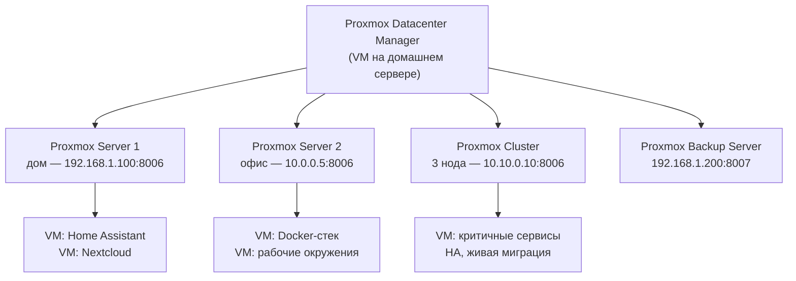

# Глава 25: Proxmox Datacenter Manager — управляем несколькими серверами

## Что вы узнаете

- что такое Proxmox Datacenter Manager и чем он отличается от обычного Proxmox UI;
- как установить PDM как VM внутри одного из Proxmox-серверов;
- как подключить несколько Proxmox-серверов и кластеров в единый интерфейс;
- как мигрировать VM между разными Proxmox-серверами через PDM.

---

У вас два Proxmox-сервера. Один дома — там живут Home Assistant, Nextcloud, файловый сервер. Второй в офисе — там Docker-стек, рабочие VM. Каждое утро вы заходите на домашний, проверяете состояние, потом открываете вкладку с офисным. Потом снова туда, обратно. Если серверов три или четыре — это уже маленький ад.

Proxmox Datacenter Manager (PDM) решает эту задачу: один веб-интерфейс, в котором видны все серверы сразу. Запустить обновления на всех нодах, посмотреть состояние VM, перенести VM с домашнего сервера в офис — всё из одного места.

Важно сразу сказать: PDM v1.0 — молодой продукт. Он умеет меньше, чем можно ожидать. Но то что он умеет — уже полезно.

---

## 25.1 Что такое PDM и зачем нужен

PDM — это не замена Proxmox UI. На каждый сервер всё равно заходишь для детальной работы: изменить конфиг VM, создать LXC, настроить хранилище. PDM — это агрегатор. Он смотрит на все серверы сверху и даёт обзорную картину.

Когда PDM нужен:
- Несколько физических серверов (дом, офис, аренда в датацентре).
- Несколько кластеров, между которыми нужно перемещать VM.
- Подключён Proxmox Backup Server — хочется видеть задания бэкапа без переключения вкладок.
- Нужно централизованно применять обновления.

Когда PDM не нужен:
- Один сервер или один кластер — Proxmox UI справляется сам.
- Меньше 3–4 нодов суммарно — накладные расходы на установку и поддержку PDM не оправданы.

Вот как PDM вписывается в типичную инфраструктуру из двух серверов:



На схеме видно: PDM — центральная точка входа. Он не хранит данные VM и не управляет ресурсами напрямую. Стрелки обозначают API-подключения: PDM периодически опрашивает каждый сервер и собирает информацию в единый интерфейс. При подключении кластера достаточно указать один нод — остальные PDM обнаружит сам.

---

## 25.2 Установка PDM

PDM устанавливается как отдельная операционная система — точно так же как сам Proxmox VE. Удобнее всего запустить его как VM на одном из уже работающих Proxmox-серверов.

### Шаг 1: Скачать ISO

Не нужно скачивать ISO на ноутбук и заливать через браузер. Proxmox умеет скачивать образы напрямую в хранилище.

В веб-интерфейсе: `local` → `ISO Images` → `Download from URL`.

URL для загрузки ISO: https://enterprise.proxmox.com/iso/proxmox-datacenter-manager_1.0-1.iso

Нажать `Query URL` — поле имени файла заполнится автоматически. Нажать `Download`. ISO скачается прямо на сервер.

### Шаг 2: Создать VM

Создать VM как обычно (глава 5), но с такими параметрами:

| Параметр | Значение |
|---|---|
| ЦП | 2 ядра |
| RAM | 4 ГБ |
| Диск | 15 ГБ |
| Сеть | vmbr0 |
| ISO | proxmox-datacenter-manager_1.0-1.iso |

PDM не требует много ресурсов — это веб-приложение с базой данных, не полноценный гипервизор.

### Шаг 3: Установить

Процесс установки идентичен Proxmox VE: загрузиться с ISO, выбрать диск, задать пароль root, указать IP-адрес и hostname. Рекомендуемый hostname — `pdm` или `pdm.local`.

После установки PDM перезагрузится и будет ждать подключений.

### Шаг 4: Открыть веб-интерфейс

PDM слушает на порту **8443**, не 8006:

```
https://<IP-адрес-PDM>:8443
```

Например: `https://192.168.1.50:8443`

Браузер предупредит о самоподписанном сертификате — добавить исключение. Войти с логином `root` и паролем, заданным при установке.

### Шаг 5: Отключить Enterprise-репозиторий

PDM, как и Proxmox VE, по умолчанию настроен на платный Enterprise-репозиторий. Если не отключить — при любом apt-обновлении будет ошибка 401 (нет подписки).

Через веб-интерфейс PDM: `Administration` → `Repositories`. Найти строку с `enterprise.proxmox.com` — отключить (`Disable`). Добавить no-subscription репозиторий: `Add` → выбрать `No-Subscription`.

Или через Shell PDM:

```bash
# Отключить Enterprise-репозиторий PDM
echo "deb [arch=amd64] http://download.proxmox.com/debian/pdm bookworm pdm-no-subscription" \
  > /etc/apt/sources.list.d/pdm-no-subscription.list

# Отключить Enterprise-источник
sed -i 's/^deb/#deb/' /etc/apt/sources.list.d/pdm-enterprise.list

# Обновить списки пакетов
apt update
```

После этого обновления работают без ошибок авторизации.

---

## 25.3 Подключение Proxmox-серверов

После установки PDM нужно добавить в него серверы, за которыми он будет следить. В терминологии PDM они называются **Remotes** (удалённые серверы).

### Добавить сервер

Перейти: `Remotes` → `Add` → `Proxmox Virtual Environment`.

Заполнить поля:

| Поле | Значение |
|---|---|
| Remote ID | произвольное имя (например: `home` или `office`) |
| Host | IP-адрес сервера или FQDN |
| Port | 8006 (порт Proxmox по умолчанию) |
| Username | `root` |
| Password | пароль root на том сервере |

Нажать `Add`. PDM подключится к серверу, проверит авторизацию и автоматически создаст API-токен на удалённом Proxmox.

Проверить что сервер добавлен: в разделе `Remotes` должна появиться строка с зелёным статусом.

### Добавить Proxmox Backup Server

Если используется Proxmox Backup Server (глава 8): `Remotes` → `Add` → `Proxmox Backup Server`. Порт PBS — 8007.

### Нюанс: старый API-токен мешает переподключению

Если раньше PDM уже подключался к этому серверу (например, при переустановке PDM), на Proxmox мог остаться старый API-токен. Новое подключение будет работать, но иногда возникают конфликты.

Удалить старый токен: в Proxmox UI → `Datacenter` → `Permissions` → `API Tokens`. Найти токен с именем, начинающимся на `auto-generated` или содержащим `pdm` — удалить. После этого переподключить сервер в PDM заново.

---

## 25.4 Возможности PDM на практике

После подключения серверов становится доступен полный набор функций. Разберём каждый по делу.

### Dashboard

Главный экран PDM показывает все VM и контейнеры со всех подключённых серверов. Видно сразу: что работает, что остановлено, сколько CPU и RAM потребляет каждый инстанс.

Полезно утром: открыл Dashboard — сразу видно что упало за ночь. Не нужно заходить на каждый сервер по очереди.

### Views (виды)

PDM позволяет создавать кастомные виды — фильтрованные подборки VM. Например:
- Вид `production` — только VM с тегом production на всех серверах.
- Вид `home` — только VM домашнего сервера.
- Вид `backups-today` — VM, у которых сегодня запланирован бэкап.

Создать вид: `Views` → `Add`. Настроить фильтры по серверу, тегам, статусу.

### Updates

Самая полезная функция для администратора нескольких серверов. PDM может обновить Proxmox-пакеты на всех нодах последовательно — без необходимости заходить на каждый.

`Updates` → выбрать серверы → `Upgrade`. PDM подключится к каждому и выполнит `apt dist-upgrade`.

Важно: PDM не перезагружает серверы автоматически. Перезагрузка после обновления ядра — ручная операция на каждом ноде.

### Firewall

Раздел `Firewall` позволяет просмотреть правила брандмауэра со всех подключённых серверов в одном месте. Полезно для аудита: убедиться что нигде не открыт лишний порт.

Создавать и изменять правила через PDM пока нельзя — только просмотр. Это ограничение v1.0.

### Access Control

Централизованное управление доступом. Если используется LDAP или Active Directory — добавить источник один раз в PDM, и он будет применён ко всем подключённым серверам. Не нужно заходить на каждый Proxmox и настраивать LDAP отдельно.

Перейти: `Access Control` → `Realms` → `Add` → выбрать LDAP или AD → заполнить параметры подключения.

---

## 25.5 Миграция VM между серверами

Одна из ключевых возможностей PDM — перенос VM между серверами, которые не объединены в кластер. Это offline-миграция: VM останавливается, переносится, запускается на целевом сервере.

### Как мигрировать

1. В разделе `Resources` найти нужную VM (видны все VM со всех серверов).
2. Нажать на VM → `Migrate`.
3. Выбрать целевой сервер из списка подключённых.
4. Настроить маппинг:
   - **Storage mapping** — на каком хранилище целевого сервера создать диск. Если на домашнем сервере диск лежит в `local-lvm`, а на офисном нужный пул называется `ssd-pool` — здесь это и указывается.
   - **Network mapping** — какой бридж использовать на целевом сервере. Если дома это `vmbr0`, в офисе может быть `vmbr1` — указать соответствие.
5. Нажать `Migrate`. PDM остановит VM, скопирует диск через API и запустит VM на целевом сервере.

### Что происходит с VM ID

При миграции VM сохраняет свой ID. Если на целевом сервере уже занят ID 101 (другой VM), миграция завершится ошибкой. Варианты:
- Заранее проверить занятые ID на целевом сервере.
- При миграции указать новый ID в настройках (если PDM поддерживает это в текущей версии — иначе сменить ID вручную после переноса через `qm clone`).

### Сколько времени занимает

Зависит от размера диска и скорости сети между серверами. VM с 20 ГБ диском по гигабитной сети переносится примерно 3–5 минут. Во время переноса VM недоступна.

Это не Live Migration — VM не работает во время переноса. Live Migration возможна только внутри кластера (глава 15). PDM переносит VM между разными Proxmox-инсталляциями, которые не имеют общего хранилища.

---

## 25.6 Что PDM не умеет (пока)

Честно: PDM v1.0 — это первая публичная версия продукта. Proxmox выпустили его в 2024 году, и список ограничений заметный.

**Нельзя создавать VM через PDM.** Для создания новой VM всё равно нужно заходить в интерфейс конкретного Proxmox-сервера. PDM только управляет уже существующими VM.

**Нельзя изменять конфигурацию VM.** Добавить диск, изменить количество ядер, поменять сетевой адаптер — всё это делается на конкретном сервере, не через PDM.

**Нельзя управлять хранилищами.** Создание пулов, LVM, ZFS — только на конкретном ноде.

**Нельзя управлять контейнерами детально.** LXC-контейнеры видны в Dashboard, но возможностей управления ими меньше чем для VM.

**Нет мобильного приложения.** Веб-интерфейс адаптивный, но специального мобильного клиента нет.

Всё это — временные ограничения. Proxmox активно развивает PDM, и с каждым релизом возможности расширяются. Продукт движется в правильную сторону — просто пока он молодой.

```text
Что PDM умеет сейчас (v1.0):
✓ Видеть все VM и контейнеры со всех серверов
✓ Запускать и останавливать VM
✓ Централизованные обновления всех нодов
✓ Просмотр правил Firewall
✓ Единое управление доступом (LDAP/AD)
✓ Миграция VM между разными серверами

Что PDM пока не умеет:
✗ Создавать VM и LXC
✗ Изменять конфигурацию VM
✗ Управлять хранилищами
✗ Live Migration между разными кластерами
```

---

## 25.7 Типичные ошибки

### Ошибка 401 при добавлении сервера в Remotes

**Симптом:** при попытке добавить Proxmox-сервер PDM сообщает об ошибке аутентификации 401.

**Причина:** Enterprise-репозиторий на самом PDM не отключён. При первом запуске PDM пытается проверить подписку — и если подписки нет, некоторые функции могут работать нестабильно, включая API-запросы к внешним серверам.

**Решение:** отключить Enterprise-репозиторий и добавить no-subscription (раздел 25.2, шаг 5). Обновить PDM (`apt update && apt upgrade`). После этого повторить добавление сервера.

---

### `VM already exists` при миграции

**Симптом:** при попытке мигрировать VM на целевой сервер появляется ошибка `VM already exists with ID 101` (или другой ID).

**Причина:** на целевом сервере уже есть VM с таким же ID.

**Решение:** проверить занятые ID на целевом сервере (в Proxmox UI → Resources → список VM). Перед миграцией освободить ID (переименовать конфликтующую VM: `qm clone 101 201 --full` на целевом сервере, затем удалить 101), или выбрать другой целевой сервер.

---

### PDM не видит второй нод кластера

**Симптом:** подключили кластер, указав IP первого нода. В Remotes появился один сервер, хотя в кластере три нода.

**Причина:** это не ошибка. При подключении кластера в PDM нужно указать IP только одного нода — PDM обнаружит остальные автоматически через Corosync.

**Решение:** подождать 1–2 минуты после добавления. Обновить страницу Remotes. Все ноды кластера должны появиться в списке. Если не появились — проверить что указанный нод действительно является частью кластера (`pvecm status` на этом ноде).

---

## Чек-лист для самопроверки

- [ ] Установил PDM как VM (2 ядра, 4 ГБ RAM, 15 ГБ диск), открыл веб-интерфейс на порту 8443
- [ ] Отключил Enterprise-репозиторий PDM, добавил no-subscription, запустил `apt update` без ошибок
- [ ] Подключил минимум два Proxmox-сервера через `Remotes → Add`
- [ ] Dashboard показывает VM со всех подключённых серверов
- [ ] Понимаю что PDM дополняет Proxmox UI, а не заменяет его, и что создавать VM нужно на конкретном сервере
