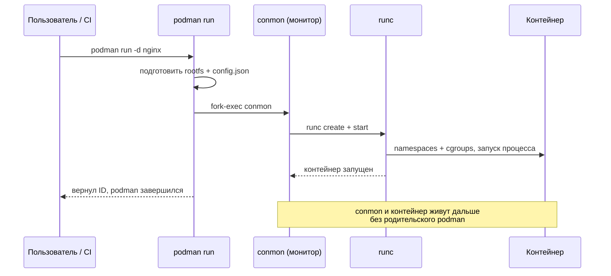

# Глава 4: Podman vs Docker — команды и концепции

## Что вы узнаете

- какие команды Docker работают в Podman без изменений, а какие отличаются;
- как архитектурно отличаются Podman и Docker на уровне процессов;
- как настроить Docker-совместимый сокет для инструментов которые ждут Docker API;
- как переключиться с Docker на Podman за один день.

---

## Процессная модель: демон против fork-exec

Это главное архитектурное различие. Понять его — значит понять половину Podman.

```text
Docker (демон-модель):
─────────────────────────────────────────────────────────────
systemd
  └── dockerd (root, всегда запущен)          ← SPOF
        └── containerd
              └── containerd-shim (один на контейнер)
                    └── nginx                 ← контейнер

Podman (fork-exec модель):
─────────────────────────────────────────────────────────────
bash / systemd / CI-runner
  └── podman run nginx                        ← запустил и вышел
        └── conmon (монитор, один на контейнер)
              └── nginx                       ← контейнер

bash / systemd / CI-runner
  └── podman run postgres                     ← независимый процесс
        └── conmon
              └── postgres                   ← контейнер
```

**Что это означает на практике:**

1. **Нет SPOF.** Упал dockerd — остановились все контейнеры. В Podman каждый контейнер — отдельный процесс. Один упал — остальные живут.

2. **Нет root-демона.** dockerd запускается как root. Podman — как текущий пользователь. При завершении процесса `podman run` контейнер продолжает жить через `conmon`, который тоже запущен от пользователя.

3. **Systemd-совместимость.** Podman-контейнер — обычный дочерний процесс. systemd может следить за ним, перезапускать, собирать логи — без каких-либо адаптеров.

Что именно происходит при `podman run`, проще увидеть как последовательность вызовов. Сам `podman` не остаётся в дереве процессов — он лишь запускает монитор `conmon`, а тот через `runc` создаёт контейнер и переживает завершение исходной команды.



В отличие от Docker, где `dockerd` обязан быть запущен всё время жизни контейнера, здесь после `podman run` исходный процесс исчезает — остаётся лёгкий `conmon`, запущенный от того же пользователя.

---

## Совместимость команд

Большинство команд Docker работают в Podman без изменений. Вот полная таблица:

```text
Docker                               Podman                    Статус
───────────────────────────────────────────────────────────────────────
docker run -d --name web nginx       podman run -d ...         ✅ идентично
docker run -it --rm alpine sh        podman run -it ...        ✅ идентично
docker run -p 8080:80 nginx          podman run -p ...         ✅ идентично
docker run -v /host:/cont nginx      podman run -v ...         ✅ идентично
docker run --env KEY=val nginx       podman run --env ...      ✅ идентично
docker run --network mynet nginx     podman run --network ...  ✅ идентично
docker ps / ps -a                    podman ps / ps -a         ✅ идентично
docker stop / start / restart        podman stop / start ...   ✅ идентично
docker rm / rmi                      podman rm / rmi           ✅ идентично
docker logs -f web                   podman logs -f web        ✅ идентично
docker exec -it web bash             podman exec -it ...       ✅ идентично
docker inspect web                   podman inspect web        ✅ идентично
docker stats                         podman stats              ✅ идентично
docker build -t app:1 .              podman build -t app:1 .   ✅ идентично
docker pull nginx                    podman pull nginx         ✅ идентично*
docker push myapp:latest             podman push myapp:latest  ✅ идентично
docker images                        podman images             ✅ идентично
docker volume create / ls / rm       podman volume ...         ✅ идентично
docker network create / ls           podman network ...        ✅ идентично
docker system df                     podman system df          ✅ идентично
docker system prune                  podman system prune       ✅ идентично
docker-compose up                    podman-compose up         ⚠️ нужен podman-compose
/var/run/docker.sock                 /run/user/UID/podman.sock ⚠️ другой путь
docker info (демон-инфо)             podman info               ⚠️ другой формат
```

`*` — `podman pull nginx` может потребовать настройки `unqualified-search-registries` (см. главу 3).

---

## Алиас: переключиться за одну команду

Если хотите использовать Podman прозрачно вместо Docker — достаточно алиасов:

```bash
# Добавить в ~/.bashrc или ~/.zshrc
alias docker='podman'
alias docker-compose='podman-compose'

# Применить в текущей сессии
source ~/.bashrc

# Проверить
docker --version
# emulate Docker CLI using podman. Create /etc/containers/nodocker to quiet msg.
# podman version 5.1.2

docker run --rm alpine echo "работает через podman"
# работает через podman
```

Podman специально выводит сообщение об эмуляции Docker CLI. Чтобы убрать:
```bash
sudo touch /etc/containers/nodocker
```

---

## Docker-совместимый сокет

Некоторые инструменты (Portainer, Watchtower, Testcontainers, часть CI-систем) работают через Docker socket — подключаются к `/var/run/docker.sock` и используют Docker API. Podman умеет предоставлять совместимый сокет.

### Включить пользовательский сокет

```bash
# Активировать systemd socket (rootless)
systemctl --user enable --now podman.socket

# Проверить что сокет создан
ls -la /run/user/$(id -u)/podman/podman.sock
# srw-rw---- ... /run/user/1000/podman/podman.sock
```

### Настроить DOCKER_HOST

```bash
# Сказать инструментам где искать Docker-совместимый сокет
export DOCKER_HOST=unix:///run/user/$(id -u)/podman/podman.sock

# Добавить в ~/.bashrc для постоянства
echo 'export DOCKER_HOST=unix:///run/user/$(id -u)/podman/podman.sock' >> ~/.bashrc

# Проверить что Docker SDK видит Podman
curl -s --unix-socket /run/user/$(id -u)/podman/podman.sock \
  http://localhost/version | python3 -m json.tool
# {
#   "Version": "5.1.2",
#   "ApiVersion": "1.41",
#   ...
# }
```

### Тест с Testcontainers

Testcontainers — популярная библиотека для интеграционных тестов. Работает через Docker socket. С Podman:

```bash
export DOCKER_HOST=unix:///run/user/$(id -u)/podman/podman.sock
export TESTCONTAINERS_RYUK_DISABLED=true  # Ryuk (cleanup daemon) не работает rootless

# Теперь Testcontainers-тесты запустятся через Podman
pytest tests/integration/
```

---

## Отличия которые важно знать

### 1. Сеть: slirp4netns вместо bridge

В rootless-режиме Podman использует `slirp4netns` (или `pasta`) для сети — пространство пользователя реализует сетевой стек. Это безопаснее, но медленнее bridge-сети Docker и не поддерживает некоторые сетевые протоколы (broadcast, multicast).

```bash
# Проверить тип сети контейнера
podman inspect <container> --format '{{.NetworkSettings.Networks}}'

# Посмотреть что использует Podman для сети
podman info --format '{{.Host.NetworkBackend}}'
# netavark (Podman 4.0+) или CNI
```

Для большинства сценариев (HTTP-сервисы, БД) это незаметно. Для overlay-сетей, multicast — нужен привилегированный режим.

### 2. Образы: нет общего кэша

Docker: все пользователи системы делят одно хранилище `/var/lib/docker`. Скачал `nginx` под root — все видят.

Podman rootless: у каждого пользователя своё хранилище `~/.local/share/containers/`. Скачал `nginx` под `user1` — `user2` не видит, нужно скачивать снова.

```bash
# Посмотреть хранилище своего пользователя
podman images
podman system df

# Если нужно поделиться образами между пользователями:
# запустить Podman с --root (привилегированный режим, не рекомендуется для rootless)
sudo podman pull nginx  # в системное хранилище
podman pull nginx       # в пользовательское
```

### 3. Порты: ограничение rootless

В rootless-режиме нельзя слушать порты < 1024 без дополнительной настройки. Это не ограничение Podman — это ограничение Linux для непривилегированных процессов.

```bash
# Не работает без настройки:
podman run -p 80:80 nginx
# Error: rootlessport cannot expose privileged port 80

# Варианты решения:
# 1. Использовать порт > 1024:
podman run -p 8080:80 nginx

# 2. Разрешить системно:
echo "net.ipv4.ip_unprivileged_port_start=80" | sudo tee /etc/sysctl.d/unprivileged-ports.conf
sudo sysctl --system

# 3. Использовать CAP_NET_BIND_SERVICE (только для rootlessport):
sudo setcap 'cap_net_bind_service=ep' /usr/bin/rootlessport
```

### 4. --privileged ведёт себя иначе

В Docker `--privileged` даёт контейнеру почти полный доступ к хосту. В rootless Podman `--privileged` даёт расширенные права, но только в пределах user namespace — не полный доступ к хосту.

```bash
# В Docker --privileged = реальный root на хосте
docker run --privileged alpine

# В rootless Podman --privileged = root в user namespace
# Можно: загрузка модулей внутри namespace, настройка сети внутри namespace
# Нельзя: изменить настройки ядра хоста, получить доступ к устройствам хоста
podman run --privileged alpine
```

---

## Переключение с Docker на Podman: план

Вот пошаговый план для тех кто хочет полностью перейти:

```bash
# День 1: установка и проверка совместимости
sudo apt install podman podman-compose
alias docker=podman
alias docker-compose=podman-compose

# Запустить свой проект:
cd my-project
podman-compose up -d
podman-compose ps
# Если всё работает — отлично. Если нет — следующие главы помогут.

# День 2: сокет и CI
systemctl --user enable --now podman.socket
export DOCKER_HOST=unix:///run/user/$(id -u)/podman/podman.sock

# Проверить что инструменты работают с Podman-сокетом:
# Portainer, Testcontainers, ваши CI-скрипты

# День 3: убрать Docker (опционально)
sudo apt remove docker-ce docker-ce-cli containerd.io
# Убедиться что ничего не сломалось
```

---

## Типичные ошибки

**«Cannot connect to Docker daemon at unix:///var/run/docker.sock»**
Инструмент ищет Docker socket, а не Podman. Решение:
```bash
export DOCKER_HOST=unix:///run/user/$(id -u)/podman/podman.sock
# Или создать симлинк (не рекомендуется):
sudo ln -s /run/user/$(id -u)/podman/podman.sock /var/run/docker.sock
```

**`docker-compose` не видит контейнеры запущенные через Podman**
У них разные хранилища. Если переходите — используйте `podman-compose` вместо `docker-compose`.

**`podman run -p 80:80` падает с "permission denied"**
Rootless не может слушать порты < 1024. Используйте 8080 или настройте `net.ipv4.ip_unprivileged_port_start`.

**Сборка через `docker build` кладёт образ в Docker storage**
После алиаса `alias docker=podman` — `docker build` вызывает `podman build`, и образ попадает в Podman storage. Это ожидаемое поведение.

---

## Чек-лист для самопроверки

- [ ] Добавил `alias docker=podman` и проверил что скрипты работают
- [ ] Понимаю разницу в процессной модели: демон vs fork-exec, и что это значит для SPOF
- [ ] Включил `podman.socket` и проверил через `DOCKER_HOST`
- [ ] Знаю почему rootless не может слушать порты < 1024 и три способа это обойти
- [ ] Понимаю что хранилища образов Docker и Podman изолированы

## Попробуйте сами

1. Добавьте `alias docker=podman` и выполните несколько привычных команд:
   ```bash
   docker pull nginx:alpine
   docker run -d --name web -p 8080:80 nginx:alpine
   docker ps
   docker logs web
   docker stop web && docker rm web
   ```
   Всё ли работает? Что изменилось?

2. Включите `podman.socket` и проверьте совместимость:
   ```bash
   systemctl --user enable --now podman.socket
   export DOCKER_HOST=unix:///run/user/$(id -u)/podman/podman.sock
   curl -s --unix-socket ${DOCKER_HOST#unix://} http://localhost/containers/json
   ```
   Видите список контейнеров в JSON? Значит Docker API работает через Podman.

3. Попробуйте запустить контейнер на порту 80:
   ```bash
   podman run -p 80:80 nginx
   ```
   Получите ошибку. Теперь исправьте через `sysctl net.ipv4.ip_unprivileged_port_start=80` и попробуйте снова.
